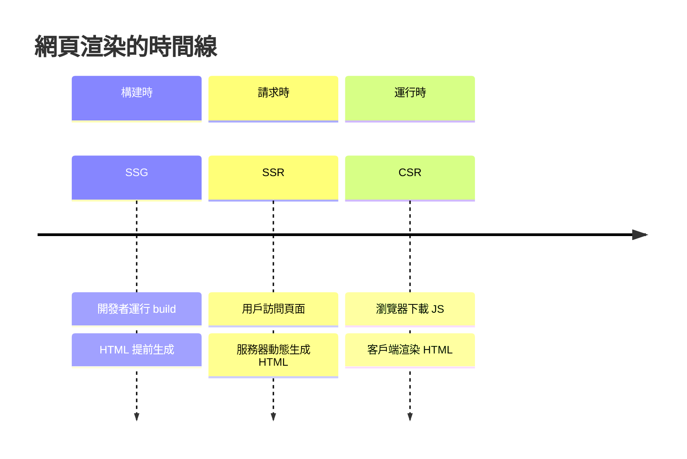
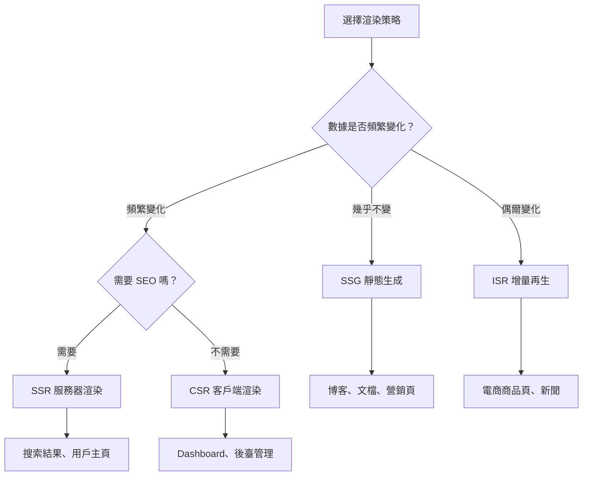

# 2.2 你的網頁何時被創建——Next.js 渲染策略全景

## 認知重構

網頁的 HTML 內容，到底是在什麼時候、由誰來生成的？這個問題的答案，就是"渲染策略"的本質。



## 四種渲染策略對比

| 策略 | HTML 生成時機 | 生成者 | 首屏速度 | SEO | 數據新鮮度 |
|------|---------------|--------|----------|-----|------------|
| **CSR** | 運行時 | 瀏覽器 | 慢 | 差 | 即時 |
| **SSR** | 請求時 | 服務器 | 中 | 好 | 即時 |
| **SSG** | 構建時 | 服務器 | 極快 | 好 | 靜態 |
| **ISR** | 構建時 + 後臺更新 | 服務器 | 極快 | 好 | 準即時 |

## 可視化解構

```mermaid
flowchart TB
    subgraph CSR["CSR 客戶端渲染"]
        direction LR
        C1["瀏覽器請求"] --> C2["返回空 HTML + JS"]
        C2 --> C3["JS 執行"]
        C3 --> C4["API 請求"]
        C4 --> C5["渲染頁面"]
    end
    
    subgraph SSR["SSR 服務器渲染"]
        direction LR
        S1["瀏覽器請求"] --> S2["服務器獲取數據"]
        S2 --> S3["生成 HTML"]
        S3 --> S4["返回完整 HTML"]
    end
    
    subgraph SSG["SSG 靜態生成"]
        direction LR
        G1["構建時生成 HTML"] --> G2["部署到 CDN"]
        G2 --> G3["瀏覽器請求"]
        G3 --> G4["直接返回 HTML"]
    end
    
    subgraph ISR["ISR 增量靜態再生"]
        direction LR
        I1["首次：返回靜態 HTML"] --> I2["後臺檢查是否過期"]
        I2 --> I3["過期則重新生成"]
        I3 --> I4["下次請求返回新 HTML"]
    end
```



## 如何選擇渲染策略？



## Next.js 中的默認行爲

在 Next.js App Router 中：

- **默認是靜態的**：如果頁面沒有動態數據獲取，會在構建時生成
- **自動變爲動態**：使用了 `cookies()`、`headers()`、`searchParams` 等會觸發 SSR
- **可以顯式控制**：通過 `export const dynamic = 'force-dynamic'` 等配置

```typescript
// 靜態生成（默認）
export default function Page() {
  return <h1>Hello</h1>
}

// 動態渲染（自動檢測）
export default function Page({ searchParams }) {
  // 使用了 searchParams，自動變爲 SSR
  return <h1>Search: {searchParams.q}</h1>
}

// 強制動態渲染
export const dynamic = 'force-dynamic'
export default function Page() {
  return <h1>Always SSR</h1>
}
```

## 本章導航

- **2.2.1 CSR**：客戶端渲染的場景與限制
- **2.2.2 SSR**：服務器渲染與 SEO 優化
- **2.2.3 SSG**：靜態生成的最佳實踐
- **2.2.4 ISR**：增量靜態再生的魔力
- **2.2.5 混合渲染**：一個頁面多種策略
