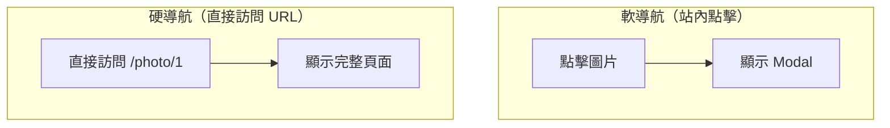

# 2.3.1 並行路由與攔截路由

## 一句話破題

並行路由讓同一個頁面可以同時渲染多個獨立區域，攔截路由讓軟導航和硬導航顯示不同內容——這兩個特性組合起來，可以實現"彈窗即頁面"的優雅體驗。

## 並行路由 (Parallel Routes)

### 什麼是並行路由？

```
app/
├── layout.tsx          # 使用 @team 和 @analytics
├── @team/
│   └── page.tsx        # 團隊區域
├── @analytics/
│   └── page.tsx        # 分析區域
└── page.tsx            # 主內容
```

### 基本用法

```typescript
// app/layout.tsx
export default function Layout({
  children,
  team,
  analytics,
}: {
  children: React.ReactNode
  team: React.ReactNode
  analytics: React.ReactNode
}) {
  return (
    <div className="grid grid-cols-2">
      <div>{children}</div>
      <div>
        {team}
        {analytics}
      </div>
    </div>
  )
}
```

### 獨立加載狀態

```typescript
// app/@team/loading.tsx
export default function TeamLoading() {
  return <div>加載團隊數據...</div>
}

// app/@analytics/loading.tsx
export default function AnalyticsLoading() {
  return <div>加載分析數據...</div>
}
```

## 攔截路由 (Intercepting Routes)

### 核心概念



### 文件結構約定

```
(.)   → 匹配同級
(..)  → 匹配上一級
(..)(..) → 匹配上兩級
(...)  → 匹配根目錄
```

### 實戰：圖片預覽彈窗

```
app/
├── photos/
│   └── [id]/
│       └── page.tsx      # 完整圖片頁面
├── @modal/
│   └── (.)photos/
│       └── [id]/
│           └── page.tsx  # Modal 內的圖片
└── layout.tsx
```

```typescript
// app/layout.tsx
export default function Layout({
  children,
  modal,
}: {
  children: React.ReactNode
  modal: React.ReactNode
}) {
  return (
    <>
      {children}
      {modal}
    </>
  )
}
```

```typescript
// app/@modal/(.)photos/[id]/page.tsx
import { Modal } from '@/components/modal'

export default function PhotoModal({
  params,
}: {
  params: { id: string }
}) {
  return (
    <Modal>
      
    </Modal>
  )
}
```

```typescript
// app/photos/[id]/page.tsx
export default function PhotoPage({
  params,
}: {
  params: { id: string }
}) {
  return (
    <div className="full-screen">
      
      <PhotoDetails id={params.id} />
    </div>
  )
}
```

## Modal 組件實現

```typescript
// components/modal.tsx
'use client'

import { useRouter } from 'next/navigation'

export function Modal({ children }: { children: React.ReactNode }) {
  const router = useRouter()
  
  return (
    <div 
      className="fixed inset-0 bg-black/50 flex items-center justify-center"
      onClick={() => router.back()}
    >
      <div 
        className="bg-white rounded-lg p-4"
        onClick={e => e.stopPropagation()}
      >
        {children}
      </div>
    </div>
  )
}
```

## 適用場景

| 場景 | 方案 |
|------|------|
| Dashboard 多區域 | 並行路由 |
| 圖片/視頻預覽 | 攔截路由 + Modal |
| 登錄彈窗 | 攔截路由 |
| 側邊欄詳情 | 並行路由 |

## 覺知：常見問題

### 1. default.tsx 的作用

```typescript
// app/@modal/default.tsx
// 當沒有匹配的 modal 時，返回 null
export default function Default() {
  return null
}
```

### 2. 刷新後 Modal 消失

這是預期行爲！刷新是硬導航，會走完整頁面路由。

## 本節小結

- **並行路由**：同一頁面多個獨立區域，各自有 loading/error 狀態
- **攔截路由**：軟導航攔截，硬導航正常
- **組合使用**：實現"彈窗即頁面"的 UX 最佳實踐
