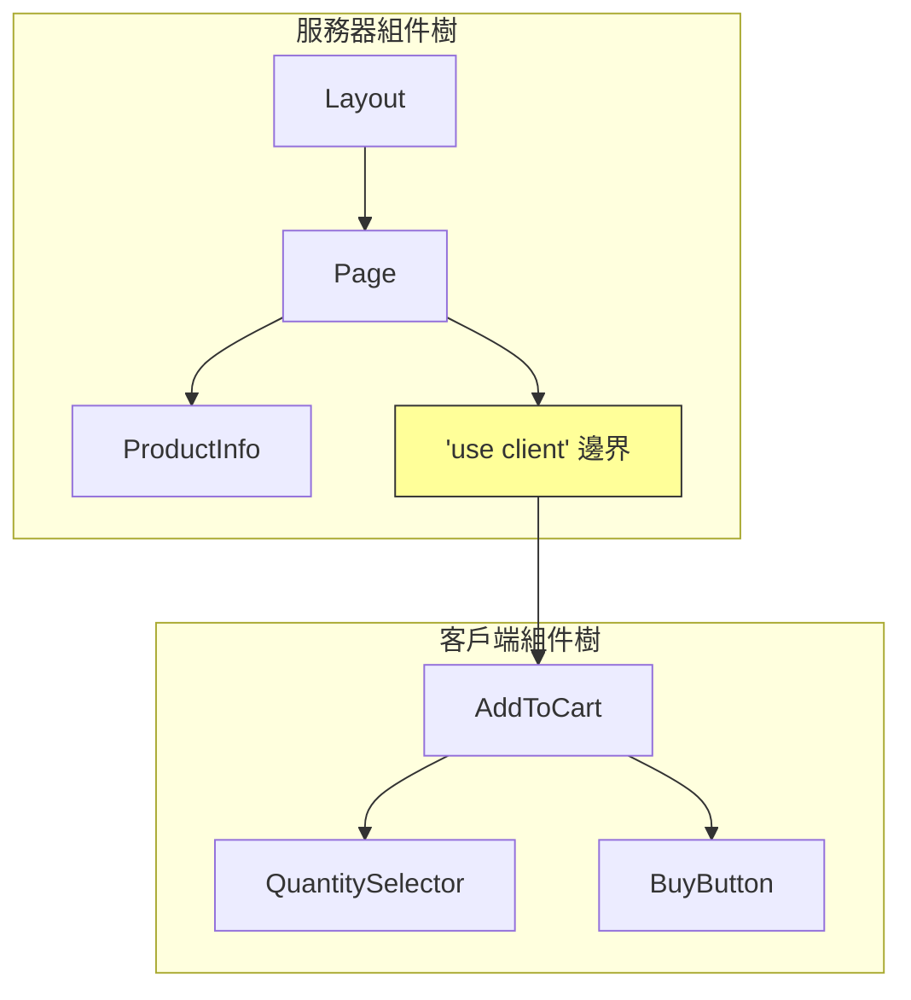

# 2.3.2 客戶端邊界與數據流

## 一句話破題

`'use client'` 不只是"讓組件能用 useState"那麼簡單——它劃定了一條邊界，決定了哪些代碼發送到瀏覽器，直接影響應用的性能和包體積。

## 邊界的本質



### 關鍵規則

| 規則 | 說明 |
|------|------|
| 默認是服務器組件 | 不加 `'use client'` 就是 Server Component |
| 邊界向下傳染 | 客戶端組件的子組件也是客戶端組件 |
| 不能逆向導入 | 客戶端組件不能 import 服務器組件 |
| Props 必須可序列化 | 跨邊界傳遞的 props 要能 JSON 序列化 |

## 正確劃分邊界

### ❌ 錯誤：整個頁面都是客戶端組件

```typescript
// app/product/page.tsx
'use client'  // ❌ 太早聲明！

export default function ProductPage() {
  const [quantity, setQuantity] = useState(1)
  
  return (
    <div>
      <ProductInfo />      {/* 本可以是服務器組件 */}
      <ProductImages />    {/* 本可以是服務器組件 */}
      <AddToCart quantity={quantity} setQuantity={setQuantity} />
    </div>
  )
}
```

### ✅ 正確：最小化客戶端邊界

```typescript
// app/product/page.tsx
// 沒有 'use client'，是服務器組件
export default async function ProductPage({ params }) {
  const product = await getProduct(params.id)
  
  return (
    <div>
      <ProductInfo product={product} />    {/* 服務器組件 */}
      <ProductImages images={product.images} />  {/* 服務器組件 */}
      <AddToCart product={product} />      {/* 客戶端組件 */}
    </div>
  )
}
```

```typescript
// components/add-to-cart.tsx
'use client'

export function AddToCart({ product }) {
  const [quantity, setQuantity] = useState(1)
  
  return (
    <div>
      <QuantitySelector value={quantity} onChange={setQuantity} />
      <BuyButton product={product} quantity={quantity} />
    </div>
  )
}
```

## Children 模式：突破邊界限制

```typescript
// ❌ 客戶端組件不能直接導入服務器組件
'use client'
import { ServerComponent } from './server-component'  // 錯誤！

// ✅ 通過 children 傳遞
// layout.tsx (服務器組件)
export default function Layout({ children }) {
  return (
    <ClientProvider>  {/* 客戶端組件 */}
      {children}       {/* 可以是服務器組件 */}
    </ClientProvider>
  )
}
```

```typescript
// client-provider.tsx
'use client'

export function ClientProvider({ children }) {
  const [theme, setTheme] = useState('light')
  
  return (
    <ThemeContext.Provider value={{ theme, setTheme }}>
      {children}  {/* 服務器組件作爲 children 傳入 */}
    </ThemeContext.Provider>
  )
}
```

## Props 序列化問題

```typescript
// ❌ 函數不能跨邊界傳遞
<ClientComponent onSubmit={async (data) => { ... }} />  // 錯誤！

// ✅ 使用 Server Actions
<ClientComponent action={submitAction} />  // Server Action 可以！
```

```typescript
// ❌ 複雜對象可能有問題
<ClientComponent data={new Map()} />  // Map 不能序列化

// ✅ 使用可序列化的數據
<ClientComponent data={Object.fromEntries(map)} />
```

## 性能對比

| 方案 | JS Bundle 大小 | 首屏速度 |
|------|---------------|----------|
| 全客戶端 | 大（包含所有組件） | 慢 |
| 最小邊界 | 小（只有交互組件） | 快 |

## 覺知：常見錯誤

### 1. 不必要的 `'use client'`

```typescript
// ❌ 純展示組件不需要 'use client'
'use client'
export function ProductCard({ product }) {
  return <div>{product.name}</div>
}

// ✅ 移除 'use client'
export function ProductCard({ product }) {
  return <div>{product.name}</div>
}
```

### 2. 誤解 "客戶端組件也在服務器運行"

```typescript
'use client'
// 這個組件會在服務器預渲染，然後在客戶端 hydrate
export function Counter() {
  console.log('這行在服務器和客戶端都會執行')
  const [count, setCount] = useState(0)
  return <button onClick={() => setCount(c => c + 1)}>{count}</button>
}
```

## 本節小結

| 原則 | 說明 |
|------|------|
| 默認服務器 | 能用服務器組件就用服務器組件 |
| 最小邊界 | `'use client'` 放在最需要的地方 |
| Children 模式 | 讓服務器組件穿過客戶端邊界 |
| Props 序列化 | 跨邊界數據必須可序列化 |
