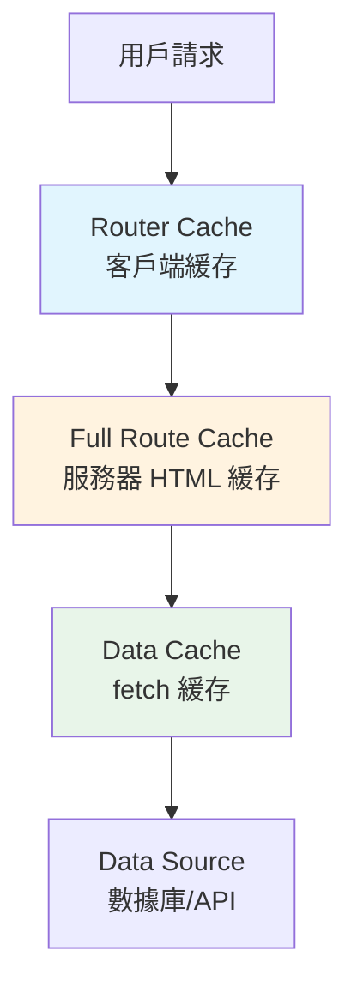

# 2.3.4 緩存策略詳解

## 一句話破題

Next.js 有多層緩存機制，理解它們的工作方式和配置選項，是避免"數據不更新"這類玄學問題的關鍵。

## 緩存層級



| 緩存層 | 位置 | 作用 | 持續時間 |
|--------|------|------|----------|
| Router Cache | 客戶端 | 緩存已訪問頁面 | 會話期間 |
| Full Route Cache | 服務器 | 緩存完整 HTML | 持久（除非重驗證） |
| Data Cache | 服務器 | 緩存 fetch 響應 | 持久（除非重驗證） |

## fetch 緩存控制

### 永久緩存（默認）

```typescript
// 默認行爲：永久緩存
const data = await fetch('https://api.example.com/data')

// 等同於
const data = await fetch('https://api.example.com/data', {
  cache: 'force-cache'
})
```

### 不緩存（每次請求）

```typescript
const data = await fetch('https://api.example.com/data', {
  cache: 'no-store'
})
```

### 定時重驗證（ISR）

```typescript
const data = await fetch('https://api.example.com/data', {
  next: { revalidate: 60 }  // 60 秒後重驗證
})
```

### 標籤重驗證

```typescript
// 打標籤
const data = await fetch('https://api.example.com/posts', {
  next: { tags: ['posts'] }
})

// 按標籤重驗證
import { revalidateTag } from 'next/cache'
revalidateTag('posts')
```

## 頁面級緩存控制

```typescript
// app/posts/page.tsx

// 強制動態渲染（不緩存）
export const dynamic = 'force-dynamic'

// 強制靜態渲染
export const dynamic = 'force-static'

// 設置 revalidate 時間
export const revalidate = 60

// 讓 Next.js 自動判斷（默認）
export const dynamic = 'auto'
```

## 重驗證方式

### 基於時間

```typescript
// 每 60 秒重新生成
export const revalidate = 60
```

### 按需重驗證

```typescript
// app/api/revalidate/route.ts
import { revalidatePath, revalidateTag } from 'next/cache'

export async function POST(request) {
  const { path, tag } = await request.json()
  
  if (path) {
    revalidatePath(path)  // 重驗證路徑
  }
  
  if (tag) {
    revalidateTag(tag)    // 重驗證標籤
  }
  
  return Response.json({ revalidated: true })
}
```

### Server Action 中重驗證

```typescript
'use server'

import { revalidatePath } from 'next/cache'

export async function createPost(formData) {
  await db.post.create({ ... })
  
  revalidatePath('/posts')  // 創建後刷新列表
}
```

## 常見場景配置

| 場景 | 配置 |
|------|------|
| 博客文章 | `revalidate: 3600` |
| 商品價格 | `revalidate: 60` |
| 用戶數據 | `cache: 'no-store'` |
| 靜態內容 | 默認（永久緩存） |

## 覺知：常見問題

### 1. 數據不更新

```typescript
// ❌ 默認緩存，數據不會更新
const posts = await fetch('/api/posts')

// ✅ 方案 1：禁用緩存
const posts = await fetch('/api/posts', { cache: 'no-store' })

// ✅ 方案 2：定時重驗證
const posts = await fetch('/api/posts', { next: { revalidate: 60 } })
```

### 2. 開發環境和生產環境行爲不同

```typescript
// 開發環境默認禁用緩存！
// 生產環境需要顯式配置
```

### 3. Router Cache 問題

```typescript
// 客戶端 Router Cache 可能導致看到舊數據
// 解決方案：在 Server Action 後調用 revalidatePath
'use server'
export async function updatePost(id, data) {
  await db.post.update({ where: { id }, data })
  revalidatePath(`/posts/${id}`)
}
```

## 調試緩存

```typescript
// 在 fetch 後打印緩存狀態
const res = await fetch(url)
console.log('Cache:', res.headers.get('x-nextjs-cache'))
// HIT = 緩存命中
// MISS = 緩存未命中
// STALE = 緩存過期，正在重驗證
```

## 本節小結

| 緩存類型 | 控制方式 | 重驗證方式 |
|----------|----------|------------|
| fetch 緩存 | `cache` / `next.revalidate` | `revalidateTag` |
| 頁面緩存 | `dynamic` / `revalidate` | `revalidatePath` |
| Router 緩存 | 自動管理 | Server Action 後自動刷新 |
