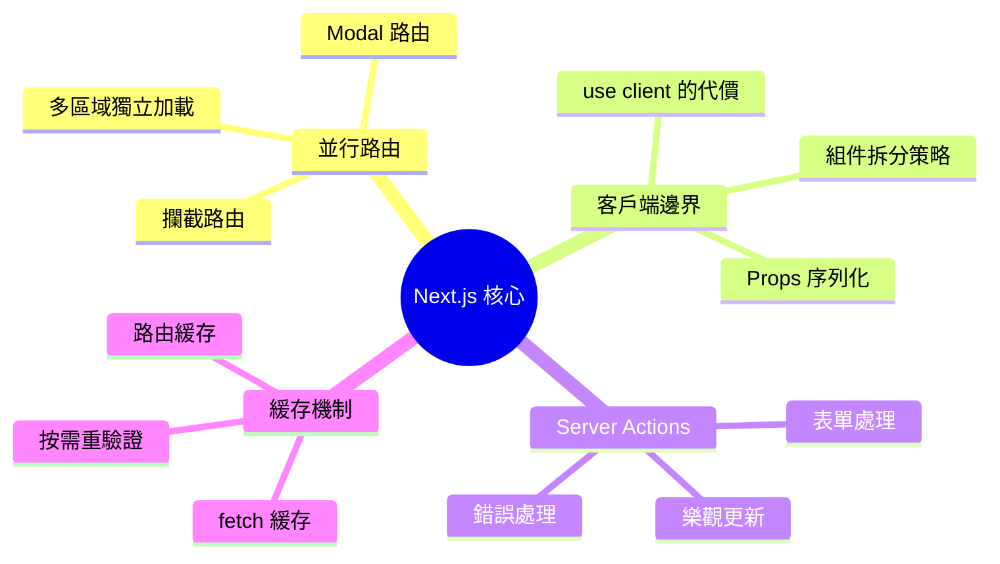
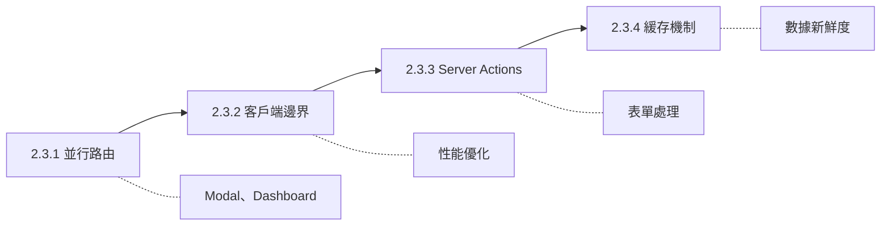

# 2.3 Next.js 核心概念深入

## 認知重構

Next.js 13+ 帶來了革命性的 App Router，但很多開發者只是"會用"，卻不"用對"。本章將深入探討如何正確使用這些新特性，發揮它們的真正威力。

## 本章知識圖譜

## 核心概念速查

| 特性 | 作用 | 典型場景 |
|------|------|----------|
| 並行路由 | 同一頁面多個獨立區域 | Dashboard、Modal |
| 攔截路由 | 軟導航顯示不同內容 | 圖片預覽、分享鏈接 |
| Client Boundary | 標記客戶端組件邊界 | 交互組件 |
| Server Actions | 服務器端函數調用 | 表單提交、數據變更 |
| fetch 緩存 | 請求級別緩存 | 數據獲取優化 |
| revalidate | 增量更新緩存 | ISR、按需刷新 |

## 學習路徑

## 本章導航

- **2.3.1 並行路由**：讓彈窗也能有自己的 URL
- **2.3.2 客戶端邊界**：`'use client'` 的正確使用方式
- **2.3.3 Server Actions**：表單處理的最佳實踐
- **2.3.4 緩存機制**：讓數據既快又新
