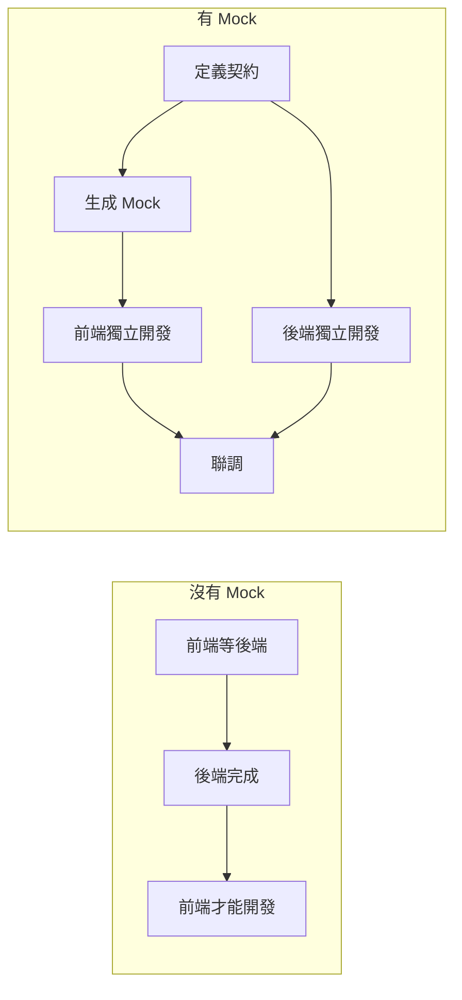

# 2.4.2 假數據也能開發——Mock 數據

## 一句話破題

Mock 數據讓前端不需要等待後端接口就能開發——基於契約生成假數據，前端頁面可以完整跑通，聯調時只需切換數據源。

## 爲什麼需要 Mock



## Mock 方案選擇

| 方案 | 優點 | 缺點 | 適用場景 |
|------|------|------|----------|
| 靜態 JSON 文件 | 簡單 | 不靈活 | 簡單場景 |
| MSW | 攔截真實請求 | 需要配置 | 複雜項目 |
| Next.js API Routes | 與真實代碼一致 | 需要寫代碼 | 全棧項目 |

## 方案一：靜態 Mock 文件

### 目錄結構

```
src/
├── mocks/
│   ├── users.json
│   └── posts.json
└── services/
    └── user.ts
```

### 簡單實現

```typescript
// mocks/users.json
{
  "users": [
    {
      "id": "1",
      "name": "張三",
      "email": "zhangsan@example.com",
      "avatar": null,
      "createdAt": "2024-01-01T00:00:00Z"
    },
    {
      "id": "2",
      "name": "李四",
      "email": "lisi@example.com",
      "avatar": "https://example.com/avatar.jpg",
      "createdAt": "2024-01-02T00:00:00Z"
    }
  ],
  "total": 2
}
```

```typescript
// services/user.ts
import type { UsersListResponse } from '@/types/user'
import mockData from '@/mocks/users.json'

const USE_MOCK = process.env.NEXT_PUBLIC_USE_MOCK === 'true'

export async function getUsers(): Promise<UsersListResponse> {
  if (USE_MOCK) {
    // 模擬網絡延遲
    await new Promise(resolve => setTimeout(resolve, 500))
    return {
      code: 200,
      message: '獲取成功',
      data: mockData
    }
  }
  
  const res = await fetch('/api/users')
  return res.json()
}
```

## 方案二：使用 Faker.js 生成動態數據

### 安裝

```bash
pnpm add -D @faker-js/faker
```

### 創建 Mock 工廠

```typescript
// mocks/factories/user.ts
import { faker } from '@faker-js/faker/locale/zh_CN'
import type { User } from '@/types/user'

export function createMockUser(overrides?: Partial<User>): User {
  return {
    id: faker.string.uuid(),
    name: faker.person.fullName(),
    email: faker.internet.email(),
    avatar: faker.image.avatar(),
    role: faker.helpers.arrayElement(['admin', 'user']),
    createdAt: faker.date.past().toISOString(),
    updatedAt: faker.date.recent().toISOString(),
    ...overrides,
  }
}

export function createMockUsers(count: number): User[] {
  return Array.from({ length: count }, () => createMockUser())
}
```

### 使用工廠

```typescript
// services/user.ts
import { createMockUsers } from '@/mocks/factories/user'
import type { UsersListResponse } from '@/types/user'

const USE_MOCK = process.env.NEXT_PUBLIC_USE_MOCK === 'true'

export async function getUsers(params?: { 
  page?: number 
  pageSize?: number 
}): Promise<UsersListResponse> {
  if (USE_MOCK) {
    await new Promise(resolve => setTimeout(resolve, 300))
    
    const page = params?.page ?? 1
    const pageSize = params?.pageSize ?? 10
    const total = 100
    
    return {
      code: 200,
      message: '獲取成功',
      data: {
        users: createMockUsers(pageSize),
        total,
        page,
        pageSize,
      }
    }
  }
  
  const searchParams = new URLSearchParams()
  if (params?.page) searchParams.set('page', String(params.page))
  if (params?.pageSize) searchParams.set('pageSize', String(params.pageSize))
  
  const res = await fetch(`/api/users?${searchParams}`)
  return res.json()
}
```

## 方案三：MSW（Mock Service Worker）

MSW 在網絡層攔截請求，最接近真實環境。

### 安裝

```bash
pnpm add -D msw
```

### 配置 Handler

```typescript
// mocks/handlers.ts
import { http, HttpResponse } from 'msw'
import { createMockUser, createMockUsers } from './factories/user'

export const handlers = [
  // 獲取用戶列表
  http.get('/api/users', ({ request }) => {
    const url = new URL(request.url)
    const page = Number(url.searchParams.get('page')) || 1
    const pageSize = Number(url.searchParams.get('pageSize')) || 10
    
    return HttpResponse.json({
      code: 200,
      message: '獲取成功',
      data: {
        users: createMockUsers(pageSize),
        total: 100,
        page,
        pageSize,
      }
    })
  }),
  
  // 創建用戶
  http.post('/api/users', async ({ request }) => {
    const body = await request.json()
    
    return HttpResponse.json({
      code: 200,
      message: '創建成功',
      data: createMockUser(body as any),
    })
  }),
  
  // 獲取單個用戶
  http.get('/api/users/:id', ({ params }) => {
    return HttpResponse.json({
      code: 200,
      message: '獲取成功',
      data: createMockUser({ id: params.id as string }),
    })
  }),
  
  // 模擬錯誤場景
  http.delete('/api/users/:id', ({ params }) => {
    if (params.id === 'error') {
      return HttpResponse.json(
        { code: 403, message: '無權限刪除' },
        { status: 403 }
      )
    }
    
    return HttpResponse.json({
      code: 200,
      message: '刪除成功',
    })
  }),
]
```

### 在開發環境啓用

```typescript
// mocks/browser.ts
import { setupWorker } from 'msw/browser'
import { handlers } from './handlers'

export const worker = setupWorker(...handlers)
```

```typescript
// app/providers.tsx
'use client'

import { useEffect } from 'react'

export function Providers({ children }: { children: React.ReactNode }) {
  useEffect(() => {
    if (process.env.NODE_ENV === 'development') {
      import('@/mocks/browser').then(({ worker }) => {
        worker.start({ onUnhandledRequest: 'bypass' })
      })
    }
  }, [])
  
  return <>{children}</>
}
```

## 場景化 Mock

### 模擬不同狀態

```typescript
// mocks/scenarios.ts
import { http, HttpResponse } from 'msw'

// 空列表場景
export const emptyListScenario = [
  http.get('/api/users', () => {
    return HttpResponse.json({
      code: 200,
      data: { users: [], total: 0, page: 1, pageSize: 10 }
    })
  }),
]

// 加載失敗場景
export const errorScenario = [
  http.get('/api/users', () => {
    return HttpResponse.json(
      { code: 500, message: '服務器錯誤' },
      { status: 500 }
    )
  }),
]

// 慢網絡場景
export const slowNetworkScenario = [
  http.get('/api/users', async () => {
    await new Promise(resolve => setTimeout(resolve, 3000))
    return HttpResponse.json({ code: 200, data: { users: [] } })
  }),
]
```

### 動態切換場景

```typescript
// 在開發時可以通過 URL 參數切換
// ?mock=empty 使用空列表
// ?mock=error 使用錯誤場景
```

## 環境配置

```bash
# .env.development
NEXT_PUBLIC_USE_MOCK=true

# .env.production
NEXT_PUBLIC_USE_MOCK=false
```

## 覺知：Mock 的常見問題

### 1. Mock 數據與真實數據格式不一致

```typescript
// ❌ Mock 返回的字段和真實 API 不同
{
  "userName": "張三"  // API 返回的是 "name"
}

// ✅ 嚴格按照契約類型生成 Mock
function createMockUser(): User {  // 類型約束
  return {
    name: faker.person.fullName(),  // 和類型定義一致
    // ...
  }
}
```

### 2. 忘記模擬邊界情況

```typescript
// ✅ 記得模擬各種邊界情況
const edgeCases = {
  emptyString: createMockUser({ name: '' }),
  longName: createMockUser({ name: '這是一個非常非常長的用戶名'.repeat(10) }),
  specialChars: createMockUser({ name: '<script>alert(1)</script>' }),
  nullAvatar: createMockUser({ avatar: null }),
}
```

### 3. Mock 延遲與真實網絡差異

```typescript
// 模擬真實網絡延遲
const delay = (min: number, max: number) => 
  new Promise(resolve => 
    setTimeout(resolve, Math.random() * (max - min) + min)
  )

// 使用
await delay(200, 800)  // 200-800ms 隨機延遲
```

## 本節小結

| Mock 方案 | 使用場景 |
|-----------|----------|
| 靜態 JSON | 快速原型、簡單頁面 |
| Faker 工廠 | 需要大量隨機數據 |
| MSW | 複雜交互、接近真實環境 |

**核心原則**：Mock 數據必須嚴格遵循契約類型，否則聯調時會出問題。
