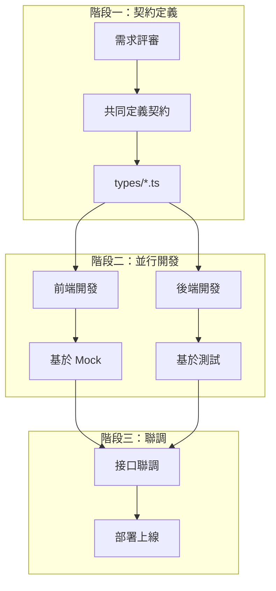
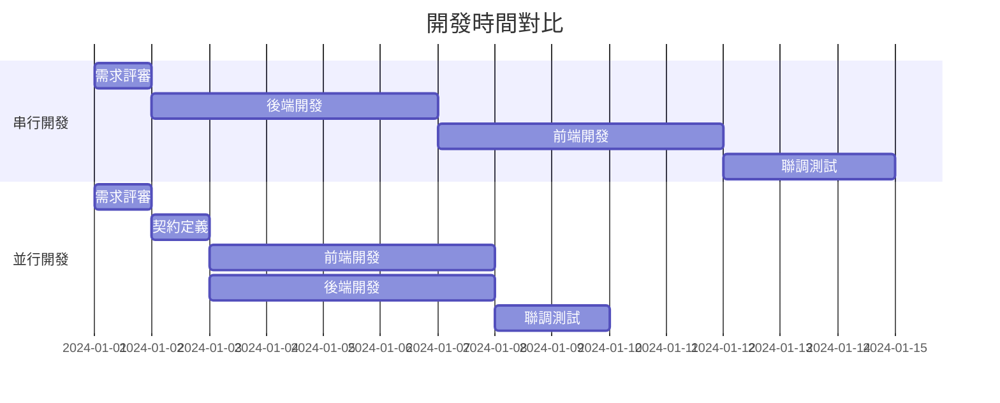
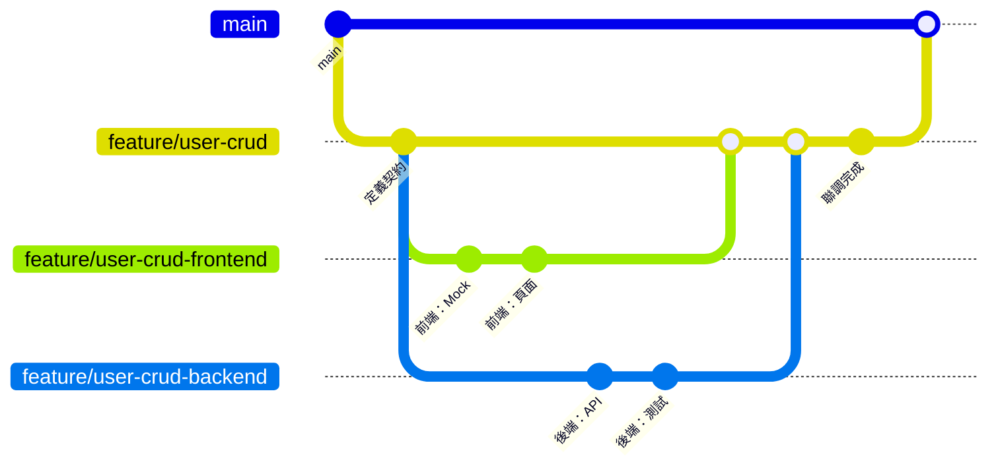
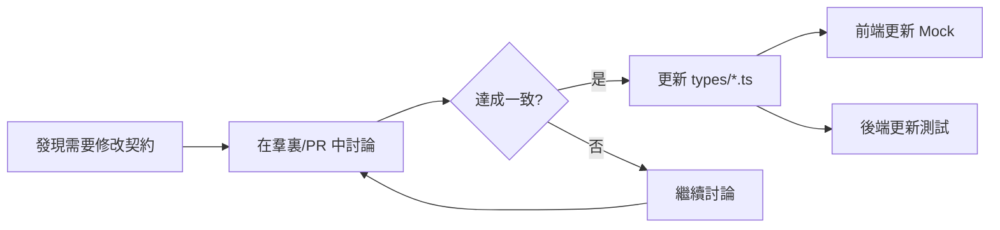

# 2.4.3 你寫你的，我寫我的——並行開發

## 一句話破題

並行開發的核心是：**前後端基於同一份契約獨立工作，彼此不阻塞**。前端用 Mock 跑通頁面，後端用測試驗證邏輯，聯調時只需對接真實接口。

## 並行開發流程



## 時間線對比



**串行開發**：1 + 5 + 5 + 3 = **14 天**  
**並行開發**：1 + 1 + 5 + 2 = **9 天**（節省 36%）

## 前端並行開發實踐

### 基於契約生成 Mock

```typescript
// 1. 定義契約（types/post.ts）
export interface Post {
  id: string
  title: string
  content: string
  author: { id: string; name: string }
  createdAt: string
}

export interface CreatePostRequest {
  title: string
  content: string
}

// 2. 創建 Mock 工廠（mocks/factories/post.ts）
import { faker } from '@faker-js/faker/locale/zh_CN'
import type { Post } from '@/types/post'

export function createMockPost(overrides?: Partial<Post>): Post {
  return {
    id: faker.string.uuid(),
    title: faker.lorem.sentence(),
    content: faker.lorem.paragraphs(3),
    author: {
      id: faker.string.uuid(),
      name: faker.person.fullName(),
    },
    createdAt: faker.date.recent().toISOString(),
    ...overrides,
  }
}

// 3. 前端直接使用（components/post-list.tsx）
'use client'
import { createMockPost } from '@/mocks/factories/post'

export function PostList() {
  // 開發階段使用 Mock 數據
  const posts = Array.from({ length: 10 }, () => createMockPost())
  
  return (
    <ul>
      {posts.map(post => (
        <li key={post.id}>{post.title}</li>
      ))}
    </ul>
  )
}
```

### 前端開發清單

- [ ] 基於契約創建 TypeScript 類型
- [ ] 創建 Mock 數據工廠
- [ ] 開發頁面組件
- [ ] 處理加載狀態
- [ ] 處理錯誤狀態
- [ ] 處理空狀態
- [ ] 表單驗證
- [ ] 響應式適配

## 後端並行開發實踐

### 基於契約編寫測試

```typescript
// app/api/posts/route.test.ts
import { POST, GET } from './route'
import { createMockPost } from '@/mocks/factories/post'

describe('POST /api/posts', () => {
  it('應該創建文章並返回正確格式', async () => {
    const request = new Request('http://localhost/api/posts', {
      method: 'POST',
      body: JSON.stringify({
        title: '測試標題',
        content: '測試內容',
      }),
    })
    
    const response = await POST(request)
    const data = await response.json()
    
    // 驗證響應格式符合契約
    expect(data.code).toBe(200)
    expect(data.data).toHaveProperty('id')
    expect(data.data).toHaveProperty('title', '測試標題')
    expect(data.data).toHaveProperty('content', '測試內容')
    expect(data.data).toHaveProperty('author')
    expect(data.data).toHaveProperty('createdAt')
  })
  
  it('標題爲空時應返回 400', async () => {
    const request = new Request('http://localhost/api/posts', {
      method: 'POST',
      body: JSON.stringify({
        title: '',
        content: '測試內容',
      }),
    })
    
    const response = await POST(request)
    const data = await response.json()
    
    expect(response.status).toBe(400)
    expect(data.code).toBe(400)
  })
})
```

### 後端開發清單

- [ ] 基於契約定義響應類型
- [ ] 編寫 API 路由處理
- [ ] 實現數據驗證（Zod）
- [ ] 實現業務邏輯
- [ ] 編寫單元測試
- [ ] 處理錯誤情況
- [ ] 實現權限控制

## 協作規範

### Git 分支策略



### 契約變更流程



### 溝通模板

```markdown
## 契約變更通知

**接口**：POST /api/posts
**變更內容**：新增 tags 字段
**原因**：產品需求新增標籤功能
**影響範圍**：文章創建、文章列表

### 變更前
\`\`\`typescript
interface CreatePostRequest {
  title: string
  content: string
}
\`\`\`

### 變更後
\`\`\`typescript
interface CreatePostRequest {
  title: string
  content: string
  tags?: string[]  // 新增
}
\`\`\`

**前端同學**：請更新 Mock 和表單
**後端同學**：請更新驗證和存儲邏輯

cc: @前端 @後端
```

## 常見問題與解決

### 1. 契約理解不一致

```typescript
// ❌ 前端以爲是數組
interface Response {
  users: User[]
}

// ❌ 後端以爲是對象
interface Response {
  users: { list: User[], total: number }
}

// ✅ 統一寫在 types 文件中，雙方共用
// types/user.ts
export interface UsersResponse {
  code: number
  data: {
    users: User[]
    total: number
  }
}
```

### 2. 字段命名不一致

```typescript
// ✅ 命名規範
// - 使用 camelCase
// - 時間字段統一用 xxxAt（createdAt, updatedAt）
// - ID 字段統一用 xxxId（userId, postId）
// - 布爾值用 isXxx / hasXxx（isActive, hasPermission）
```

### 3. 進度不同步

```markdown
## 每日站會同步模板

**前端進度**：
- 完成：用戶列表頁面
- 進行中：用戶編輯表單
- 阻塞：無

**後端進度**：
- 完成：用戶 CRUD API
- 進行中：權限校驗
- 阻塞：等待確認權限規則

**需要協調**：
- 用戶刪除接口的返回格式需確認
```

## 本節小結

| 階段 | 前端工作 | 後端工作 |
|------|----------|----------|
| 契約定義 | 參與討論、確認格式 | 參與討論、確認格式 |
| 並行開發 | Mock 數據 + 頁面開發 | API 實現 + 單元測試 |
| 聯調測試 | 切換真實 API | 提供測試環境 |

**核心原則**：契約是前後端的唯一共識，一切以契約爲準。
