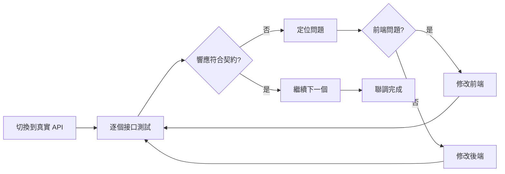

# 2.4.4 爲什麼接口對不上——聯調測試

## 一句話破題

聯調是驗證契約的最後一關——前端的 Mock 和後端的實現必須都嚴格遵循契約，否則這一階段就會暴露所有的"我以爲"問題。

## 聯調流程



## 聯調前的準備

### 1. 環境配置

```bash
# .env.development
NEXT_PUBLIC_API_BASE_URL=http://localhost:3000/api

# .env.staging
NEXT_PUBLIC_API_BASE_URL=https://staging-api.example.com

# .env.production  
NEXT_PUBLIC_API_BASE_URL=https://api.example.com
```

### 2. 切換 Mock 到真實 API

```typescript
// services/user.ts
const USE_MOCK = process.env.NEXT_PUBLIC_USE_MOCK === 'true'

export async function getUsers(): Promise<UsersListResponse> {
  if (USE_MOCK) {
    return getMockUsers()  // 開發時用 Mock
  }
  
  // 聯調時用真實 API
  const res = await fetch(`${process.env.NEXT_PUBLIC_API_BASE_URL}/users`)
  return res.json()
}
```

### 3. 聯調清單

```markdown
## 用戶模塊聯調清單

### GET /api/users
- [ ] 正常返回用戶列表
- [ ] 分頁參數生效
- [ ] 搜索參數生效
- [ ] 空列表處理
- [ ] 權限校驗

### POST /api/users
- [ ] 正常創建用戶
- [ ] 字段驗證錯誤返回
- [ ] 郵箱重複檢測
- [ ] 創建成功後刷新列表

### PUT /api/users/:id
- [ ] 正常更新用戶
- [ ] 不存在的用戶返回 404
- [ ] 權限校驗

### DELETE /api/users/:id
- [ ] 正常刪除用戶
- [ ] 不存在的用戶返回 404
- [ ] 刪除後列表刷新
```

## 常見問題排查

### 1. 字段名不一致

```typescript
// 契約定義
interface User {
  createdAt: string
}

// 後端返回
{
  "created_at": "2024-01-01"  // snake_case vs camelCase
}

// 排查方法：在 Network 面板查看實際響應
```

**解決方案**：

```typescript
// 方案 1：後端改爲 camelCase（推薦）
// 方案 2：前端做字段映射
function transformUser(data: any): User {
  return {
    ...data,
    createdAt: data.created_at,
  }
}
```

### 2. 數據類型不匹配

```typescript
// 契約定義
interface User {
  id: string  // 前端期望字符串
}

// 後端返回
{
  "id": 123  // 實際是數字
}

// 可能導致問題
users.find(u => u.id === "123")  // 永遠找不到
```

**解決方案**：

```typescript
// 方案 1：後端統一返回字符串
// 方案 2：前端做類型轉換
function transformUser(data: any): User {
  return {
    ...data,
    id: String(data.id),
  }
}
```

### 3. 響應格式不一致

```typescript
// 契約定義
interface ApiResponse<T> {
  code: number
  message: string
  data: T
}

// 後端返回（錯誤情況）
{
  "error": "Not found"  // 缺少 code 字段
}

// 前端處理時崩潰
if (response.code === 200) { ... }  // code undefined
```

**解決方案**：

```typescript
// 統一的響應處理函數
async function fetchApi<T>(url: string): Promise<ApiResponse<T>> {
  const res = await fetch(url)
  const data = await res.json()
  
  // 標準化響應格式
  if (!data.code) {
    return {
      code: res.status,
      message: data.error || data.message || '未知錯誤',
      data: null as T,
    }
  }
  
  return data
}
```

### 4. 跨域問題（CORS）

```
Access to fetch at 'https://api.example.com' from origin 
'http://localhost:3000' has been blocked by CORS policy
```

**解決方案**：

```typescript
// next.config.js - 開發環境代理
module.exports = {
  async rewrites() {
    return [
      {
        source: '/api/:path*',
        destination: 'https://api.example.com/:path*',
      },
    ]
  },
}

// 或者後端配置 CORS headers
// Access-Control-Allow-Origin: *
```

### 5. 時間格式不一致

```typescript
// 契約定義
createdAt: string  // 期望 ISO 格式

// 後端返回各種格式
"2024-01-01"           // 缺少時間
"2024/01/01 12:00:00"  // 非 ISO 格式
1704067200             // Unix 時間戳
```

**解決方案**：

```typescript
// 統一使用 dayjs 處理
import dayjs from 'dayjs'

function formatDate(date: string | number): string {
  return dayjs(date).format('YYYY-MM-DD HH:mm:ss')
}
```

## 調試工具

### 1. 瀏覽器 Network 面板

```
查看位置：F12 → Network → Fetch/XHR

關鍵信息：
- Request URL：請求地址是否正確
- Request Method：GET/POST 是否正確
- Request Headers：Content-Type 是否正確
- Request Payload：請求體格式
- Response：實際返回數據
- Status Code：200/400/500
```

### 2. 使用 console.log 對比

```typescript
export async function getUsers() {
  const res = await fetch('/api/users')
  const data = await res.json()
  
  // 對比契約和實際數據
  console.log('契約要求:', '{ code, message, data: { users, total } }')
  console.log('實際返回:', JSON.stringify(data, null, 2))
  
  return data
}
```

### 3. Postman / Thunder Client

```
1. 導入 API 契約
2. 獨立測試每個接口
3. 驗證響應格式
4. 保存測試用例
```

## 聯調問題追蹤模板

```markdown
## 問題：用戶列表接口返回格式不對

**接口**：GET /api/users

**契約要求**：
\`\`\`json
{
  "code": 200,
  "data": {
    "users": [...],
    "total": 100
  }
}
\`\`\`

**實際返回**：
\`\`\`json
{
  "code": 200,
  "data": [...]  // 直接是數組，缺少 total
}
\`\`\`

**影響**：分頁組件無法顯示總數

**解決方案**：後端修改返回格式

**責任人**：@後端同學

**狀態**：待修復
```

## 聯調自動化

### 契約測試

```typescript
// tests/contract.test.ts
import { z } from 'zod'

const UserSchema = z.object({
  id: z.string(),
  name: z.string(),
  email: z.string().email(),
  createdAt: z.string().datetime(),
})

const UsersResponseSchema = z.object({
  code: z.number(),
  message: z.string(),
  data: z.object({
    users: z.array(UserSchema),
    total: z.number(),
  }),
})

describe('API 契約測試', () => {
  it('GET /api/users 應該符合契約', async () => {
    const res = await fetch(`${API_BASE}/users`)
    const data = await res.json()
    
    // 驗證響應格式
    const result = UsersResponseSchema.safeParse(data)
    
    if (!result.success) {
      console.log('契約驗證失敗:', result.error.format())
    }
    
    expect(result.success).toBe(true)
  })
})
```

## 本節小結

| 階段 | 工作內容 |
|------|----------|
| 聯調前 | 準備環境變量、編寫聯調清單 |
| 聯調中 | 逐個接口驗證、記錄問題 |
| 聯調後 | 更新契約（如有變更）、補充測試 |

**核心原則**：聯調問題 80% 源於契約理解不一致，先查契約再查代碼。
