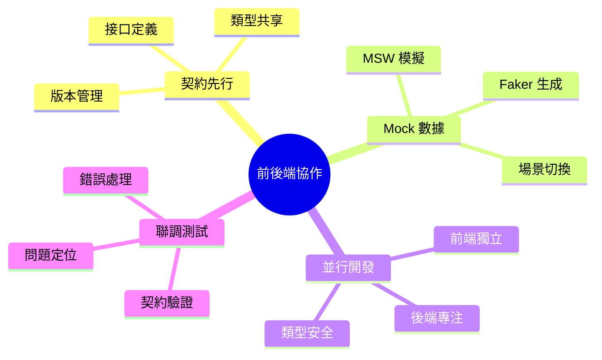
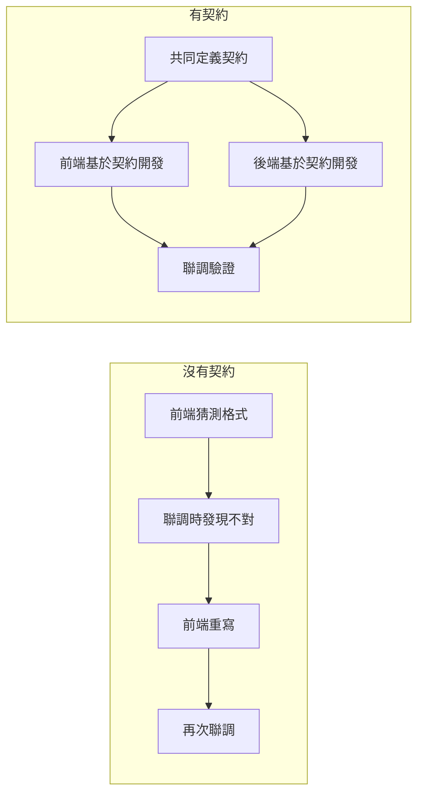
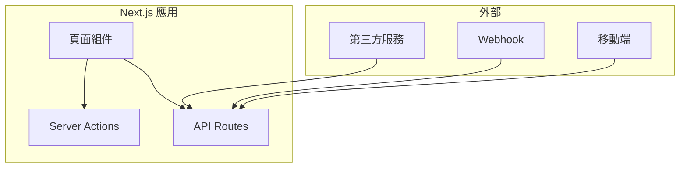

# 2.4 前後端如何高效協作——接口契約

## 認知重構

在傳統開發模式中，前端等後端、後端等需求，彼此阻塞是常態。而在 Vibe Coding 時代，**契約先行**的理念讓前後端可以並行開發，AI 也能基於契約生成更準確的代碼。

```
傳統模式：需求 → 後端開發 → 前端對接 → 聯調（串行）
契約先行：需求 → 定義契約 → 前後端並行開發 → 聯調（並行）
```

## 本章知識圖譜



## 核心概念速覽

| 概念 | 作用 | 工具 |
|------|------|------|
| **API 契約** | 定義請求/響應格式 | TypeScript 類型、Zod Schema |
| **Mock 數據** | 模擬後端響應 | MSW、Faker.js |
| **並行開發** | 前後端同時進行 | 共享類型定義 |
| **聯調測試** | 驗證契約一致性 | Postman、測試用例 |

## 爲什麼需要 API 契約？



### 契約的三大價值

1. **消除溝通歧義**：接口格式白紙黑字，沒有"我以爲"
2. **支持並行開發**：前端用 Mock，後端用測試，互不阻塞
3. **AI 協作更精準**：AI 基於類型定義生成代碼，準確率大幅提升

## API Route 在 Next.js 中的位置



| 場景 | 推薦方案 |
|------|----------|
| 內部數據變更 | Server Actions |
| 對外暴露接口 | API Routes |
| 第三方回調 | API Routes |
| 移動端調用 | API Routes |

## 本章導航

- **2.4.1 契約先行**：先定義接口，再寫代碼
- **2.4.2 Mock 數據**：讓前端不依賴後端
- **2.4.3 並行開發**：前後端同時進行
- **2.4.4 聯調測試**：確保契約一致性
