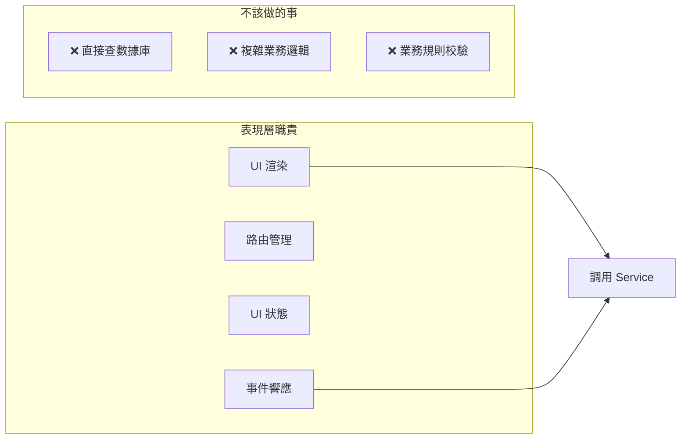
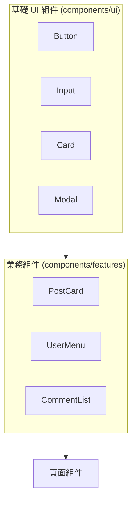

# 2.5.1 用戶能看見的層——表現層

## 一句話破題

表現層是用戶直接接觸的界面——它只負責"呈現什麼"和"如何交互"，不關心數據從哪來、業務規則是什麼。

## 表現層的職責邊界



| 應該做 | 不應該做 |
|--------|----------|
| 渲染 UI 組件 | 直接寫 SQL/Prisma 查詢 |
| 處理用戶交互 | 實現複雜業務邏輯 |
| 管理 UI 狀態（展開/摺疊） | 處理跨實體的業務規則 |
| 調用 Service 層方法 | 直接操作多個數據表 |

## Next.js 中的表現層文件

### 約定文件職責

| 文件 | 職責 | 示例 |
|------|------|------|
| `page.tsx` | 頁面入口，組裝組件 | 文章列表頁 |
| `layout.tsx` | 共享佈局，導航/側邊欄 | Dashboard 佈局 |
| `loading.tsx` | 加載狀態 UI | 骨架屏 |
| `error.tsx` | 錯誤邊界 UI | 錯誤提示 + 重試 |
| `not-found.tsx` | 404 頁面 | 自定義 404 |

### 目錄組織

```
app/
├── (marketing)/              # 營銷頁面組
│   ├── layout.tsx            # 營銷頁共享佈局
│   ├── page.tsx              # 首頁
│   └── about/
│       └── page.tsx
│
├── (dashboard)/              # 後臺頁面組
│   ├── layout.tsx            # 後臺共享佈局（含側邊欄）
│   ├── dashboard/
│   │   └── page.tsx          # 儀表盤首頁
│   └── posts/
│       ├── page.tsx          # 文章列表
│       ├── [id]/
│       │   └── page.tsx      # 文章詳情
│       └── new/
│           └── page.tsx      # 新建文章
│
└── components/               # 組件庫
    ├── ui/                   # 基礎 UI 組件
    │   ├── button.tsx
    │   └── input.tsx
    └── features/             # 業務組件
        ├── post-card.tsx
        └── user-avatar.tsx
```

## 頁面組件的正確寫法

### ✅ 好的實踐：職責單一

```typescript
// app/(dashboard)/posts/page.tsx
import { postService } from '@/services/post.service'
import { PostList } from '@/components/features/post-list'
import { CreatePostButton } from '@/components/features/create-post-button'

export default async function PostsPage() {
  // 只做一件事：獲取數據並傳給組件
  const posts = await postService.getMyPosts()
  
  return (
    <div className="space-y-6">
      <div className="flex justify-between items-center">
        <h1 className="text-2xl font-bold">我的文章</h1>
        <CreatePostButton />
      </div>
      <PostList posts={posts} />
    </div>
  )
}
```

### ❌ 壞的實踐：職責混雜

```typescript
// ❌ 不要這樣寫
export default async function PostsPage() {
  const session = await getServerSession()
  
  // ❌ 業務邏輯不應該在頁面裏
  if (!session) {
    redirect('/login')
  }
  
  // ❌ 數據庫操作不應該在頁面裏
  const posts = await prisma.post.findMany({
    where: { authorId: session.user.id },
    include: { tags: true, author: true },
  })
  
  // ❌ 業務規則不應該在頁面裏
  const publishedPosts = posts.filter(p => p.status === 'published')
  const canCreateMore = publishedPosts.length < 100
  
  return (
    <div>
      {/* 很長的 JSX，難以維護 */}
    </div>
  )
}
```

## 組件分類策略

### 基礎 UI 組件 vs 業務組件



| 類型 | 特點 | 示例 |
|------|------|------|
| **基礎 UI** | 無業務邏輯，高度複用 | Button, Input, Card |
| **業務組件** | 包含特定業務展示邏輯 | PostCard, UserAvatar |
| **頁面組件** | 組裝各類組件，處理數據流 | PostsPage |

### 業務組件示例

```typescript
// components/features/post-card.tsx
import { Card } from '@/components/ui/card'
import { Badge } from '@/components/ui/badge'
import type { Post } from '@/types/post'

interface PostCardProps {
  post: Post
  onEdit?: () => void
  onDelete?: () => void
}

export function PostCard({ post, onEdit, onDelete }: PostCardProps) {
  return (
    <Card className="p-4">
      <div className="flex justify-between">
        <h3 className="font-semibold">{post.title}</h3>
        <Badge variant={post.status === 'published' ? 'success' : 'secondary'}>
          {post.status === 'published' ? '已發佈' : '草稿'}
        </Badge>
      </div>
      <p className="text-gray-600 mt-2 line-clamp-2">{post.excerpt}</p>
      <div className="flex gap-2 mt-4">
        {onEdit && <button onClick={onEdit}>編輯</button>}
        {onDelete && <button onClick={onDelete}>刪除</button>}
      </div>
    </Card>
  )
}
```

## UI 狀態管理

### 局部狀態：useState

```typescript
// 展開/摺疊、輸入框值等 UI 狀態
'use client'

export function Accordion({ title, children }) {
  const [isOpen, setIsOpen] = useState(false)
  
  return (
    <div>
      <button onClick={() => setIsOpen(!isOpen)}>{title}</button>
      {isOpen && <div>{children}</div>}
    </div>
  )
}
```

### 跨組件狀態：Context

```typescript
// contexts/sidebar-context.tsx
'use client'

const SidebarContext = createContext<{
  isOpen: boolean
  toggle: () => void
} | null>(null)

export function SidebarProvider({ children }) {
  const [isOpen, setIsOpen] = useState(true)
  
  return (
    <SidebarContext.Provider value={{ isOpen, toggle: () => setIsOpen(!isOpen) }}>
      {children}
    </SidebarContext.Provider>
  )
}

export function useSidebar() {
  const context = useContext(SidebarContext)
  if (!context) throw new Error('useSidebar must be used within SidebarProvider')
  return context
}
```

## 覺知：表現層常見問題

### 1. 在 Server Component 中使用 Hooks

```typescript
// ❌ Server Component 不能用 useState
export default function Page() {
  const [count, setCount] = useState(0)  // 報錯！
}

// ✅ 把有狀態的部分抽成 Client Component
export default function Page() {
  return <Counter />  // Counter 是 'use client'
}
```

### 2. 頁面組件過於臃腫

```typescript
// ❌ 一個頁面文件 500 行
export default function Page() {
  // 200 行邏輯
  return (
    // 300 行 JSX
  )
}

// ✅ 拆分成多個組件
export default function Page() {
  return (
    <PageLayout>
      <PageHeader />
      <PageContent />
      <PageFooter />
    </PageLayout>
  )
}
```

### 3. 樣式和邏輯耦合

```typescript
// ❌ 業務邏輯決定樣式
<div className={user.role === 'admin' ? 'bg-red-500' : 'bg-blue-500'}>

// ✅ 抽象成語義化的 props
<UserBadge role={user.role} />

// UserBadge 內部處理樣式映射
```

## 本節小結

| 原則 | 說明 |
|------|------|
| **職責單一** | 頁面只負責組裝組件和獲取數據 |
| **組件分層** | 基礎 UI → 業務組件 → 頁面組件 |
| **狀態下沉** | UI 狀態放在最小需要的組件中 |
| **邏輯外移** | 業務邏輯交給 Service 層 |
