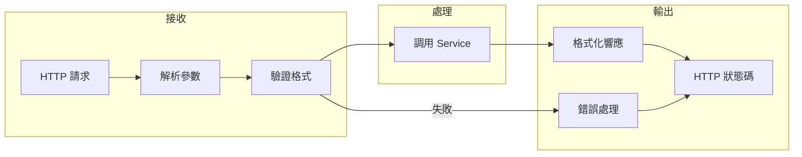

# 2.5.2 前後端溝通的層——接口層

## 一句話破題

接口層是前後端的"翻譯官"——它把 HTTP 請求轉換成業務層能理解的參數，把業務層的結果轉換成標準的 HTTP 響應。

## 接口層的職責邊界



| 應該做 | 不應該做 |
|--------|----------|
| 解析請求參數 | 實現業務邏輯 |
| 驗證參數格式 | 直接操作數據庫 |
| 調用 Service 層 | 處理複雜業務規則 |
| 格式化響應數據 | 跨多個實體的操作 |
| 處理 HTTP 錯誤 | 發送郵件等副作用 |

## Next.js 中的接口層

### API Routes vs Server Actions

| 特性 | API Routes | Server Actions |
|------|-----------|----------------|
| **觸發方式** | HTTP 請求 | 函數調用 |
| **適用場景** | 對外 API、Webhook | 內部數據變更 |
| **文件位置** | `app/api/*/route.ts` | `app/actions/*.ts` |
| **返回格式** | Response 對象 | 任意可序列化數據 |

### API Route 結構

```typescript
// app/api/posts/route.ts
import { NextRequest, NextResponse } from 'next/server'
import { postService } from '@/services/post.service'
import { CreatePostSchema } from '@/schemas/post'

// GET /api/posts
export async function GET(request: NextRequest) {
  const searchParams = request.nextUrl.searchParams
  const page = Number(searchParams.get('page')) || 1
  const pageSize = Number(searchParams.get('pageSize')) || 10
  
  const result = await postService.list({ page, pageSize })
  
  return NextResponse.json({
    code: 200,
    message: '獲取成功',
    data: result,
  })
}

// POST /api/posts
export async function POST(request: NextRequest) {
  const body = await request.json()
  
  // 參數驗證
  const validated = CreatePostSchema.safeParse(body)
  if (!validated.success) {
    return NextResponse.json({
      code: 400,
      message: '參數錯誤',
      errors: validated.error.flatten().fieldErrors,
    }, { status: 400 })
  }
  
  // 調用 Service
  const post = await postService.create(validated.data)
  
  return NextResponse.json({
    code: 200,
    message: '創建成功',
    data: post,
  }, { status: 201 })
}
```

### 動態路由

```typescript
// app/api/posts/[id]/route.ts
import { NextRequest, NextResponse } from 'next/server'
import { postService } from '@/services/post.service'

// GET /api/posts/:id
export async function GET(
  request: NextRequest,
  { params }: { params: { id: string } }
) {
  const post = await postService.findById(params.id)
  
  if (!post) {
    return NextResponse.json({
      code: 404,
      message: '文章不存在',
    }, { status: 404 })
  }
  
  return NextResponse.json({
    code: 200,
    data: post,
  })
}

// DELETE /api/posts/:id
export async function DELETE(
  request: NextRequest,
  { params }: { params: { id: string } }
) {
  await postService.delete(params.id)
  
  return NextResponse.json({
    code: 200,
    message: '刪除成功',
  })
}
```

## 統一錯誤處理

### 自定義錯誤類

```typescript
// lib/errors.ts
export class AppError extends Error {
  constructor(
    public code: number,
    public message: string,
    public status: number = 400
  ) {
    super(message)
  }
}

export class NotFoundError extends AppError {
  constructor(message = '資源不存在') {
    super(404, message, 404)
  }
}

export class UnauthorizedError extends AppError {
  constructor(message = '未授權') {
    super(401, message, 401)
  }
}

export class ForbiddenError extends AppError {
  constructor(message = '無權限') {
    super(403, message, 403)
  }
}
```

### 錯誤處理包裝器

```typescript
// lib/api-handler.ts
import { NextRequest, NextResponse } from 'next/server'
import { AppError } from './errors'

type Handler = (request: NextRequest, context?: any) => Promise<NextResponse>

export function withErrorHandler(handler: Handler): Handler {
  return async (request, context) => {
    try {
      return await handler(request, context)
    } catch (error) {
      console.error('API Error:', error)
      
      if (error instanceof AppError) {
        return NextResponse.json({
          code: error.code,
          message: error.message,
        }, { status: error.status })
      }
      
      return NextResponse.json({
        code: 500,
        message: '服務器內部錯誤',
      }, { status: 500 })
    }
  }
}
```

### 使用錯誤處理

```typescript
// app/api/posts/[id]/route.ts
import { withErrorHandler } from '@/lib/api-handler'
import { NotFoundError } from '@/lib/errors'

export const GET = withErrorHandler(async (request, { params }) => {
  const post = await postService.findById(params.id)
  
  if (!post) {
    throw new NotFoundError('文章不存在')
  }
  
  return NextResponse.json({ code: 200, data: post })
})
```

## 請求驗證

### 使用 Zod 驗證

```typescript
// schemas/post.ts
import { z } from 'zod'

export const CreatePostSchema = z.object({
  title: z.string().min(1, '標題不能爲空').max(100, '標題最多 100 字'),
  content: z.string().min(10, '內容至少 10 個字符'),
  tags: z.array(z.string()).optional(),
  status: z.enum(['draft', 'published']).default('draft'),
})

export const UpdatePostSchema = CreatePostSchema.partial()

export const ListPostsSchema = z.object({
  page: z.coerce.number().min(1).default(1),
  pageSize: z.coerce.number().min(1).max(100).default(10),
  status: z.enum(['draft', 'published']).optional(),
})
```

### 驗證查詢參數

```typescript
// app/api/posts/route.ts
export async function GET(request: NextRequest) {
  const searchParams = Object.fromEntries(request.nextUrl.searchParams)
  
  const validated = ListPostsSchema.safeParse(searchParams)
  if (!validated.success) {
    return NextResponse.json({
      code: 400,
      message: '參數錯誤',
      errors: validated.error.flatten().fieldErrors,
    }, { status: 400 })
  }
  
  const result = await postService.list(validated.data)
  return NextResponse.json({ code: 200, data: result })
}
```

## 認證中間件

```typescript
// lib/auth-middleware.ts
import { getServerSession } from 'next-auth'
import { NextRequest, NextResponse } from 'next/server'
import { authOptions } from '@/lib/auth'

export async function withAuth(
  request: NextRequest,
  handler: (request: NextRequest, user: User) => Promise<NextResponse>
) {
  const session = await getServerSession(authOptions)
  
  if (!session?.user) {
    return NextResponse.json({
      code: 401,
      message: '請先登錄',
    }, { status: 401 })
  }
  
  return handler(request, session.user)
}
```

## 覺知：接口層常見問題

### 1. 在接口層寫業務邏輯

```typescript
// ❌ 業務邏輯不應該在 route.ts 裏
export async function POST(request: NextRequest) {
  const body = await request.json()
  
  // 這些應該在 Service 層
  const existingUser = await prisma.user.findUnique({ ... })
  if (existingUser) { ... }
  const hashedPassword = await bcrypt.hash(body.password, 10)
  const user = await prisma.user.create({ ... })
  await sendWelcomeEmail(user.email)
  
  return NextResponse.json({ ... })
}

// ✅ 接口層只做轉發
export async function POST(request: NextRequest) {
  const body = await request.json()
  const validated = CreateUserSchema.safeParse(body)
  if (!validated.success) { ... }
  
  const user = await userService.register(validated.data)
  
  return NextResponse.json({ code: 200, data: user })
}
```

### 2. 狀態碼使用不當

```typescript
// ❌ 所有響應都用 200
return NextResponse.json({ code: 404, message: '不存在' })  // HTTP 200

// ✅ HTTP 狀態碼和業務碼對應
return NextResponse.json(
  { code: 404, message: '不存在' },
  { status: 404 }  // HTTP 404
)
```

### 3. 響應格式不統一

```typescript
// ❌ 各種格式混用
return NextResponse.json({ success: true, data: user })
return NextResponse.json({ error: 'Not found' })
return NextResponse.json(user)

// ✅ 統一格式
return NextResponse.json({ code: 200, message: '成功', data: user })
return NextResponse.json({ code: 404, message: '不存在' })
```

## 本節小結

| 原則 | 說明 |
|------|------|
| **只做轉發** | 接口層不實現業務邏輯 |
| **驗證前置** | 先驗證參數，再調用 Service |
| **格式統一** | 響應格式和錯誤處理保持一致 |
| **狀態碼準確** | HTTP 狀態碼要反映真實情況 |
