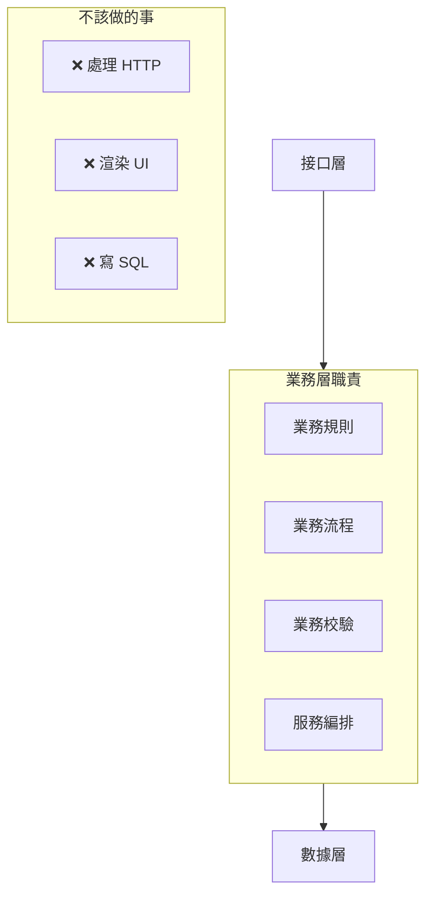
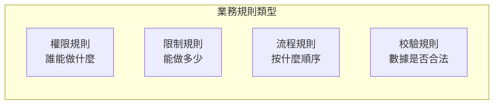
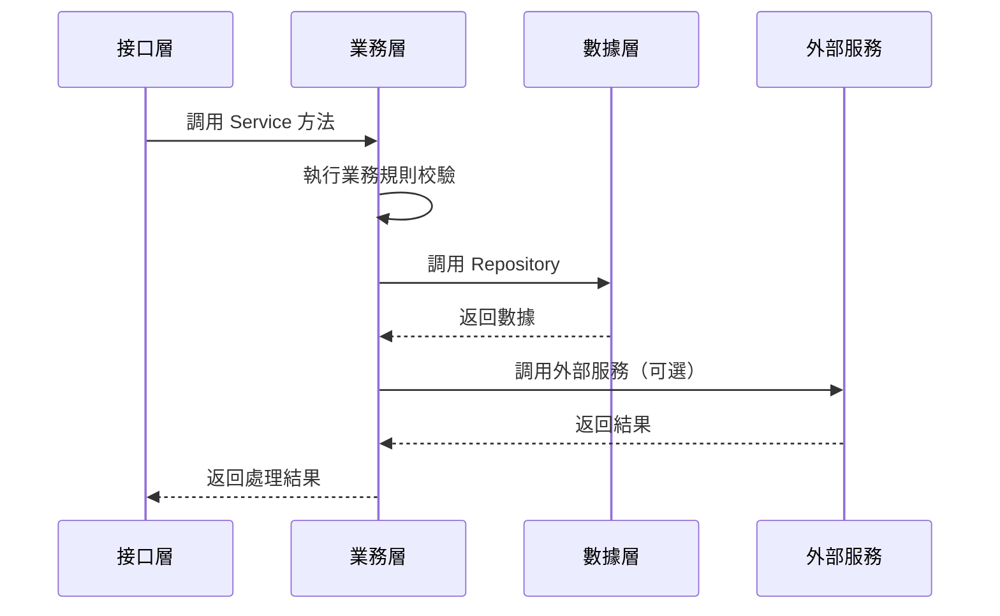

# 2.5.3 處理複雜業務的層——業務層

## 一句話破題

業務層是應用的"大腦"——它封裝了所有業務規則和核心邏輯，不關心數據怎麼存、界面怎麼展示，只關心"業務應該怎麼做"。

## 業務層的職責邊界



| 應該做 | 不應該做 |
|--------|----------|
| 實現業務規則 | 處理 HTTP 請求/響應 |
| 業務數據校驗 | 直接寫 Prisma 查詢 |
| 編排多個數據操作 | 渲染 UI 組件 |
| 調用外部服務 | 處理路由邏輯 |

## Service 的基本結構

### 文件組織

```
services/
├── auth.service.ts      # 認證相關
├── user.service.ts      # 用戶相關
├── post.service.ts      # 文章相關
└── notification.service.ts  # 通知相關
```

### 基本模式

```typescript
// services/post.service.ts
import { postRepository } from '@/repositories/post.repository'
import { userRepository } from '@/repositories/user.repository'
import { NotFoundError, ForbiddenError } from '@/lib/errors'
import type { CreatePostInput, UpdatePostInput } from '@/types/post'

export const postService = {
  // 獲取文章列表
  async list(params: { page: number; pageSize: number; authorId?: string }) {
    return postRepository.findMany(params)
  },
  
  // 獲取單篇文章
  async findById(id: string) {
    const post = await postRepository.findById(id)
    if (!post) {
      throw new NotFoundError('文章不存在')
    }
    return post
  },
  
  // 創建文章
  async create(input: CreatePostInput, authorId: string) {
    // 業務規則：檢查用戶是否可以發佈
    const user = await userRepository.findById(authorId)
    if (user.status === 'banned') {
      throw new ForbiddenError('賬號已被禁止發佈')
    }
    
    // 業務規則：免費用戶每天限 3 篇
    if (user.plan === 'free') {
      const todayCount = await postRepository.countTodayByAuthor(authorId)
      if (todayCount >= 3) {
        throw new ForbiddenError('今日發佈已達上限')
      }
    }
    
    return postRepository.create({ ...input, authorId })
  },
  
  // 更新文章
  async update(id: string, input: UpdatePostInput, userId: string) {
    const post = await this.findById(id)
    
    // 業務規則：只能編輯自己的文章
    if (post.authorId !== userId) {
      throw new ForbiddenError('無權編輯此文章')
    }
    
    return postRepository.update(id, input)
  },
  
  // 刪除文章
  async delete(id: string, userId: string) {
    const post = await this.findById(id)
    
    if (post.authorId !== userId) {
      throw new ForbiddenError('無權刪除此文章')
    }
    
    return postRepository.delete(id)
  },
}
```

## 業務規則的封裝

### 規則分類



### 權限規則示例

```typescript
// services/post.service.ts
async publish(postId: string, userId: string) {
  const post = await postRepository.findById(postId)
  
  // 權限規則 1：文章必須存在
  if (!post) {
    throw new NotFoundError()
  }
  
  // 權限規則 2：只有作者能發佈
  if (post.authorId !== userId) {
    throw new ForbiddenError('只有作者能發佈文章')
  }
  
  // 權限規則 3：草稿才能發佈
  if (post.status !== 'draft') {
    throw new ForbiddenError('只有草稿可以發佈')
  }
  
  return postRepository.update(postId, { 
    status: 'published',
    publishedAt: new Date(),
  })
}
```

### 限制規則示例

```typescript
// services/user.service.ts
async uploadAvatar(userId: string, file: File) {
  const user = await userRepository.findById(userId)
  
  // 限制規則 1：文件大小
  const maxSize = user.plan === 'pro' ? 10 * 1024 * 1024 : 2 * 1024 * 1024
  if (file.size > maxSize) {
    throw new ForbiddenError(`文件大小不能超過 ${maxSize / 1024 / 1024}MB`)
  }
  
  // 限制規則 2：文件類型
  const allowedTypes = ['image/jpeg', 'image/png', 'image/webp']
  if (!allowedTypes.includes(file.type)) {
    throw new ForbiddenError('只支持 JPG、PNG、WebP 格式')
  }
  
  // 上傳邏輯...
}
```

## 服務編排

當一個操作涉及多個數據實體時，Service 層負責編排：

```typescript
// services/order.service.ts
async createOrder(input: CreateOrderInput, userId: string) {
  // 1. 校驗用戶
  const user = await userRepository.findById(userId)
  if (!user) throw new NotFoundError('用戶不存在')
  
  // 2. 校驗商品庫存
  const product = await productRepository.findById(input.productId)
  if (!product) throw new NotFoundError('商品不存在')
  if (product.stock < input.quantity) {
    throw new ForbiddenError('庫存不足')
  }
  
  // 3. 計算價格（應用優惠等業務規則）
  const totalPrice = this.calculatePrice(product, input.quantity, input.couponCode)
  
  // 4. 創建訂單（事務）
  return prisma.$transaction(async (tx) => {
    // 扣減庫存
    await productRepository.decreaseStock(tx, input.productId, input.quantity)
    
    // 創建訂單
    const order = await orderRepository.create(tx, {
      userId,
      productId: input.productId,
      quantity: input.quantity,
      totalPrice,
    })
    
    // 發送通知
    await notificationService.sendOrderCreated(user.email, order)
    
    return order
  })
}
```

## 與其他層的交互



## 覺知：業務層常見問題

### 1. Service 變成"透傳層"

```typescript
// ❌ 沒有業務邏輯，只是轉發
async findById(id: string) {
  return postRepository.findById(id)
}

// ✅ 應該包含業務處理
async findById(id: string) {
  const post = await postRepository.findById(id)
  if (!post) throw new NotFoundError()
  
  // 業務邏輯：增加瀏覽量
  await postRepository.incrementViewCount(id)
  
  return post
}
```

### 2. 在 Service 裏寫 Prisma 查詢

```typescript
// ❌ 數據訪問應該在 Repository
async list() {
  return prisma.post.findMany({
    where: { status: 'published' },
    include: { author: true },
  })
}

// ✅ 調用 Repository
async list() {
  return postRepository.findPublished()
}
```

### 3. 業務規則分散在各處

```typescript
// ❌ 同一個規則在多處重複
// page.tsx 裏
if (post.authorId !== userId) { ... }
// route.ts 裏
if (post.authorId !== userId) { ... }

// ✅ 規則集中在 Service
// service.ts
async checkOwnership(postId: string, userId: string) {
  const post = await this.findById(postId)
  if (post.authorId !== userId) {
    throw new ForbiddenError()
  }
  return post
}
```

## 本節小結

| 原則 | 說明 |
|------|------|
| **規則集中** | 所有業務規則寫在 Service 層 |
| **服務編排** | 跨實體操作由 Service 協調 |
| **不碰數據庫** | 數據操作委託給 Repository |
| **不處理 HTTP** | HTTP 相關邏輯在接口層 |
