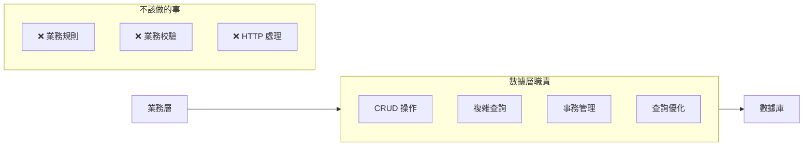

# 2.5.4 和數據庫打交道的層——數據層

## 一句話破題

數據層是應用與數據庫之間的"橋樑"——它封裝了所有數據訪問邏輯，讓上層不需要關心數據是怎麼存、怎麼取的。

## 數據層的職責邊界



| 應該做 | 不應該做 |
|--------|----------|
| 數據的增刪改查 | 業務邏輯判斷 |
| 複雜 SQL/查詢 | 權限校驗 |
| 事務控制 | 發送通知 |
| 數據轉換 | 調用外部服務 |

## Repository 模式

### 基本結構

```typescript
// repositories/post.repository.ts
import { prisma } from '@/lib/prisma'
import type { Prisma } from '@prisma/client'

export const postRepository = {
  // 基礎 CRUD
  async findById(id: string) {
    return prisma.post.findUnique({
      where: { id },
      include: { author: true, tags: true },
    })
  },
  
  async findMany(params: {
    page: number
    pageSize: number
    authorId?: string
    status?: string
  }) {
    const { page, pageSize, authorId, status } = params
    
    const where: Prisma.PostWhereInput = {}
    if (authorId) where.authorId = authorId
    if (status) where.status = status
    
    const [posts, total] = await Promise.all([
      prisma.post.findMany({
        where,
        skip: (page - 1) * pageSize,
        take: pageSize,
        orderBy: { createdAt: 'desc' },
        include: { author: true },
      }),
      prisma.post.count({ where }),
    ])
    
    return { posts, total, page, pageSize }
  },
  
  async create(data: Prisma.PostCreateInput) {
    return prisma.post.create({
      data,
      include: { author: true },
    })
  },
  
  async update(id: string, data: Prisma.PostUpdateInput) {
    return prisma.post.update({
      where: { id },
      data,
      include: { author: true },
    })
  },
  
  async delete(id: string) {
    return prisma.post.delete({ where: { id } })
  },
}
```

### 業務查詢方法

```typescript
// repositories/post.repository.ts
export const postRepository = {
  // ...基礎 CRUD
  
  // 業務相關的查詢
  async findPublished() {
    return prisma.post.findMany({
      where: { status: 'published' },
      orderBy: { publishedAt: 'desc' },
    })
  },
  
  async findByAuthor(authorId: string) {
    return prisma.post.findMany({
      where: { authorId },
      orderBy: { createdAt: 'desc' },
    })
  },
  
  async countTodayByAuthor(authorId: string) {
    const today = new Date()
    today.setHours(0, 0, 0, 0)
    
    return prisma.post.count({
      where: {
        authorId,
        createdAt: { gte: today },
      },
    })
  },
  
  async incrementViewCount(id: string) {
    return prisma.post.update({
      where: { id },
      data: { viewCount: { increment: 1 } },
    })
  },
  
  async findWithRelations(id: string) {
    return prisma.post.findUnique({
      where: { id },
      include: {
        author: true,
        tags: true,
        comments: {
          include: { author: true },
          orderBy: { createdAt: 'desc' },
        },
      },
    })
  },
}
```

## 事務處理

### 簡單事務

```typescript
// repositories/order.repository.ts
async createWithItems(
  orderData: Prisma.OrderCreateInput,
  items: Prisma.OrderItemCreateManyInput[]
) {
  return prisma.$transaction(async (tx) => {
    const order = await tx.order.create({ data: orderData })
    
    await tx.orderItem.createMany({
      data: items.map(item => ({ ...item, orderId: order.id })),
    })
    
    return order
  })
}
```

### 帶事務參數的方法

```typescript
// repositories/product.repository.ts
async decreaseStock(
  tx: Prisma.TransactionClient,
  productId: string,
  quantity: number
) {
  return tx.product.update({
    where: { id: productId },
    data: { stock: { decrement: quantity } },
  })
}

// 使用
await prisma.$transaction(async (tx) => {
  await productRepository.decreaseStock(tx, productId, quantity)
  await orderRepository.create(tx, orderData)
})
```

## 複雜查詢

### 關聯查詢

```typescript
async findPostsWithStats(authorId: string) {
  return prisma.post.findMany({
    where: { authorId },
    include: {
      _count: {
        select: {
          comments: true,
          likes: true,
        },
      },
    },
  })
}
```

### 聚合查詢

```typescript
async getAuthorStats(authorId: string) {
  return prisma.post.aggregate({
    where: { authorId },
    _count: { id: true },
    _sum: { viewCount: true },
    _avg: { viewCount: true },
  })
}
```

### 分組查詢

```typescript
async getPostCountByStatus(authorId: string) {
  return prisma.post.groupBy({
    by: ['status'],
    where: { authorId },
    _count: { id: true },
  })
}
```

## 數據轉換

```typescript
// repositories/user.repository.ts
import type { User } from '@prisma/client'
import type { UserDTO } from '@/types/user'

function toDTO(user: User): UserDTO {
  return {
    id: user.id,
    name: user.name,
    email: user.email,
    avatar: user.avatar,
    createdAt: user.createdAt.toISOString(),
    // 不返回密碼等敏感字段
  }
}

export const userRepository = {
  async findById(id: string): Promise<UserDTO | null> {
    const user = await prisma.user.findUnique({ where: { id } })
    return user ? toDTO(user) : null
  },
}
```

## 覺知：數據層常見問題

### 1. 在 Repository 裏寫業務邏輯

```typescript
// ❌ 權限判斷是業務邏輯
async findById(id: string, userId: string) {
  const post = await prisma.post.findUnique({ where: { id } })
  if (post.authorId !== userId) {
    throw new Error('無權限')  // 這是業務邏輯！
  }
  return post
}

// ✅ Repository 只負責取數據
async findById(id: string) {
  return prisma.post.findUnique({ where: { id } })
}
// 權限判斷放在 Service 層
```

### 2. 查詢條件硬編碼

```typescript
// ❌ 查詢條件寫死
async findPosts() {
  return prisma.post.findMany({
    where: { status: 'published' },  // 硬編碼
  })
}

// ✅ 通過參數傳入
async findPosts(params: { status?: string }) {
  const where: Prisma.PostWhereInput = {}
  if (params.status) where.status = params.status
  return prisma.post.findMany({ where })
}
```

### 3. N+1 查詢問題

```typescript
// ❌ 循環中查詢，導致 N+1
const posts = await prisma.post.findMany()
for (const post of posts) {
  post.author = await prisma.user.findUnique({
    where: { id: post.authorId }
  })
}

// ✅ 使用 include 一次查詢
const posts = await prisma.post.findMany({
  include: { author: true }
})
```

## Prisma 最佳實踐

### 1. 單例模式

```typescript
// lib/prisma.ts
import { PrismaClient } from '@prisma/client'

const globalForPrisma = globalThis as unknown as {
  prisma: PrismaClient | undefined
}

export const prisma = globalForPrisma.prisma ?? new PrismaClient()

if (process.env.NODE_ENV !== 'production') {
  globalForPrisma.prisma = prisma
}
```

### 2. 查詢日誌

```typescript
const prisma = new PrismaClient({
  log: process.env.NODE_ENV === 'development' 
    ? ['query', 'error', 'warn'] 
    : ['error'],
})
```

### 3. 軟刪除

```typescript
// 中間件實現軟刪除
prisma.$use(async (params, next) => {
  if (params.model === 'Post') {
    if (params.action === 'delete') {
      params.action = 'update'
      params.args.data = { deletedAt: new Date() }
    }
    if (params.action === 'findMany') {
      params.args.where = { ...params.args.where, deletedAt: null }
    }
  }
  return next(params)
})
```

## 本節小結

| 原則 | 說明 |
|------|------|
| **只管數據** | Repository 只負責數據訪問 |
| **參數化查詢** | 查詢條件通過參數傳入 |
| **避免 N+1** | 使用 include 關聯查詢 |
| **事務封裝** | 複雜操作使用事務保證一致性 |
