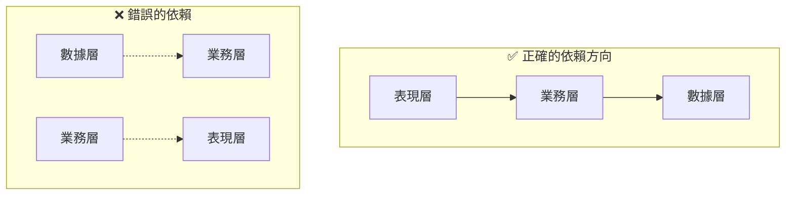

# 2.5.5 層與層如何對話——層間通信

## 一句話破題

層與層之間如何通信決定了代碼的可維護性——通過接口抽象和依賴注入，可以讓各層之間松耦合，便於測試和替換。

## 依賴關係原則



**核心原則**：上層依賴下層，下層不依賴上層。

| 層級 | 可以依賴 | 不可依賴 |
|------|----------|----------|
| 表現層 | 業務層 | - |
| 業務層 | 數據層 | 表現層 |
| 數據層 | 無 | 業務層、表現層 |

## 接口抽象

### 定義接口

```typescript
// types/repositories.ts
export interface IPostRepository {
  findById(id: string): Promise<Post | null>
  findMany(params: FindManyParams): Promise<PaginatedResult<Post>>
  create(data: CreatePostInput): Promise<Post>
  update(id: string, data: UpdatePostInput): Promise<Post>
  delete(id: string): Promise<void>
}

export interface IUserRepository {
  findById(id: string): Promise<User | null>
  findByEmail(email: string): Promise<User | null>
  create(data: CreateUserInput): Promise<User>
}
```

### 實現接口

```typescript
// repositories/post.repository.ts
import type { IPostRepository } from '@/types/repositories'

export const postRepository: IPostRepository = {
  async findById(id) {
    return prisma.post.findUnique({ where: { id } })
  },
  
  async findMany(params) {
    // 實現...
  },
  
  async create(data) {
    return prisma.post.create({ data })
  },
  
  async update(id, data) {
    return prisma.post.update({ where: { id }, data })
  },
  
  async delete(id) {
    await prisma.post.delete({ where: { id } })
  },
}
```

## 依賴注入

### 簡單方式：直接導入

```typescript
// services/post.service.ts
import { postRepository } from '@/repositories/post.repository'

export const postService = {
  async findById(id: string) {
    return postRepository.findById(id)
  },
}
```

適用於：小型項目、快速開發。

### 工廠模式

```typescript
// services/post.service.ts
import type { IPostRepository } from '@/types/repositories'

export function createPostService(repo: IPostRepository) {
  return {
    async findById(id: string) {
      const post = await repo.findById(id)
      if (!post) throw new NotFoundError()
      return post
    },
    
    async create(input: CreatePostInput, authorId: string) {
      return repo.create({ ...input, authorId })
    },
  }
}

// 創建實例
import { postRepository } from '@/repositories/post.repository'
export const postService = createPostService(postRepository)
```

適用於：需要測試、需要替換實現。

### 依賴容器

```typescript
// lib/container.ts
import { postRepository } from '@/repositories/post.repository'
import { userRepository } from '@/repositories/user.repository'
import { createPostService } from '@/services/post.service'
import { createUserService } from '@/services/user.service'

// 創建所有服務實例
export const container = {
  repositories: {
    post: postRepository,
    user: userRepository,
  },
  services: {
    post: createPostService(postRepository),
    user: createUserService(userRepository),
  },
}

// 使用
import { container } from '@/lib/container'
const post = await container.services.post.findById(id)
```

## 測試中的依賴替換

### Mock Repository

```typescript
// tests/post.service.test.ts
import { createPostService } from '@/services/post.service'

const mockPostRepository = {
  findById: jest.fn(),
  findMany: jest.fn(),
  create: jest.fn(),
  update: jest.fn(),
  delete: jest.fn(),
}

const postService = createPostService(mockPostRepository)

describe('PostService', () => {
  beforeEach(() => {
    jest.clearAllMocks()
  })
  
  describe('findById', () => {
    it('should return post when found', async () => {
      const mockPost = { id: '1', title: 'Test' }
      mockPostRepository.findById.mockResolvedValue(mockPost)
      
      const result = await postService.findById('1')
      
      expect(result).toEqual(mockPost)
      expect(mockPostRepository.findById).toHaveBeenCalledWith('1')
    })
    
    it('should throw NotFoundError when not found', async () => {
      mockPostRepository.findById.mockResolvedValue(null)
      
      await expect(postService.findById('1')).rejects.toThrow(NotFoundError)
    })
  })
})
```

### 使用真實數據庫測試

```typescript
// tests/integration/post.repository.test.ts
import { postRepository } from '@/repositories/post.repository'
import { prisma } from '@/lib/prisma'

describe('PostRepository Integration', () => {
  beforeEach(async () => {
    await prisma.post.deleteMany()
  })
  
  afterAll(async () => {
    await prisma.$disconnect()
  })
  
  it('should create and find post', async () => {
    const created = await postRepository.create({
      title: 'Test',
      content: 'Content',
      authorId: 'user-1',
    })
    
    const found = await postRepository.findById(created.id)
    
    expect(found).toMatchObject({
      title: 'Test',
      content: 'Content',
    })
  })
})
```

## 跨層數據傳遞

### 使用 DTO

```typescript
// types/dto.ts
export interface PostDTO {
  id: string
  title: string
  content: string
  author: {
    id: string
    name: string
  }
  createdAt: string
}

// 數據層返回原始數據
// 業務層轉換爲 DTO
// 表現層使用 DTO

// services/post.service.ts
function toDTO(post: PostWithAuthor): PostDTO {
  return {
    id: post.id,
    title: post.title,
    content: post.content,
    author: {
      id: post.author.id,
      name: post.author.name,
    },
    createdAt: post.createdAt.toISOString(),
  }
}

export const postService = {
  async findById(id: string): Promise<PostDTO> {
    const post = await postRepository.findWithAuthor(id)
    if (!post) throw new NotFoundError()
    return toDTO(post)
  },
}
```

## 覺知：層間通信常見問題

### 1. 循環依賴

```typescript
// ❌ Service A 依賴 Service B，B 又依賴 A
// user.service.ts
import { postService } from './post.service'
// post.service.ts
import { userService } from './user.service'

// ✅ 通過事件或回調解耦
// 或者提取公共邏輯到新的 Service
```

### 2. 跨層直接調用

```typescript
// ❌ 表現層直接調用數據層
// page.tsx
const post = await prisma.post.findUnique({ where: { id } })

// ✅ 通過業務層
// page.tsx
const post = await postService.findById(id)
```

### 3. 暴露內部實現

```typescript
// ❌ 返回 Prisma 類型，暴露了 ORM 細節
async findById(id: string): Promise<Prisma.Post> { }

// ✅ 返回業務類型
async findById(id: string): Promise<Post> { }
```

## 本節小結

| 原則 | 說明 |
|------|------|
| **單向依賴** | 上層依賴下層，不可反向 |
| **接口抽象** | 通過接口定義層間契約 |
| **依賴注入** | 運行時傳入依賴，便於測試 |
| **DTO 傳遞** | 跨層使用 DTO，隱藏內部實現 |
