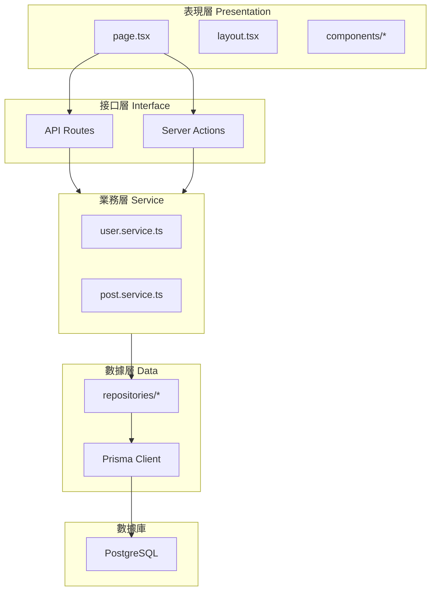

# 2.5 代碼爲什麼會越寫越亂——架構分層

## 認知重構

代碼越寫越亂的根本原因是：**職責混雜**。頁面組件裏寫數據庫查詢，API 路由裏寫業務邏輯，到處都是重複代碼。分層架構的目的就是**讓每一層只做一件事**。

```
亂的代碼：page.tsx 裏既有 UI、又有業務邏輯、還有數據庫操作
好的代碼：page.tsx 只管 UI，邏輯交給 service，數據交給 repository
```

## 分層架構全景



## 各層職責速覽

| 層級 | 職責 | 關鍵文件 |
|------|------|----------|
| **表現層** | UI 渲染、用戶交互 | `page.tsx`, `components/*` |
| **接口層** | 請求處理、參數校驗 | `route.ts`, `actions.ts` |
| **業務層** | 核心邏輯、業務規則 | `*.service.ts` |
| **數據層** | 數據訪問、ORM 操作 | `*.repository.ts`, Prisma |

## 爲什麼要分層？

### 不分層的代碼

```typescript
// app/posts/page.tsx - 一個文件幹所有事
export default async function PostsPage() {
  // UI 關心的
  const session = await getServerSession()
  
  // 業務邏輯
  if (!session) {
    redirect('/login')
  }
  
  // 數據訪問
  const posts = await prisma.post.findMany({
    where: { authorId: session.user.id },
    orderBy: { createdAt: 'desc' },
    include: { author: true, tags: true },
  })
  
  // 更多業務邏輯
  const publishedPosts = posts.filter(p => p.status === 'published')
  const draftPosts = posts.filter(p => p.status === 'draft')
  
  return (
    <div>
      <h1>我的文章</h1>
      {/* 很長的 JSX */}
    </div>
  )
}
```

**問題**：
- 換數據庫要改頁面文件
- 業務邏輯無法複用
- 難以測試
- AI 生成的代碼到處都是

### 分層後的代碼

```typescript
// app/posts/page.tsx - 只關心 UI
export default async function PostsPage() {
  const { publishedPosts, draftPosts } = await postService.getMyPosts()
  
  return (
    <div>
      <PostTabs published={publishedPosts} drafts={draftPosts} />
    </div>
  )
}

// services/post.service.ts - 只關心業務邏輯
export const postService = {
  async getMyPosts() {
    const session = await authService.requireAuth()
    const posts = await postRepository.findByAuthor(session.user.id)
    
    return {
      publishedPosts: posts.filter(p => p.status === 'published'),
      draftPosts: posts.filter(p => p.status === 'draft'),
    }
  }
}

// repositories/post.repository.ts - 只關心數據訪問
export const postRepository = {
  async findByAuthor(authorId: string) {
    return prisma.post.findMany({
      where: { authorId },
      orderBy: { createdAt: 'desc' },
      include: { author: true, tags: true },
    })
  }
}
```

**好處**：
- 每層職責單一，易於理解
- 業務邏輯可複用
- 易於測試（Mock 數據層即可）
- AI 生成的代碼有固定的放置位置

## 目錄結構建議

```
src/
├── app/                    # 表現層 + 接口層
│   ├── (marketing)/        # 營銷頁面
│   ├── (dashboard)/        # 後臺頁面
│   ├── api/                # API Routes
│   └── actions/            # Server Actions（可選單獨放）
│
├── components/             # UI 組件
│   ├── ui/                 # 基礎 UI 組件
│   └── features/           # 業務組件
│
├── services/               # 業務層
│   ├── auth.service.ts
│   ├── user.service.ts
│   └── post.service.ts
│
├── repositories/           # 數據層
│   ├── user.repository.ts
│   └── post.repository.ts
│
├── lib/                    # 工具函數
│   ├── prisma.ts
│   └── utils.ts
│
└── types/                  # 類型定義
    ├── user.ts
    └── post.ts
```

## 本章導航

- **2.5.1 表現層**：頁面組件與路由管理
- **2.5.2 接口層**：API 路由與 HTTP 處理
- **2.5.3 業務層**：核心邏輯與規則封裝
- **2.5.4 數據層**：ORM 與數據庫交互
- **2.5.5 層間通信**：依賴注入與接口抽象
