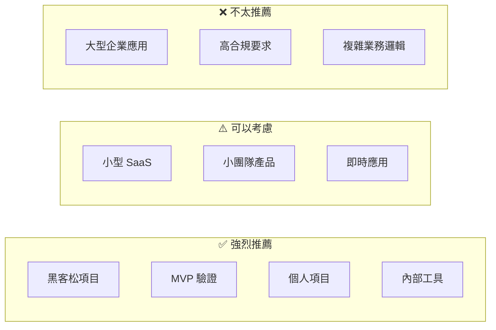
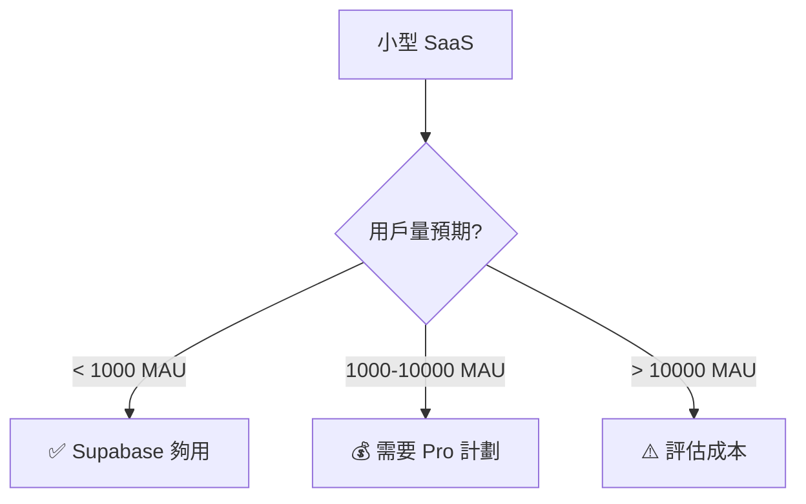
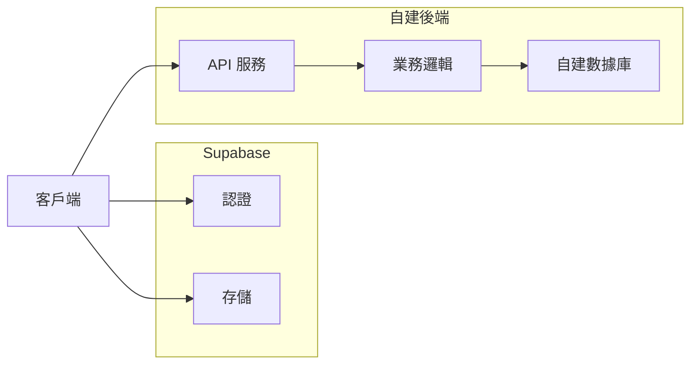

# 2.6.2 適用場景：快速原型 vs 生產環境

## 一句話破題

Supabase 在"快速上線"場景下無可匹敵，但到了"深度定製"階段就要慎重考慮了。

## 場景決策矩陣



## ✅ 強烈推薦的場景

### 1. 黑客松 / 48小時比賽

```typescript
// 10 分鐘搭建完整後端
// 1. 創建項目（supabase.com）
// 2. 建表（可視化界面）
// 3. 寫代碼

const { data } = await supabase
  .from('submissions')
  .insert({ name, idea, team_id })
  .select()

// 完成！不用配置數據庫、不用寫 API
```

**爲什麼適合**：時間緊迫，驗證想法比代碼質量重要。

### 2. MVP 產品驗證

| 階段 | 用 Supabase | 傳統方式 |
|------|-------------|----------|
| 搭建後端 | 1 天 | 1-2 周 |
| 用戶認證 | 30 分鐘 | 2-3 天 |
| 文件上傳 | 1 小時 | 1-2 天 |
| **總計** | **1-2 天** | **2-3 周** |

**核心價值**：快速驗證產品假設，失敗了損失最小。

### 3. 個人項目 / Side Project

```typescript
// 個人博客、筆記應用、TODO 工具等
// 免費額度完全夠用：
// - 500MB 數據庫
// - 1GB 文件存儲
// - 200 併發連接
```

### 4. 內部工具

- 後臺管理系統
- 數據看板
- 團隊協作工具

**優勢**：用戶量可控，免費額度夠用，快速迭代。

## ⚠️ 可以考慮的場景

### 小型 SaaS 產品



### 即時協作應用

```typescript
// Supabase Realtime 開箱即用
const channel = supabase
  .channel('room:123')
  .on('broadcast', { event: 'cursor' }, (payload) => {
    updateCursor(payload.userId, payload.position)
  })
  .subscribe()

// 廣播鼠標位置
channel.send({
  type: 'broadcast',
  event: 'cursor',
  payload: { userId, position },
})
```

**注意**：免費版限制 200 併發連接。

## ❌ 不太推薦的場景

### 1. 複雜業務邏輯

```typescript
// ❌ 複雜業務規則難以用 RLS 表達
// 例如：多級審批、動態權限、複雜計費規則

// 這種邏輯放在 Supabase RLS 裏會很痛苦
// 建議使用傳統後端 + 業務層
```

### 2. 高合規要求

| 要求 | Supabase 支持 |
|------|---------------|
| 數據本地化 | ⚠️ 有限（部分區域） |
| 審計日誌 | ⚠️ 需要額外配置 |
| HIPAA | ❌ 需要企業版 |
| PCI DSS | ❌ 不支持 |

### 3. 已有成熟基礎設施

```
如果你已經有：
- 運維團隊
- CI/CD 流程
- 監控告警
- 自建認證系統

那麼 Supabase 的價值就沒那麼大了
```

## 混合方案

### Supabase + 自建後端



```typescript
// 只用 Supabase 的 Auth 和 Storage
// 業務邏輯走自建後端

// 1. 用 Supabase 登錄
const { data: { session } } = await supabase.auth.getSession()

// 2. 調用自建 API（帶上 token）
const response = await fetch('/api/orders', {
  headers: {
    Authorization: `Bearer ${session?.access_token}`,
  },
})

// 3. 自建後端驗證 Supabase JWT
import { createClient } from '@supabase/supabase-js'
const { data: { user } } = await supabase.auth.getUser(token)
```

## 覺知：場景選擇常見誤區

### 1. "免費就用 Supabase"

```
❌ 錯誤認知：因爲免費所以用
✅ 正確思考：因爲適合場景所以用

即使 Supabase 收費，如果能幫你節省 2 周開發時間，
那也是值得的。
```

### 2. "生產環境不能用 BaaS"

```
❌ 錯誤認知：BaaS 只能做原型
✅ 現實情況：

很多公司用 Supabase 跑生產：
- 用戶量不大的 SaaS
- 內部工具
- 特定模塊（認證、存儲）
```

### 3. "以後肯定要遷移，不如現在自建"

```
❌ 過早優化
✅ YAGNI 原則

如果項目可能失敗，先驗證再優化。
遷移成本 < 驗證失敗的時間成本。
```

## 本節小結

| 場景 | 推薦度 | 理由 |
|------|--------|------|
| 黑客松/MVP | ⭐⭐⭐⭐⭐ | 速度第一 |
| 個人項目 | ⭐⭐⭐⭐⭐ | 免費夠用 |
| 小型 SaaS | ⭐⭐⭐⭐ | 成本可控 |
| 即時應用 | ⭐⭐⭐⭐ | 開箱即用 |
| 複雜業務 | ⭐⭐ | 定製困難 |
| 企業應用 | ⭐ | 合規問題 |
