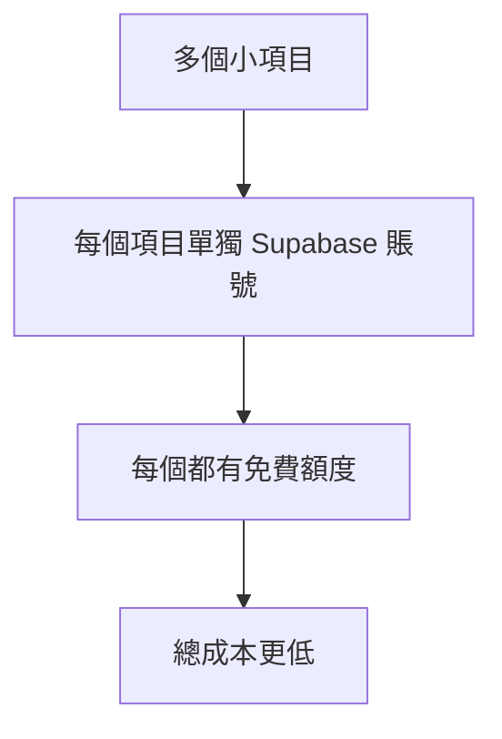

# 2.6.3 成本考量：免費額度與付費計劃

## 一句話破題

Supabase 的免費額度對個人項目綽綽有餘，但一旦上量，成本可能比自建更高——關鍵是算清楚你的使用模式。

## 定價方案對比

### 三檔定價（2024）

| 項目 | Free | Pro ($25/月) | Team ($599/月) |
|------|------|--------------|----------------|
| **數據庫** | 500 MB | 8 GB | 8 GB |
| **文件存儲** | 1 GB | 100 GB | 100 GB |
| **帶寬** | 2 GB | 250 GB | 250 GB |
| **併發連接** | 200 | 500 | 500 |
| **Edge Functions** | 500K 調用 | 2M 調用 | 2M 調用 |
| **Realtime** | 200 併發 | 500 併發 | 500 併發 |
| **暫停策略** | 7 天不活躍 | 永不暫停 | 永不暫停 |

### 超出額度費用

```
數據庫：$0.125/GB/月
存儲：$0.021/GB/月
帶寬：$0.09/GB
Edge Functions：$2/100萬次調用
```

## 成本計算實例

### 場景 1：個人博客

```
月訪問量：5,000 PV
數據庫：50 MB
文件存儲：200 MB
帶寬：1 GB

結論：✅ 免費版完全夠用
費用：$0/月
```

### 場景 2：小型 SaaS

```
月活用戶：500
數據庫：2 GB
文件存儲：20 GB
帶寬：50 GB

方案：Pro 版本
費用：$25/月
```

### 場景 3：中型應用

```
月活用戶：5,000
數據庫：10 GB
文件存儲：100 GB
帶寬：300 GB

計算：
- Pro 基礎：$25
- 數據庫超出 (10-8) × $0.125 = $0.25
- 帶寬超出 (300-250) × $0.09 = $4.5

費用：約 $30/月
```

### 場景 4：高流量應用

```
月活用戶：50,000
數據庫：100 GB
文件存儲：1 TB
帶寬：5 TB

這種情況下，自建可能更划算
需要評估 Team 版本或自託管
```

## 成本優化策略

### 1. 數據庫優化

```sql
-- 定期清理舊數據
DELETE FROM logs WHERE created_at < NOW() - INTERVAL '30 days';

-- 使用合適的數據類型
-- ❌ 不要用 TEXT 存儲短字符串
-- ✅ 使用 VARCHAR(100) 等
```

### 2. 存儲優化

```typescript
// 壓縮圖片後上傳
import imageCompression from 'browser-image-compression'

const compressedFile = await imageCompression(file, {
  maxSizeMB: 0.5,
  maxWidthOrHeight: 1200,
})

await supabase.storage.from('images').upload(path, compressedFile)
```

### 3. 減少帶寬

```typescript
// 只查詢需要的字段
const { data } = await supabase
  .from('posts')
  .select('id, title, summary')  // 不要 select('*')
  .limit(20)

// 使用 CDN 緩存
const { data } = supabase.storage
  .from('images')
  .getPublicUrl('image.jpg', {
    transform: { width: 400, height: 300 },
  })
```

### 4. 利用免費額度



## 與自建方案成本對比

### 自建成本估算

| 組件 | 月費用 |
|------|--------|
| VPS (2核4G) | $10-20 |
| 託管 PostgreSQL | $15-50 |
| S3 存儲 (50GB) | $1-3 |
| 運維時間成本 | $$$（無法估算） |

### 對比結論

```
小項目（< 1000 用戶）：
  Supabase 更划算，省去運維成本

中型項目（1000-10000 用戶）：
  差不多，取決於具體使用模式

大型項目（> 10000 用戶）：
  自建可能更划算，但要考慮運維成本
```

## 隱性成本

### Supabase 的隱性成本

- **學習曲線**：RLS、Realtime 需要時間學習
- **調試困難**：問題排查不如自建透明
- **供應商鎖定**：遷移有成本

### 自建的隱性成本

- **運維時間**：數據庫備份、安全更新
- **故障響應**：半夜數據庫掛了誰來修
- **擴容規劃**：預估容量、調整配置

## 免費版限制警告

### 7 天暫停策略

```
Free 版本：7 天無活動會自動暫停數據庫
- 會丟失數據庫連接
- 需要手動喚醒
- 不適合生產環境

解決方案：
1. 升級 Pro
2. 定時任務保持活躍（不推薦）
3. 自託管 Supabase
```

### 併發連接限制

```
Free：200 併發
Pro：500 併發

超出限制會導致連接失敗
高併發場景需要：
1. 使用連接池
2. 升級到更高版本
3. 考慮自建
```

## 本節小結

| 用戶規模 | 推薦方案 | 月成本 |
|----------|----------|--------|
| 個人項目 | Free | $0 |
| 1-500 MAU | Free/Pro | $0-25 |
| 500-5000 MAU | Pro | $25-50 |
| 5000-50000 MAU | Team/自建 | $100+ |
| 50000+ MAU | 自建 | 視情況 |
