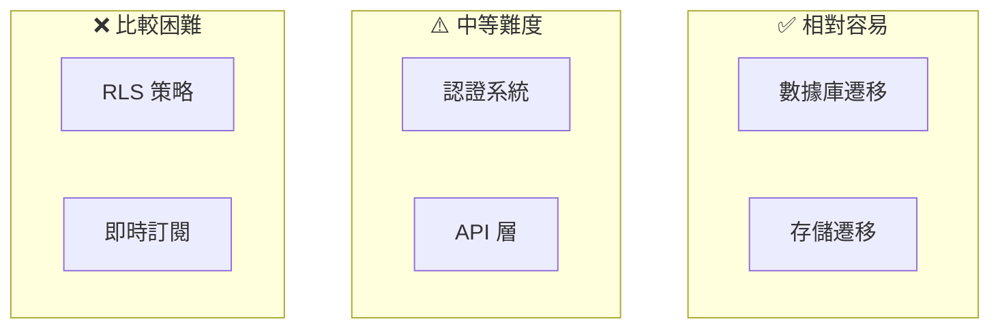
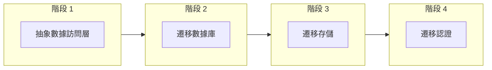

# 2.6.4 遷移策略：從 Supabase 到自建服務

## 一句話破題

Supabase 基於開源技術棧，遷移不是不可能，但需要提前規劃——在代碼設計時就要考慮"可替換性"。

## 遷移難度評估



| 服務 | 遷移難度 | 替代方案 |
|------|----------|----------|
| Database | ⭐⭐ | 標準 PostgreSQL |
| Storage | ⭐⭐ | S3 / 阿里雲 OSS |
| Auth | ⭐⭐⭐ | NextAuth.js / Clerk |
| Realtime | ⭐⭐⭐⭐ | Socket.io / Pusher |
| RLS | ⭐⭐⭐⭐⭐ | 應用層權限控制 |

## 數據庫遷移

### 導出數據

```bash
# 方式 1：Supabase Dashboard 導出
# Settings > Database > Download backup

# 方式 2：使用 pg_dump
pg_dump -h db.xxx.supabase.co \
  -p 5432 \
  -U postgres \
  -d postgres \
  -F c \
  -f backup.dump
```

### 導入到新數據庫

```bash
# 創建新數據庫
createdb -h localhost -U postgres myapp

# 恢復數據
pg_restore -h localhost \
  -U postgres \
  -d myapp \
  backup.dump
```

### 代碼改造

```typescript
// 之前：使用 Supabase 客戶端
const { data } = await supabase.from('posts').select('*')

// 之後：使用 Prisma
const posts = await prisma.post.findMany()

// 或者保持接口一致
// repositories/post.repository.ts
export const postRepository = {
  async findAll() {
    // 只需要改這裏的實現
    return prisma.post.findMany()
  }
}
```

## 存儲遷移

### 導出文件

```typescript
// 列出所有文件
const { data: files } = await supabase.storage
  .from('images')
  .list()

// 批量下載
for (const file of files) {
  const { data } = await supabase.storage
    .from('images')
    .download(file.name)
  
  // 保存到本地或上傳到新存儲
  await uploadToS3(file.name, data)
}
```

### 遷移到 S3

```typescript
// lib/storage.ts
import { S3Client, PutObjectCommand } from '@aws-sdk/client-s3'

const s3 = new S3Client({ region: 'ap-northeast-1' })

export async function uploadFile(key: string, file: Buffer) {
  await s3.send(new PutObjectCommand({
    Bucket: 'my-bucket',
    Key: key,
    Body: file,
  }))
}

export function getPublicUrl(key: string) {
  return `https://my-bucket.s3.amazonaws.com/${key}`
}
```

### 代碼適配

```typescript
// 抽象存儲接口
interface IStorage {
  upload(path: string, file: File): Promise<string>
  getUrl(path: string): string
  delete(path: string): Promise<void>
}

// Supabase 實現
const supabaseStorage: IStorage = {
  async upload(path, file) {
    await supabase.storage.from('bucket').upload(path, file)
    return path
  },
  getUrl(path) {
    return supabase.storage.from('bucket').getPublicUrl(path).data.publicUrl
  },
  async delete(path) {
    await supabase.storage.from('bucket').remove([path])
  },
}

// S3 實現
const s3Storage: IStorage = {
  async upload(path, file) { /* S3 實現 */ },
  getUrl(path) { /* S3 URL */ },
  async delete(path) { /* S3 刪除 */ },
}

// 使用時只依賴接口
export const storage: IStorage = supabaseStorage  // 輕鬆切換
```

## 認證遷移

### 導出用戶數據

```sql
-- 從 Supabase auth.users 導出
SELECT id, email, created_at, raw_user_meta_data
FROM auth.users;
```

### 遷移到 NextAuth.js

```typescript
// 1. 安裝 NextAuth
// pnpm add next-auth @auth/prisma-adapter

// 2. 配置 NextAuth
// app/api/auth/[...nextauth]/route.ts
import NextAuth from 'next-auth'
import { PrismaAdapter } from '@auth/prisma-adapter'
import Google from 'next-auth/providers/google'

export const { handlers, auth } = NextAuth({
  adapter: PrismaAdapter(prisma),
  providers: [Google],
})

// 3. 遷移用戶數據
// 需要重置密碼或讓用戶重新關聯 OAuth
```

### 處理已登錄用戶

```typescript
// 過渡期：同時支持兩套認證
async function getCurrentUser(request: Request) {
  // 先嚐試 Supabase token
  const supabaseUser = await getSupabaseUser(request)
  if (supabaseUser) return supabaseUser
  
  // 再嘗試 NextAuth session
  const session = await auth()
  if (session?.user) return session.user
  
  return null
}
```

## RLS 遷移（最難）

### Supabase RLS

```sql
-- Supabase 的 RLS 策略
CREATE POLICY "users_own_posts" ON posts
  USING (auth.uid() = author_id);
```

### 遷移到應用層

```typescript
// 必須在應用層實現權限控制
// services/post.service.ts
export const postService = {
  async findById(id: string, userId: string) {
    const post = await postRepository.findById(id)
    
    if (!post) throw new NotFoundError()
    
    // 原來 RLS 自動做的，現在要手動做
    if (post.authorId !== userId && post.status !== 'published') {
      throw new ForbiddenError()
    }
    
    return post
  },
  
  async update(id: string, userId: string, data: UpdatePostInput) {
    const post = await postRepository.findById(id)
    
    // 權限檢查
    if (post.authorId !== userId) {
      throw new ForbiddenError()
    }
    
    return postRepository.update(id, data)
  },
}
```

## 漸進式遷移策略



### 階段 1：代碼重構

```typescript
// 不直接使用 Supabase 客戶端
// ❌
const { data } = await supabase.from('posts').select('*')

// ✅ 通過 Repository 抽象
const posts = await postRepository.findAll()
```

### 階段 2：遷移數據庫

```typescript
// 改變 Repository 實現，不改接口
// postRepository 從 Supabase 切換到 Prisma
```

### 階段 3：遷移存儲

```typescript
// 改變 Storage 實現
export const storage: IStorage = s3Storage
```

### 階段 4：遷移認證

```typescript
// 最後遷移認證，影響範圍最大
// 需要通知用戶重新登錄
```

## 覺知：遷移常見問題

### 1. 沒有提前抽象

```typescript
// ❌ 到處直接用 supabase.from()
// 遷移時要改幾十個文件

// ✅ 提前用 Repository 模式
// 遷移時只改一處
```

### 2. 依賴 RLS 的隱式權限

```typescript
// ❌ 前端直接查詢，依賴 RLS 過濾
const { data } = await supabase.from('posts').select('*')

// 遷移後沒有 RLS，會暴露所有數據！

// ✅ 顯式傳遞用戶 ID
const posts = await postService.findByUser(userId)
```

### 3. 低估遷移時間

```
實際遷移時間往往是預估的 2-3 倍

建議：
1. 預留充足時間
2. 先在測試環境完整跑一遍
3. 準備回滾方案
```

## 本節小結

| 遷移項 | 難度 | 建議 |
|--------|------|------|
| **數據庫** | ⭐⭐ | 標準 pg_dump/restore |
| **存儲** | ⭐⭐ | 抽象 Storage 接口 |
| **認證** | ⭐⭐⭐ | 提前規劃過渡期 |
| **RLS** | ⭐⭐⭐⭐⭐ | 應用層重寫權限 |

**核心原則**：在寫代碼時就考慮可替換性，用接口抽象隔離具體實現。
