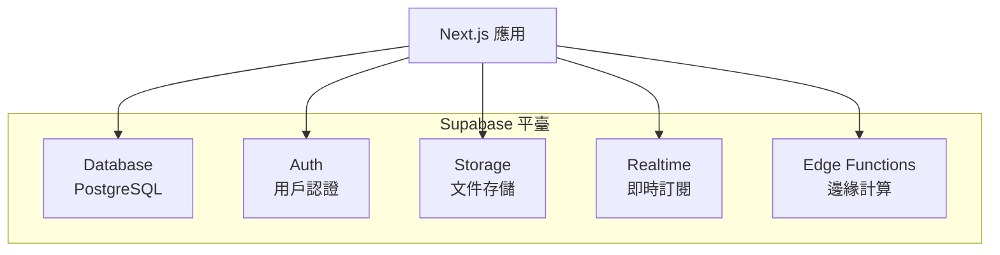
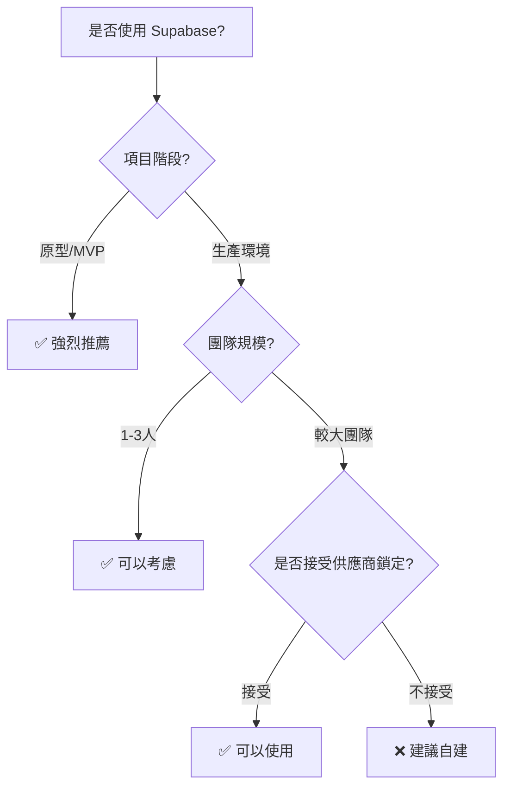

# 2.6 全家桶服務好不好用——Supabase 適用與取捨

## 認知重構

Supabase 自稱"開源的 Firebase 替代品"，提供了數據庫、認證、存儲、即時訂閱等一體化服務。它能讓你快速搭建後端，但"全家桶"也意味着一定程度的綁定。

```
傳統方式：PostgreSQL + NextAuth + S3 + 自建即時服務
Supabase：一個平臺全搞定（但有遷移成本）
```

## Supabase 服務全景



| 服務 | 功能 | 對標 |
|------|------|------|
| **Database** | PostgreSQL 數據庫 | 自建 PostgreSQL |
| **Auth** | 用戶認證、OAuth | NextAuth.js |
| **Storage** | 文件存儲 | 阿里雲 OSS / S3 |
| **Realtime** | 數據變更訂閱 | Socket.io |
| **Edge Functions** | 邊緣函數 | Cloudflare Workers |

## 何時該用 Supabase？



### ✅ 適合使用 Supabase

- **快速原型**：幾分鐘搭建後端
- **黑客松項目**：時間緊迫，一站式解決
- **小團隊**：不想運維數據庫
- **即時功能**：聊天、協作等場景

### ❌ 不太適合

- **高度定製化需求**：複雜業務邏輯
- **嚴格合規要求**：數據必須自主可控
- **已有成熟基礎設施**：遷移成本高
- **預算敏感**：用量大時成本可能更高

## 本章導航

- **2.6.1 Supabase 服務概覽**：數據庫/存儲/認證一體化
- **2.6.2 適用場景**：快速原型 vs 生產環境
- **2.6.3 成本考量**：免費額度與付費計劃
- **2.6.4 遷移策略**：從 Supabase 到自建服務
