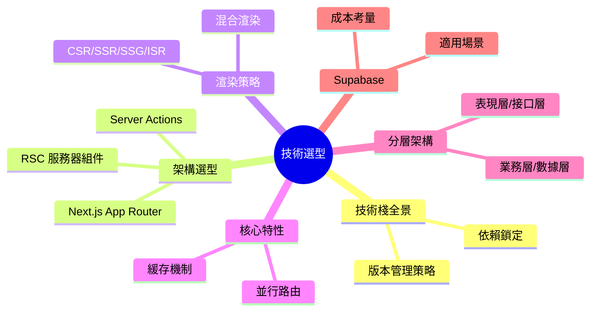

# 2 ｜技術選型與架構藍圖

> **技術選型的本質不是選"最好的"，而是選"最適合的"。**

在 Vibe Coding 時代，技術棧的選擇變得尤爲關鍵——不僅要滿足業務需求，更要讓 AI 能夠高效地幫你寫代碼。一套 AI 擅長、社區活躍、文檔完善的技術棧，能讓你的開發效率提升數倍。

## 本章你將學到

## 核心技術棧一覽

| 層級 | 技術選型 | 核心價值 |
|------|----------|----------|
| **框架** | Next.js 16+ (App Router) | 全棧能力、極致性能 |
| **語言** | TypeScript | 類型安全、AI 友好 |
| **數據庫** | PostgreSQL + Prisma | 類型安全 ORM、強大生態 |
| **樣式** | Tailwind CSS + shadcn/ui | 原子化 CSS、開箱即用組件 |
| **部署** | Vercel / Docker + 1Panel | 零配置部署 / 自主可控 |
| **後端即服務** | Supabase (可選) | 數據庫+認證+存儲一體化 |

## 章節導航

- **2.0** 技術棧全景與版本管理策略
- **2.1** Next.js + TS + Prisma 架構全景
- **2.2** 渲染策略：CSR/SSR/SSG/ISR
- **2.3** Next.js 核心特性深入
- **2.4** 前後端協作與 API 契約
- **2.5** 架構分層詳解
- **2.6** Supabase 適用與取捨
