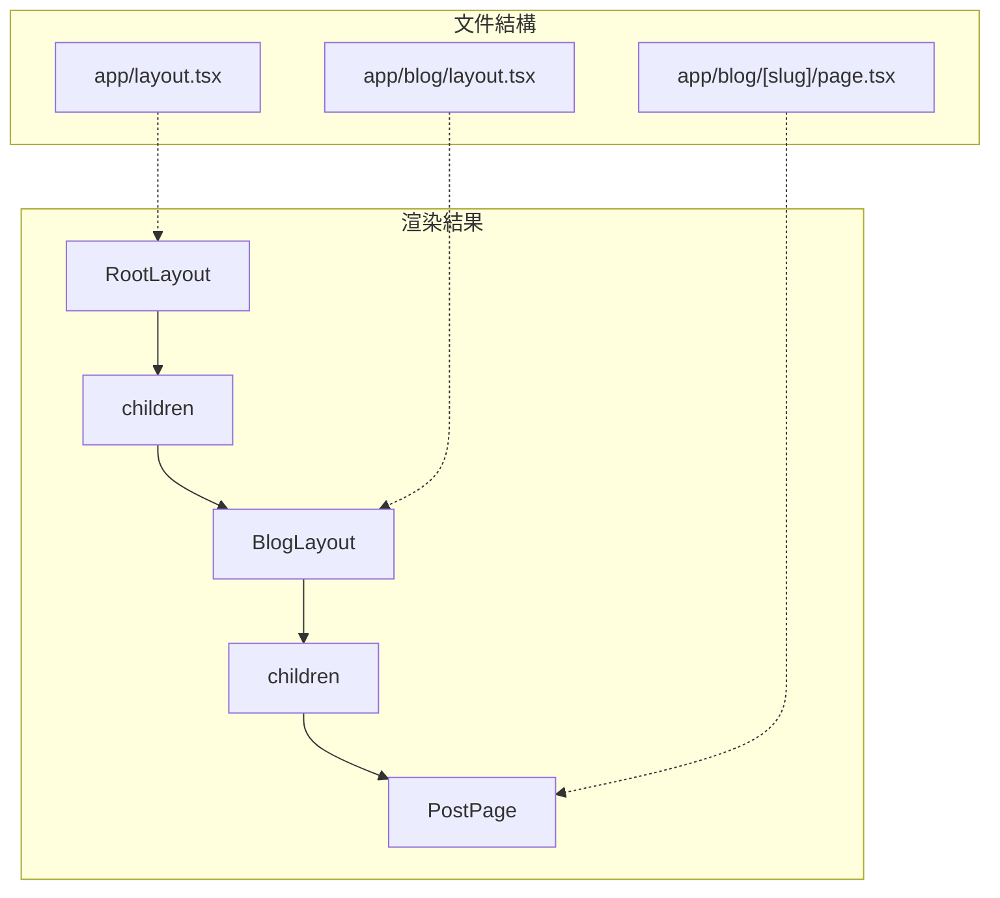

# 3.1.1 頁面放哪，路由就在哪——文件系統路由

### 一句話破題

在 App Router 中，文件夾結構就是 URL 結構，`page.tsx` 是頁面終點，`layout.tsx` 是共享外殼。

### 核心價值

傳統的路由配置需要維護一個獨立的配置文件，手動映射 URL 和組件。App Router 的文件系統路由徹底消除了這層抽象——**你的文件目錄就是你的網站地圖**。這種"所見即所得"的設計大幅降低了心智負擔。

### 特殊文件約定

Next.js App Router 定義了一組**保留文件名**，每個都有特定用途：

| 文件名 | 作用 | 是否必須 |
|--------|------|----------|
| `page.tsx` | 定義路由的 UI 內容，使該路由可訪問 | 是（否則該路徑不可訪問） |
| `layout.tsx` | 定義共享佈局，包裹子路由 | 根目錄必須有 |
| `loading.tsx` | 定義加載狀態 UI（Suspense 邊界） | 否 |
| `error.tsx` | 定義錯誤狀態 UI（Error Boundary） | 否 |
| `not-found.tsx` | 定義 404 頁面 | 否 |
| `template.tsx` | 類似 layout 但每次導航都重新掛載 | 否 |

### 快速上手

**最小可行結構：**

```
app/
├── layout.tsx      # 根佈局（必須）
├── page.tsx        # 首頁 /
├── about/
│   └── page.tsx    # /about
└── blog/
    ├── page.tsx    # /blog
    └── [slug]/
        └── page.tsx # /blog/xxx
```

**根佈局示例 (`app/layout.tsx`)：**

```tsx
export default function RootLayout({
  children,
}: {
  children: React.ReactNode
}) {
  return (
    <html lang="zh-CN">
      <body>
        <nav>全站導航欄</nav>
        <main>{children}</main>
        <footer>全站頁腳</footer>
      </body>
    </html>
  )
}
```

**頁面示例 (`app/about/page.tsx`)：**

```tsx
export default function AboutPage() {
  return (
    <div>
      <h1>關於我們</h1>
      <p>這是關於頁面的內容</p>
    </div>
  )
}
```

### 佈局嵌套機制

佈局的核心特性是**嵌套**和**持久化**。當用戶在子頁面間導航時，父級 Layout 不會重新渲染。



**嵌套佈局示例 (`app/blog/layout.tsx`)：**

```tsx
export default function BlogLayout({
  children,
}: {
  children: React.ReactNode
}) {
  return (
    <div className="blog-container">
      <aside>博客側邊欄</aside>
      <article>{children}</article>
    </div>
  )
}
```

### Loading 狀態

`loading.tsx` 會自動創建一個 Suspense 邊界，在頁面內容加載時顯示：

```tsx
// app/blog/loading.tsx
export default function Loading() {
  return (
    <div className="animate-pulse">
      <div className="h-8 bg-gray-200 rounded w-3/4 mb-4"></div>
      <div className="h-4 bg-gray-200 rounded w-full mb-2"></div>
      <div className="h-4 bg-gray-200 rounded w-5/6"></div>
    </div>
  )
}
```

### AI 協作指南

**核心意圖**：讓 AI 幫你快速搭建頁面結構骨架。

**需求定義公式**：
- 功能描述：我需要創建一個 [頁面類型] 頁面
- 交互方式：該頁面需要 [共享佈局/獨立佈局]
- 預期效果：URL 路徑爲 `/xxx`，包含 [具體內容]

**關鍵術語**：`page.tsx`、`layout.tsx`、`loading.tsx`、`children prop`、`嵌套佈局`

**交互策略**：
1. 先讓 AI 生成文件結構目錄
2. 確認結構正確後，再讓它填充各文件內容
3. 最後讓它添加 loading 和 error 狀態

### 避坑指南

1. **根佈局必須包含 `<html>` 和 `<body>` 標籤**，子佈局不需要
2. **`page.tsx` 是使路由可訪問的唯一方式**，沒有它文件夾只是用於組織代碼
3. **Layout 組件必須接受並渲染 `children` prop**，否則子頁面無法顯示
4. **避免在 Layout 中使用會頻繁變化的狀態**，因爲它不會重新渲染

### 驗收清單

- [ ] 根目錄有 `layout.tsx` 且包含 `<html>` 和 `<body>`
- [ ] 每個需要訪問的路徑都有對應的 `page.tsx`
- [ ] 佈局正確嵌套，導航時父佈局不閃爍
- [ ] 數據加載較慢的頁面有 `loading.tsx` 骨架屏
