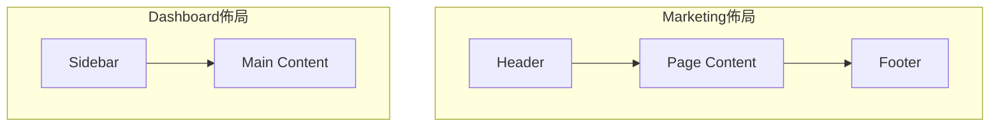

# 3.1.3 整理亂糟糟的路由——路由組

### 一句話破題

用圓括號 `(group)` 命名文件夾，可以在不影響 URL 的情況下組織代碼和共享佈局。

### 核心價值

當項目變大時，`app` 目錄下會堆滿文件夾：首頁、關於、博客、後臺、設置……亂成一團。路由組讓你像整理抽屜一樣分類這些頁面，而且**分類名不會出現在 URL 中**。

### 路由組語法

用圓括號包裹的文件夾名稱就是路由組：

```
app/
├── (marketing)/
│   ├── layout.tsx      # 營銷頁專用佈局
│   ├── page.tsx        # 首頁 -> URL: /
│   └── about/
│       └── page.tsx    # 關於 -> URL: /about
├── (dashboard)/
│   ├── layout.tsx      # 後臺專用佈局
│   └── settings/
│       └── page.tsx    # 設置 -> URL: /settings
```

**關鍵點**：`(marketing)` 和 `(dashboard)` 都不會出現在 URL 中。

### 三大應用場景

#### 場景一：代碼組織

把相關頁面放在一起，代碼更清晰：

```
app/
├── (auth)/             # 認證相關
│   ├── login/
│   ├── register/
│   └── forgot-password/
├── (shop)/             # 商城相關
│   ├── products/
│   ├── cart/
│   └── checkout/
└── (blog)/             # 博客相關
    ├── posts/
    └── categories/
```

#### 場景二：不同佈局

營銷頁面和後臺頁面通常需要完全不同的 UI 框架：

```tsx
// app/(marketing)/layout.tsx
export default function MarketingLayout({ children }) {
  return (
    <div>
      <header>品牌 Logo + 導航</header>
      <main>{children}</main>
      <footer>版權信息</footer>
    </div>
  )
}

// app/(dashboard)/layout.tsx
export default function DashboardLayout({ children }) {
  return (
    <div className="flex">
      <aside>側邊欄菜單</aside>
      <main className="flex-1">{children}</main>
    </div>
  )
}
```



#### 場景三：多個根佈局

甚至可以爲不同路由組創建獨立的根佈局：

```
app/
├── (marketing)/
│   ├── layout.tsx      # 包含 <html><body>
│   └── page.tsx
├── (dashboard)/
│   ├── layout.tsx      # 包含 <html><body>
│   └── page.tsx
```

> **注意**：使用多個根佈局時，在它們之間導航會觸發完整的頁面刷新。

### 路由組 vs 普通文件夾

| 特性 | 普通文件夾 | 路由組 `(name)` |
|------|-----------|-----------------|
| 影響 URL | 是 | 否 |
| 可包含 layout | 是 | 是 |
| 可包含 page | 是 | 是 |
| 用途 | 定義 URL 路徑 | 組織代碼/共享佈局 |

### 嵌套路由組

路由組可以嵌套使用：

```
app/
├── (shop)/
│   ├── (browse)/       # 瀏覽相關
│   │   ├── products/
│   │   └── categories/
│   └── (checkout)/     # 結賬相關
│       ├── cart/
│       └── payment/
```

### AI 協作指南

**核心意圖**：讓 AI 幫你重構現有路由結構，或規劃新項目的路由組織。

**需求定義公式**：
- 功能描述：我的項目有 [頁面類型列表]
- 交互方式：不同類型需要 [不同佈局描述]
- 預期效果：URL 保持簡潔，代碼按功能分組

**關鍵術語**：`路由組`、`(group)`、`共享佈局`、`代碼組織`

**交互策略**：
1. 列出所有頁面和它們的 URL
2. 讓 AI 分析哪些頁面可以共享佈局
3. 讓它給出路由組劃分建議
4. 確認後讓它生成文件結構

### 避坑指南

1. **路由組名稱不能重複**：`(auth)` 和 `(auth)` 不能同時存在
2. **同一 URL 只能有一個 page.tsx**：不能在 `(a)/about/page.tsx` 和 `(b)/about/page.tsx` 同時存在
3. **多根佈局會導致頁面刷新**：跨根佈局導航時，狀態會丟失
4. **不要過度使用**：簡單項目用普通文件夾就夠了

### 驗收清單

- [ ] 路由組名稱使用圓括號包裹
- [ ] URL 中不包含路由組名稱
- [ ] 每個路由組有獨立的 layout.tsx（如需要）
- [ ] 同一 URL 路徑下只有一個 page.tsx
