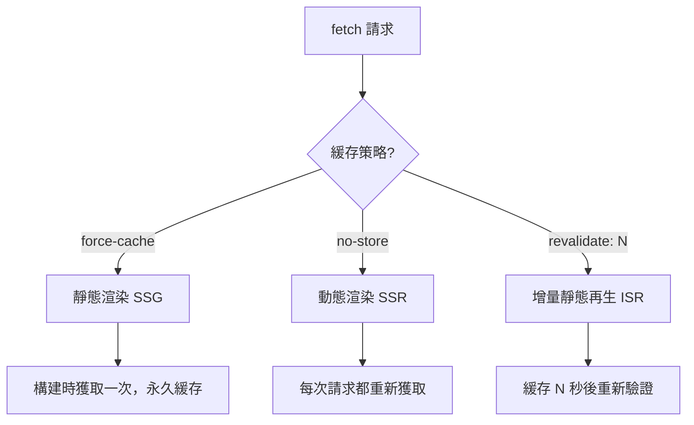

# 3.1.4 數據該何時獲取——數據獲取策略

### 一句話破題

在 Server Component 中直接 `await` 數據，Next.js 會根據你的緩存配置自動選擇最優的渲染策略。

### 核心價值

忘記 `useEffect` 和 `isLoading` 狀態管理。App Router 的數據獲取模式讓你像寫後端代碼一樣直接獲取數據——沒有客戶端請求，沒有加載狀態管理，數據隨 HTML 一起到達瀏覽器。

### 數據獲取基礎

**Server Component 中直接獲取數據：**

```tsx
// app/posts/page.tsx
async function getPosts() {
  const res = await fetch('https://api.example.com/posts')
  if (!res.ok) throw new Error('獲取失敗')
  return res.json()
}

export default async function PostsPage() {
  const posts = await getPosts()
  
  return (
    <ul>
      {posts.map((post: any) => (
        <li key={post.id}>{post.title}</li>
      ))}
    </ul>
  )
}
```

### 三種緩存策略

Next.js 擴展了原生 `fetch`，提供了三種緩存行爲：



| 策略 | 配置 | 行爲 | 適用場景 |
|------|------|------|----------|
| **靜態** | `cache: 'force-cache'` | 構建時獲取，永久緩存 | 不常變化的內容 |
| **動態** | `cache: 'no-store'` | 每次請求都重新獲取 | 即時數據 |
| **ISR** | `next: { revalidate: N }` | 緩存 N 秒後重新驗證 | 需要定期更新的內容 |

### 快速上手

**靜態渲染（默認）：**

```tsx
// 構建時獲取，之後永不更新
const data = await fetch('https://api.example.com/static-data')
```

**動態渲染：**

```tsx
// 每次訪問都重新獲取
const data = await fetch('https://api.example.com/realtime', {
  cache: 'no-store'
})
```

**ISR（推薦）：**

```tsx
// 每 60 秒重新驗證一次
const data = await fetch('https://api.example.com/posts', {
  next: { revalidate: 60 }
})
```

### 頁面級緩存配置

除了在 fetch 中配置，也可以在頁面級別設置：

```tsx
// app/posts/page.tsx

// 整個頁面每 60 秒重新驗證
export const revalidate = 60

// 或者強制動態渲染
// export const dynamic = 'force-dynamic'

export default async function PostsPage() {
  // ...
}
```

### 並行數據獲取

多個數據源時，使用 `Promise.all` 並行獲取：

```tsx
export default async function DashboardPage() {
  // 並行獲取，總耗時 = 最慢的那個請求
  const [user, posts, notifications] = await Promise.all([
    getUser(),
    getPosts(),
    getNotifications()
  ])
  
  return (
    <div>
      <UserProfile user={user} />
      <PostList posts={posts} />
      <NotificationBell count={notifications.length} />
    </div>
  )
}
```

### 手動重新驗證

對於需要立即更新的場景（如用戶提交後），可以手動觸發重新驗證：

```tsx
// app/actions.ts
'use server'

import { revalidatePath, revalidateTag } from 'next/cache'

export async function createPost(formData: FormData) {
  // 創建文章...
  
  // 方式一：重新驗證特定路徑
  revalidatePath('/posts')
  
  // 方式二：重新驗證特定標籤
  revalidateTag('posts')
}
```

配合 fetch 的 tag：

```tsx
const posts = await fetch('https://api.example.com/posts', {
  next: { tags: ['posts'] }
})
```

### 數據獲取模式對比

| 模式 | 獲取時機 | 首屏速度 | 數據新鮮度 | 適用場景 |
|------|----------|----------|------------|----------|
| **Server Component** | 服務端 | 快 | 可配置 | 大多數場景 |
| **Client fetch** | 客戶端 | 慢 | 即時 | 用戶交互觸發 |
| **Route Handler** | API 路由 | - | 即時 | 第三方調用 |

### AI 協作指南

**核心意圖**：讓 AI 幫你爲頁面選擇合適的數據獲取策略。

**需求定義公式**：
- 功能描述：這個頁面需要展示 [數據類型]
- 交互方式：數據更新頻率爲 [即時/每小時/每天/很少]
- 預期效果：首屏加載 [快速/可接受]，數據 [必須最新/可以稍舊]

**關鍵術語**：`fetch`、`cache`、`revalidate`、`no-store`、`revalidatePath`、`revalidateTag`

**交互策略**：
1. 描述頁面的數據需求和更新頻率
2. 讓 AI 推薦緩存策略
3. 讓它實現數據獲取函數
4. 補充手動重新驗證邏輯（如需要）

### 避坑指南

1. **Server Component 中不能用 Hooks**：`useState`、`useEffect` 等在服務端不可用
2. **fetch 默認靜態緩存**：如需即時數據，必須顯式設置 `cache: 'no-store'`
3. **revalidate 是最小間隔**：設置 60 秒不代表每 60 秒必定更新，而是至少 60 秒後纔可能更新
4. **錯誤要處理**：fetch 失敗時要有兜底方案，否則整個頁面會崩潰

### 驗收清單

- [ ] 數據在服務端獲取，HTML 中已包含內容
- [ ] 緩存策略與業務需求匹配
- [ ] 多個數據源使用 `Promise.all` 並行獲取
- [ ] fetch 錯誤有適當處理
- [ ] 需要立即更新的場景配置了手動重新驗證
