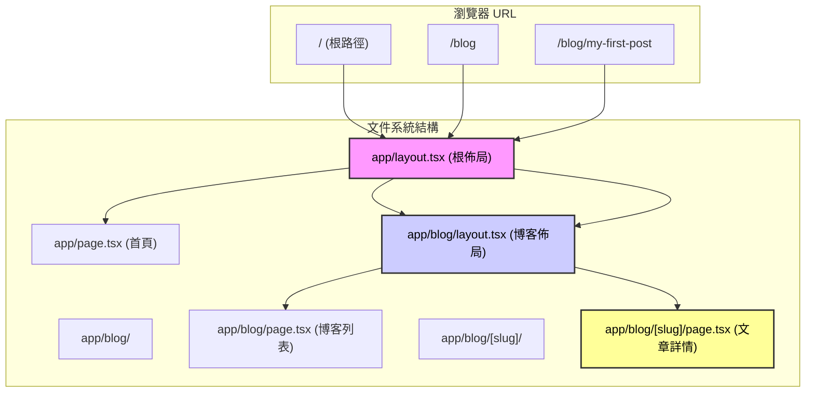

# 3.1 你的文件目錄就是網站地圖——App Router：文件路由與數據獲取

> 迴歸 Web 的本質，URL 路徑即資源路徑。

在這一節，我們要徹底重構你對“路由”的認知。

在傳統的 SPA（單頁應用）時代，你可能習慣了在一個巨大的 `router.js` 配置文件裏寫滿 `path: '/about', component: About` 的映射關係。那是一種人工維護的映射。

但現在，Next.js App Router 帶我們迴歸了 Web 的**第一性原理**：**文件系統的結構，就是 URL 的結構**。你把文件放在哪裏，它的網址就是什麼。這不僅是工程上的簡化，更是“所見即所得”思維的極致體現。

## 1. 定義邊界：App Router 的物理法則

在開始寫代碼之前，我們需要先建立一套物理法則。這就像是告訴 AI 建築師：“在這個世界裏，磚塊怎麼擺放決定了房子的形狀。”

- **輸入 (URL)**：用戶在瀏覽器地址欄輸入的路徑（如 `/dashboard/settings`）。
- **映射機制**：Next.js 自動尋找 `app/dashboard/settings/page.tsx`。
- **輸出 (UI)**：由層層嵌套的 `layout.tsx` 包裹着最終的 `page.tsx` 渲染出的 HTML。
- **異常邊界**：找不到文件？顯示 `not-found.tsx`。報錯了？顯示 `error.tsx`。

**一句話心法**：**文件夾是路徑，`page.tsx` 是終點，`layout.tsx` 是包裝紙。**

## 2. 可視化解構：看不見的路由邏輯

App Router 最難理解的不是“對應關係”，而是“嵌套關係”。當你訪問一個深層頁面時，Next.js 其實是在像“俄羅斯套娃”一樣組裝組件。



> **覺知點**：注意看圖，`layout` 是**持久化**的。當你從 `/blog` 跳轉到 `/blog/my-first-post` 時，`RootLayout` 和 `BlogLayout` **不會**重新渲染，只有最裏面的 `page.tsx` 變了。這就是 Next.js 極速體驗的祕密。

## 3. 漸進式開發策略：與 AI 結對編程

不要試圖一次性寫出完美的路由結構。我們要用**MV P（最小可行性產品）**思維，一步步指揮 AI 搭建。

### 第一步：搭建骨架（Static Routes & Layouts）

先讓 AI 幫你搞定最基礎的頁面結構。

> **🤖 AI 指令意圖**： "幫我創建 App Router 的基礎結構。我要一個首頁、一個關於頁，還有一個共用的導航欄佈局。"

**關鍵文件結構：**

- `app/layout.tsx`：**必須存在**。這裏定義 `<html>` 和 `<body>` 標籤。
- `app/page.tsx`：首頁內容。
- `app/about/page.tsx`：`/about` 頁面內容。

**驗收清單：**

- [ ] 訪問 `http://localhost:3000/` 能看到首頁？
- [ ] 訪問 `http://localhost:3000/about` 能看到關於頁？
- [ ] 兩個頁面是否都有相同的導航欄（來自 `layout.tsx`）？

### 第二步：處理動態內容（Dynamic Routes）

現在，我們要處理“成千上萬”個頁面了，比如博客文章或用戶資料。我們不能手動創建 `post-1.tsx`, `post-2.tsx`。

> **AI 指令意圖**： "我要做一個博客詳情頁。請在 `app/blog` 下創建一個動態路由，用 `slug` 作爲參數。並在頁面中把這個 `slug` 參數打印出來。"

**關鍵代碼邏輯 (`app/blog/[slug]/page.tsx`)：**

```
// 這裏的 params 是 Next.js 自動傳入的
// 注意：params 在 Next.js 16+ 中可能是異步的，具體視版本而定，但在 Vibe Coding 體系中我們通常直接解構
export default async function BlogPost({ params }: { params: { slug: string } }) {
  // 1. 獲取 URL 上的參數
  const { slug } = params; 
  
  return <div>正在閱讀文章：{slug}</div>;
}
```

### 第三步：組織與整理（Route Groups）

如果你的項目變大了，`app` 文件夾下一堆文件夾亂糟糟的怎麼辦？比如你想區分“管理後臺”和“營銷頁面”，但不想讓 URL 變成 `/marketing/home`。

這時候就需要 **Route Groups（路由組）**。這是一種**“只有文件夾，沒有 URL”**的魔法。

> **🤖 AI 指令意圖**： "我想把代碼組織得更清晰。請把營銷相關的頁面（首頁、關於）放在 `(marketing)` 組裏，把後臺頁面放在 `(dashboard)` 組裏。確保 URL 路徑**不包含**括號裏的名字。"

**效果：**

- `app/(marketing)/about/page.tsx` -> URL 依然是 `/about`
- `app/(dashboard)/settings/page.tsx` -> URL 依然是 `/settings`

## 4. 數據獲取：Server Component 的“特權”

這是 Vibe Coding 技術棧最迷人的地方。忘記 `useEffect`，忘記 `isLoading` 狀態管理。在 App Router 裏，我們在**服務器**上直接拿數據。

### 核心概念：Fetch, Cache, Revalidate

在 `page.tsx` (Server Component) 中，獲取數據就像寫普通的 Node.js 腳本一樣簡單。

> **🤖 AI 協作指南**： 告訴 AI：“我要在這個頁面獲取博客列表數據。請使用 `fetch` API，並配置數據緩存策略。”

**實戰代碼模板：**

```
// app/blog/page.tsx

// 1. 定義數據獲取函數
async function getPosts() {
  // Next.js 擴展了原生的 fetch
  const res = await fetch('[https://api.example.com/posts](https://api.example.com/posts)', {
    // 策略 A: 靜態生成 (默認) - 像 SSG，構建時獲取，永久緩存
    // cache: 'force-cache', 
    
    // 策略 B: 動態渲染 - 像 SSR，每次請求都重新獲取
    // cache: 'no-store',
    
    // 策略 C: 增量靜態再生 (ISR) - Vibe Coding 推薦！
    // 每 3600 秒更新一次緩存，兼顧速度與新鮮度
    next: { revalidate: 3600 }
  });

  if (!res.ok) throw new Error('Failed to fetch posts');
  return res.json();
}

// 2. 頁面組件直接變成 async
export default async function BlogPage() {
  // 3. 直接 await 數據，就像在後端寫代碼一樣
  const posts = await getPosts();

  return (
    <ul>
      {posts.map((post: any) => (
        <li key={post.id}>{post.title}</li>
      ))}
    </ul>
  );
}
```

### 爲什麼這很“Vibe”？

1. **沒有白屏加載**：數據在服務器拿好後，帶着 HTML 一起發給瀏覽器。
2. **零客戶端 JS**：獲取數據的邏輯不會打包到客戶端，減小體積。
3. **直覺**：需要數據？那就去拿。不需要複雜的狀態管理庫。

## 5. 驗收清單 (Checklist)

在這一章結束時，請按照以下標準驗收你的成果：

1. [ ] **文件結構清晰**：我能通過看文件目錄，就能畫出網站的 Sitemap。
2. [ ] **路由跳轉流暢**：使用 `<Link>` 組件在頁面間跳轉，且 Layout 沒有不必要的閃爍。
3. [ ] **Loading 狀態**：在數據加載慢的頁面旁邊放一個 `loading.tsx`，驗證是否能自動顯示骨架屏。
4. [ ] **數據獲取正確**：修改數據庫或 API 數據後，頁面的更新行爲符合你設置的 `revalidate` 時間（試試設置爲 0 或 10 秒來測試）。

## 6. 下一步

現在你的頁面已經跑起來了，數據也有了。但是它們長得還很醜，而且是一堆散亂的積木。下一節，我們將學習**3.2 像搭樂高一樣構建頁面**，用組件化思維把這些頁面變得漂亮且可複用。
