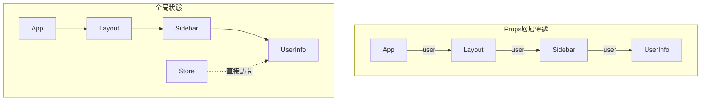
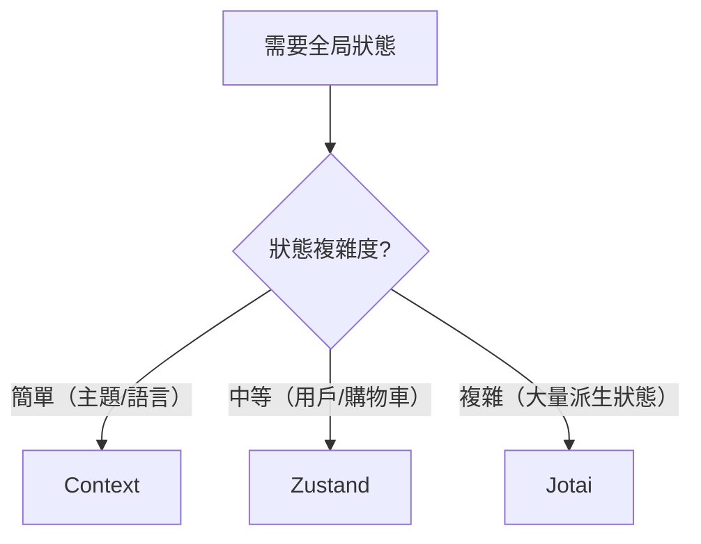

# 3.2.3 複雜狀態的全局管理——全局狀態管理

### 一句話破題

當狀態需要跨越多層組件共享時，全局狀態管理讓你擺脫"Props 層層傳遞"的噩夢。

### 核心價值

狀態提升解決了兄弟組件共享數據的問題，但當組件層級很深時，中間的組件被迫傳遞它們根本不關心的 Props。全局狀態管理允許任意組件直接訪問共享狀態。



### 方案一：React Context

內置方案，適合簡單場景：

```tsx
'use client'

import { createContext, useContext, useState, ReactNode } from 'react'

// 1. 創建 Context
interface ThemeContextType {
  theme: 'light' | 'dark'
  toggleTheme: () => void
}

const ThemeContext = createContext<ThemeContextType | null>(null)

// 2. 創建 Provider
export function ThemeProvider({ children }: { children: ReactNode }) {
  const [theme, setTheme] = useState<'light' | 'dark'>('light')
  
  const toggleTheme = () => {
    setTheme(prev => prev === 'light' ? 'dark' : 'light')
  }
  
  return (
    <ThemeContext.Provider value={{ theme, toggleTheme }}>
      {children}
    </ThemeContext.Provider>
  )
}

// 3. 創建 Hook（推薦）
export function useTheme() {
  const context = useContext(ThemeContext)
  if (!context) {
    throw new Error('useTheme must be used within ThemeProvider')
  }
  return context
}

// 4. 使用
function ThemeToggle() {
  const { theme, toggleTheme } = useTheme()
  return <button onClick={toggleTheme}>當前：{theme}</button>
}
```

**Context 的侷限性：**
- 任何 value 變化都會導致所有消費者重新渲染
- 需要手動優化（useMemo、拆分 Context）
- 不適合頻繁更新的狀態

### 方案二：Zustand（推薦）

輕量、簡單、無樣板代碼：

```tsx
// store/useUserStore.ts
import { create } from 'zustand'

interface UserState {
  user: { name: string; email: string } | null
  setUser: (user: UserState['user']) => void
  logout: () => void
}

export const useUserStore = create<UserState>((set) => ({
  user: null,
  setUser: (user) => set({ user }),
  logout: () => set({ user: null }),
}))

// 在組件中使用
'use client'

import { useUserStore } from '@/store/useUserStore'

function UserProfile() {
  const user = useUserStore((state) => state.user)
  const logout = useUserStore((state) => state.logout)
  
  if (!user) return <p>請登錄</p>
  
  return (
    <div>
      <p>{user.name}</p>
      <button onClick={logout}>退出</button>
    </div>
  )
}
```

**Zustand 的優勢：**
- 自動進行細粒度訂閱，避免不必要渲染
- 可在 React 外部訪問狀態
- 支持中間件（持久化、日誌等）
- TypeScript 支持良好

### 方案三：Jotai

原子化狀態，適合複雜交互：

```tsx
// atoms/userAtom.ts
import { atom } from 'jotai'

export const userAtom = atom<{ name: string } | null>(null)

// 派生狀態
export const isLoggedInAtom = atom((get) => get(userAtom) !== null)

// 使用
'use client'

import { useAtom, useAtomValue } from 'jotai'
import { userAtom, isLoggedInAtom } from '@/atoms/userAtom'

function UserStatus() {
  const [user, setUser] = useAtom(userAtom)
  const isLoggedIn = useAtomValue(isLoggedInAtom)  // 只讀
  
  return <p>{isLoggedIn ? user?.name : '未登錄'}</p>
}
```

### 方案對比

| 特性 | Context | Zustand | Jotai |
|------|---------|---------|-------|
| 學習成本 | 低 | 低 | 中 |
| 樣板代碼 | 中 | 少 | 少 |
| 渲染優化 | 手動 | 自動 | 自動 |
| 適用場景 | 簡單/低頻更新 | 通用 | 複雜派生狀態 |
| React 外訪問 | 困難 | 簡單 | 可行 |

### 選擇建議



### AI 協作指南

**核心意圖**：讓 AI 幫你設計全局狀態結構和選擇合適的方案。

**需求定義公式**：
- 功能描述：需要在 [哪些組件] 之間共享 [什麼數據]
- 交互方式：數據更新頻率是 [高/中/低]
- 預期效果：狀態變化時只有 [哪些組件] 需要重新渲染

**關鍵術語**：`Context`、`Zustand`、`Jotai`、`atom`、`store`、`selector`

**交互策略**：
1. 描述需要共享的狀態和使用場景
2. 讓 AI 推薦合適的方案
3. 讓它實現 store/context 定義
4. 在組件中集成使用

### 避坑指南

1. **Context 不是萬能的**：頻繁更新的狀態用 Context 會導致性能問題
2. **Zustand selector 要穩定**：避免在組件內創建新的 selector 函數
3. **不要過度使用全局狀態**：能用 Props 解決的就不要用全局
4. **Server Component 不能使用 Hooks**：全局狀態只能在 Client Component 中訪問

### 驗收清單

- [ ] 選擇了合適的狀態管理方案
- [ ] 狀態結構設計合理
- [ ] 使用 selector 進行細粒度訂閱
- [ ] Provider 包裹在正確的層級
