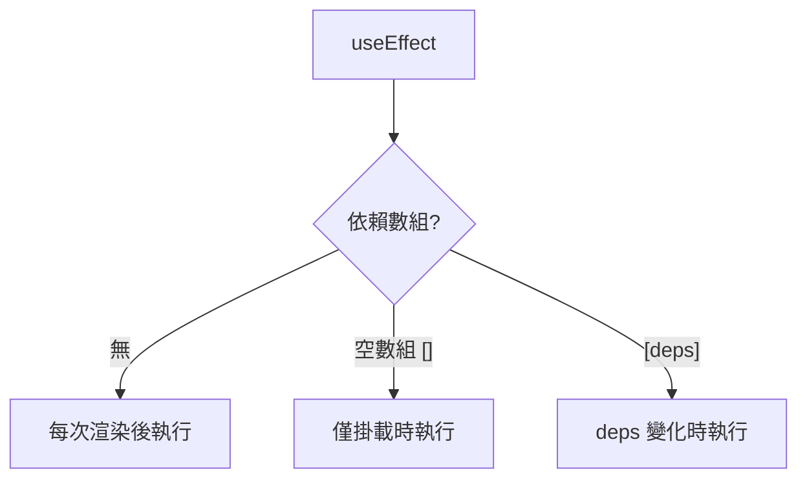

# 3.2.4 積木的副作用怎麼辦——Effect 副作用

### 一句話破題

useEffect 讓你在組件渲染後執行"副作用"操作，如數據獲取、訂閱事件、操作 DOM。

### 核心價值

React 組件的主要職責是根據 Props 和 State 返回 UI。但有時你需要與"外部世界"交互——這些不直接影響渲染輸出的操作就是"副作用"。

**常見副作用：**
- 發起網絡請求
- 手動操作 DOM
- 設置定時器
- 訂閱事件/WebSocket
- 記錄日誌

### useEffect 基礎

```tsx
'use client'

import { useEffect, useState } from 'react'

function UserProfile({ userId }: { userId: string }) {
  const [user, setUser] = useState(null)
  
  useEffect(() => {
    // 副作用邏輯
    async function fetchUser() {
      const res = await fetch(`/api/users/${userId}`)
      const data = await res.json()
      setUser(data)
    }
    fetchUser()
  }, [userId])  // 依賴數組：userId 變化時重新執行
  
  return <div>{user?.name}</div>
}
```

### 依賴數組詳解

```tsx
// 1. 無依賴數組：每次渲染後都執行（謹慎使用）
useEffect(() => {
  console.log('每次渲染後執行')
})

// 2. 空數組：只在掛載時執行一次
useEffect(() => {
  console.log('只在掛載時執行')
}, [])

// 3. 有依賴：依賴變化時執行
useEffect(() => {
  console.log('userId 變化時執行')
}, [userId])
```



### 清理函數

當組件卸載或依賴變化時，需要清理副作用：

```tsx
useEffect(() => {
  // 設置
  const timer = setInterval(() => {
    console.log('tick')
  }, 1000)
  
  // 清理函數（組件卸載或依賴變化前執行）
  return () => {
    clearInterval(timer)
  }
}, [])
```

**需要清理的場景：**

```tsx
// 事件監聽
useEffect(() => {
  const handleResize = () => console.log(window.innerWidth)
  window.addEventListener('resize', handleResize)
  return () => window.removeEventListener('resize', handleResize)
}, [])

// WebSocket
useEffect(() => {
  const ws = new WebSocket('wss://...')
  ws.onmessage = (e) => setMessages(prev => [...prev, e.data])
  return () => ws.close()
}, [])

// AbortController（取消請求）
useEffect(() => {
  const controller = new AbortController()
  
  fetch('/api/data', { signal: controller.signal })
    .then(res => res.json())
    .then(setData)
    .catch(err => {
      if (err.name !== 'AbortError') throw err
    })
  
  return () => controller.abort()
}, [])
```

### 常見錯誤模式

**錯誤 1：遺漏依賴**

```tsx
// 錯誤：count 應該在依賴數組中
useEffect(() => {
  const timer = setInterval(() => {
    setCount(count + 1)  // 閉包陷阱
  }, 1000)
  return () => clearInterval(timer)
}, [])  // ESLint 會警告

// 正確：使用函數式更新
useEffect(() => {
  const timer = setInterval(() => {
    setCount(prev => prev + 1)
  }, 1000)
  return () => clearInterval(timer)
}, [])
```

**錯誤 2：無限循環**

```tsx
// 錯誤：每次渲染都創建新對象，觸發 effect
useEffect(() => {
  setUser({ ...user, lastVisit: new Date() })
}, [user])  // 死循環！

// 正確：只在必要時更新
useEffect(() => {
  setUser(prev => ({ ...prev, lastVisit: new Date() }))
}, [])  // 或使用其他條件
```

### App Router 中的 useEffect

在 App Router 中，**優先使用 Server Component 獲取數據**，只在必要時使用 useEffect：

| 場景 | 推薦方案 |
|------|----------|
| 頁面初始數據 | Server Component + fetch |
| 用戶交互後獲取 | useEffect 或 Server Action |
| 訂閱/監聽 | useEffect |
| DOM 操作 | useEffect |

### AI 協作指南

**核心意圖**：讓 AI 幫你正確處理副作用邏輯。

**需求定義公式**：
- 功能描述：需要在 [時機] 執行 [操作]
- 交互方式：該操作依賴 [哪些數據] 的變化
- 預期效果：組件卸載時需要 [清理什麼]

**關鍵術語**：`useEffect`、依賴數組、清理函數、`AbortController`

**交互策略**：
1. 描述副作用的觸發條件
2. 讓 AI 分析正確的依賴數組
3. 確認是否需要清理函數
4. 檢查是否有更好的替代方案（如 Server Component）

### 避坑指南

1. **依賴數組要完整**：ESLint 規則 `react-hooks/exhaustive-deps` 會提醒你
2. **對象/函數依賴要穩定**：用 useMemo/useCallback 包裹
3. **異步操作要處理競態**：使用 AbortController 或 flag 變量
4. **避免在 useEffect 中直接 async**：內部定義 async 函數再調用

### 驗收清單

- [ ] 依賴數組完整且正確
- [ ] 需要清理的副作用有返回清理函數
- [ ] 異步請求有競態處理
- [ ] 考慮過是否可用 Server Component 替代
