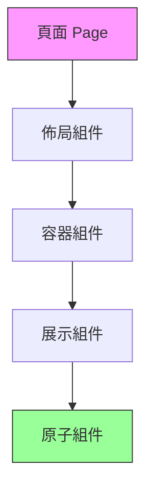
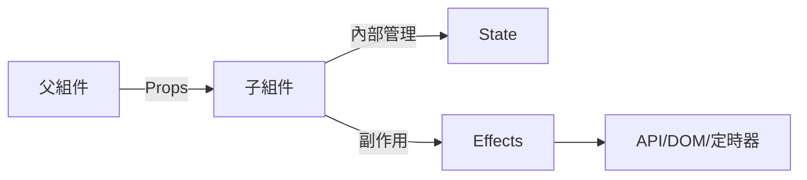

# 3.2 像搭樂高一樣構建頁面——前端構建塊

### 一句話破題

組件是 React 應用的原子單位，通過 Props 傳遞數據、State 管理內部狀態、Effects 處理副作用。

### 本節定位

如果說路由是網站的骨架，那麼組件就是構成骨架的每一塊積木。本節將教你如何像搭樂高一樣，用可複用的組件構建複雜的用戶界面。



### 組件化思維的核心

#### 爲什麼要組件化？

| 傳統開發 | 組件化開發 |
|----------|------------|
| 一個頁面一坨代碼 | 拆分成可複用的小塊 |
| 改一處影響全局 | 組件內部獨立運作 |
| 複製粘貼滿天飛 | 一處修改，處處生效 |
| 難以測試 | 單元測試友好 |

#### 組件的三大要素

1. **Props（屬性）**：父組件傳遞給子組件的數據，只讀
2. **State（狀態）**：組件內部管理的數據，可變
3. **Effects（副作用）**：與外部世界交互的邏輯



### Server Component vs Client Component

在 App Router 中，組件默認是 Server Component：

| 特性 | Server Component | Client Component |
|------|------------------|------------------|
| 默認值 | 是 | 否（需 `'use client'`） |
| 可使用 Hooks | 否 | 是 |
| 可訪問瀏覽器 API | 否 | 是 |
| 可直接訪問數據庫 | 是 | 否 |
| 打包到客戶端 JS | 否 | 是 |
| 適用場景 | 數據獲取、靜態 UI | 交互、狀態管理 |

**何時使用 Client Component：**

```tsx
'use client' // 在文件頂部聲明

import { useState } from 'react'

export function Counter() {
  const [count, setCount] = useState(0)
  
  return (
    <button onClick={() => setCount(count + 1)}>
      點擊次數：{count}
    </button>
  )
}
```

### 組件設計原則

1. **單一職責**：每個組件只做一件事
2. **Props 向下，Events 向上**：數據單向流動
3. **組合優於繼承**：通過嵌套組合構建複雜 UI
4. **關注點分離**：展示邏輯與業務邏輯分開

### 本節導航

| 小節 | 主題 | 核心內容 |
|------|------|----------|
| **3.2.1** | Props | 類型定義、默認值、children |
| **3.2.2** | State | useState、狀態提升 |
| **3.2.3** | 全局狀態 | Context、Zustand/Jotai |
| **3.2.4** | Effects | useEffect、清理函數 |
| **3.2.5** | 自定義 Hooks | 邏輯複用與抽象 |
| **3.2.6** | 組件設計 | 單一職責、組合模式 |

### AI 協作指南

**核心意圖**：讓 AI 幫你設計和實現可複用的組件。

**需求定義公式**：
- 功能描述：我需要一個 [組件名稱]，用於 [具體用途]
- 交互方式：用戶可以 [操作描述]
- 預期效果：組件展示 [外觀描述]，響應 [交互行爲]

**關鍵術語**：`Props`、`State`、`useEffect`、`'use client'`、`Server Component`

**交互策略**：
1. 先讓 AI 分析組件應該是 Server 還是 Client
2. 定義 Props 接口
3. 實現基礎 UI 結構
4. 添加交互邏輯和狀態管理

### 驗收清單

- [ ] 理解 Server/Client Component 的區別
- [ ] 知道何時使用 `'use client'`
- [ ] 能夠設計合理的 Props 接口
- [ ] 理解數據流動方向（Props 向下，Events 向上）
