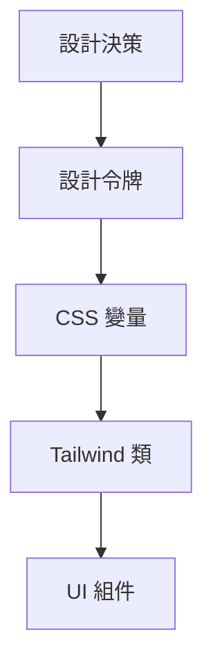

# 3.4.3 告別五顏六色的黑——設計系統

### 一句話破題

設計系統是一套統一的視覺規範（顏色、字體、間距），確保 UI 一致性並簡化與 AI 的協作。

### 核心價值

沒有設計系統，每次描述顏色都要說"那種藍"、"稍微深一點的灰"。有了設計系統，你只需說 `primary`、`muted`，AI 就知道確切的值。

### 設計令牌（Design Tokens）

設計令牌是設計系統的基礎，它將設計決策抽象爲可複用的變量：



### 顏色系統

**語義化顏色（推薦）**

shadcn/ui 使用語義化顏色命名：

| 變量 | 用途 | 示例 |
|------|------|------|
| `--background` | 頁面背景 | 白色/深灰 |
| `--foreground` | 主要文字 | 黑色/白色 |
| `--primary` | 品牌主色 | 藍色 |
| `--secondary` | 次要元素 | 淺灰 |
| `--muted` | 弱化內容 | 灰色文字 |
| `--accent` | 強調元素 | 懸停背景 |
| `--destructive` | 危險操作 | 紅色 |

**在 CSS 中定義**

```css
/* globals.css */
@layer base {
  :root {
    --background: 0 0% 100%;
    --foreground: 222.2 84% 4.9%;
    --primary: 222.2 47.4% 11.2%;
    --primary-foreground: 210 40% 98%;
    --secondary: 210 40% 96%;
    --muted: 210 40% 96%;
    --muted-foreground: 215.4 16.3% 46.9%;
    --accent: 210 40% 96%;
    --destructive: 0 84.2% 60.2%;
  }

  .dark {
    --background: 222.2 84% 4.9%;
    --foreground: 210 40% 98%;
    /* ... */
  }
}
```

**在 Tailwind 中使用**

```tsx
<div className="bg-background text-foreground">
  <button className="bg-primary text-primary-foreground">
    主按鈕
  </button>
  <p className="text-muted-foreground">
    次要文字
  </p>
</div>
```

### 字體系統

**字號規範**

| 類名 | 大小 | 用途 |
|------|------|------|
| `text-xs` | 12px | 輔助信息、標籤 |
| `text-sm` | 14px | 次要內容、表單 |
| `text-base` | 16px | 正文 |
| `text-lg` | 18px | 小標題 |
| `text-xl` | 20px | 標題 |
| `text-2xl` | 24px | 大標題 |
| `text-3xl` | 30px | 頁面標題 |

**字重規範**

| 類名 | 字重 | 用途 |
|------|------|------|
| `font-normal` | 400 | 正文 |
| `font-medium` | 500 | 強調 |
| `font-semibold` | 600 | 小標題 |
| `font-bold` | 700 | 標題 |

**配置自定義字體**

```ts
// tailwind.config.ts
import { fontFamily } from "tailwindcss/defaultTheme"

export default {
  theme: {
    extend: {
      fontFamily: {
        sans: ["Inter", ...fontFamily.sans],
        mono: ["JetBrains Mono", ...fontFamily.mono],
      },
    },
  },
}
```

### 間距系統

Tailwind 使用 4px 爲基礎單位：

| 值 | 像素 | 常見用途 |
|-----|------|----------|
| `1` | 4px | 圖標與文字間距 |
| `2` | 8px | 緊湊元素間距 |
| `3` | 12px | 表單元素內邊距 |
| `4` | 16px | 卡片內邊距、默認間距 |
| `6` | 24px | 區塊間距 |
| `8` | 32px | 大區塊間距 |
| `12` | 48px | 頁面區域分隔 |

**間距使用原則**

1. **一致性**：相同層級的元素使用相同間距
2. **層次感**：父子元素間距 < 兄弟元素間距
3. **呼吸感**：重要內容周圍留更多空白

### 圓角與陰影

**圓角規範**

| 類名 | 值 | 用途 |
|------|-----|------|
| `rounded-sm` | 2px | 小元素 |
| `rounded` | 4px | 默認 |
| `rounded-md` | 6px | 按鈕、輸入框 |
| `rounded-lg` | 8px | 卡片 |
| `rounded-xl` | 12px | 大卡片 |
| `rounded-full` | 9999px | 圓形頭像、標籤 |

**陰影規範**

| 類名 | 用途 |
|------|------|
| `shadow-sm` | 懸浮卡片、下拉菜單 |
| `shadow` | 普通卡片 |
| `shadow-md` | 彈窗、模態框 |
| `shadow-lg` | 重要浮層 |

### 建立項目設計系統

**1. 定義設計變量文件**

```ts
// lib/design-tokens.ts
export const colors = {
  brand: {
    primary: "#3B82F6",
    secondary: "#10B981",
    accent: "#F59E0B",
  },
  semantic: {
    success: "#22C55E",
    warning: "#EAB308",
    error: "#EF4444",
    info: "#3B82F6",
  },
}

export const spacing = {
  page: "max-w-7xl mx-auto px-4 sm:px-6 lg:px-8",
  section: "py-12 md:py-16 lg:py-20",
  card: "p-4 md:p-6",
}
```

**2. 擴展 Tailwind 配置**

```ts
// tailwind.config.ts
import { colors } from "./lib/design-tokens"

export default {
  theme: {
    extend: {
      colors: {
        brand: colors.brand,
      },
    },
  },
}
```

### AI 協作指南

**核心意圖**：讓 AI 使用統一的設計語言。

**需求定義公式**：
- 項目使用 [設計系統名/自定義規範]
- 顏色使用語義化變量：`primary`、`muted`、`destructive`
- 間距遵循 4px 基礎單位

**關鍵術語**：`設計令牌`、`語義化顏色`、`CSS 變量`、`主題切換`

**交互策略**：
1. 項目初期向 AI 說明設計系統規範
2. 在 Prompt 中使用設計系統術語
3. 要求 AI 使用已定義的顏色/間距變量

### 驗收清單

- [ ] 顏色使用語義化變量，不是硬編碼值
- [ ] 字號使用 Tailwind 預設類
- [ ] 間距遵循 4px 倍數規律
- [ ] 暗色模式顏色正確切換
