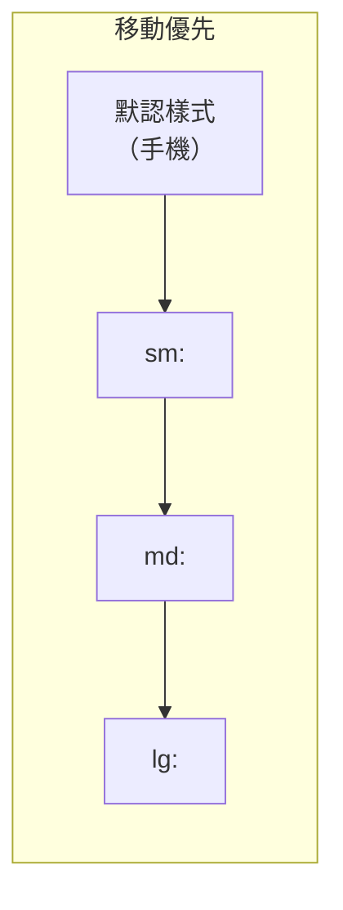

# 3.4.4 手機和電腦都能看——響應式設計

### 一句話破題

移動優先意味着先爲小屏設計，再逐步增強大屏體驗，Tailwind 的斷點系統天然支持這種方式。

### 核心價值

超過 50% 的網頁流量來自移動設備。響應式設計確保你的應用在任何設備上都能提供良好體驗，而移動優先策略讓這個過程更簡單。

### 移動優先 vs 桌面優先



**移動優先**：默認樣式面向手機，用斷點添加大屏樣式。

```html
<!-- 移動優先：默認單列，md 以上兩列 -->
<div class="grid grid-cols-1 md:grid-cols-2">
```

**桌面優先**（不推薦）：默認樣式面向桌面，用 `max-*` 斷點收縮。

### Tailwind 斷點詳解

| 斷點 | 最小寬度 | 典型設備 |
|------|----------|----------|
| 默認 | 0px | 手機（豎屏） |
| `sm:` | 640px | 手機（橫屏） |
| `md:` | 768px | 平板 |
| `lg:` | 1024px | 筆記本 |
| `xl:` | 1280px | 桌面顯示器 |
| `2xl:` | 1536px | 大顯示器 |

### 常見響應式模式

**1. 響應式網格**

```tsx
<div className="grid grid-cols-1 sm:grid-cols-2 lg:grid-cols-3 xl:grid-cols-4 gap-4">
  {products.map(product => (
    <ProductCard key={product.id} {...product} />
  ))}
</div>
```

**2. 響應式導航**

```tsx
function Navbar() {
  return (
    <nav className="flex items-center justify-between p-4">
      <Logo />
      
      {/* 桌面導航：大屏顯示 */}
      <div className="hidden md:flex gap-6">
        <NavLink href="/">首頁</NavLink>
        <NavLink href="/products">產品</NavLink>
        <NavLink href="/about">關於</NavLink>
      </div>
      
      {/* 移動端漢堡菜單：小屏顯示 */}
      <button className="md:hidden">
        <MenuIcon />
      </button>
    </nav>
  )
}
```

**3. 響應式字體**

```html
<h1 class="text-2xl sm:text-3xl md:text-4xl lg:text-5xl font-bold">
  響應式標題
</h1>
```

**4. 響應式間距**

```html
<section class="py-8 md:py-12 lg:py-16">
  <div class="px-4 md:px-6 lg:px-8 max-w-7xl mx-auto">
    內容區域
  </div>
</section>
```

**5. 響應式隱藏/顯示**

| 類 | 效果 |
|-----|------|
| `hidden` | 默認隱藏 |
| `block` | 默認顯示 |
| `md:hidden` | md 以上隱藏 |
| `hidden md:block` | md 以下隱藏，md 以上顯示 |

### 響應式佈局組件

**容器組件**

```tsx
function Container({ children }: { children: React.ReactNode }) {
  return (
    <div className="w-full max-w-7xl mx-auto px-4 sm:px-6 lg:px-8">
      {children}
    </div>
  )
}
```

**響應式卡片列表**

```tsx
function CardGrid({ children }: { children: React.ReactNode }) {
  return (
    <div className="grid grid-cols-1 sm:grid-cols-2 lg:grid-cols-3 gap-4 md:gap-6">
      {children}
    </div>
  )
}
```

**響應式側邊欄佈局**

```tsx
function DashboardLayout({ children }: { children: React.ReactNode }) {
  return (
    <div className="flex flex-col md:flex-row min-h-screen">
      {/* 側邊欄：移動端在頂部，桌面端在左側 */}
      <aside className="w-full md:w-64 bg-gray-100 p-4">
        <Sidebar />
      </aside>
      
      {/* 主內容區 */}
      <main className="flex-1 p-4 md:p-6">
        {children}
      </main>
    </div>
  )
}
```

### 響應式圖片

```tsx
import Image from 'next/image'

function ResponsiveImage() {
  return (
    <div className="relative w-full aspect-video md:aspect-[4/3] lg:aspect-[16/9]">
      <Image
        src="/hero.jpg"
        alt="Hero"
        fill
        className="object-cover"
        sizes="(max-width: 768px) 100vw, (max-width: 1200px) 50vw, 33vw"
      />
    </div>
  )
}
```

### 調試響應式

**1. 瀏覽器開發者工具**

Chrome DevTools 的設備模擬器可以快速切換不同尺寸。

**2. Tailwind 調試指示器**

```tsx
// 開發時添加到頁面角落
function BreakpointIndicator() {
  if (process.env.NODE_ENV === 'production') return null
  
  return (
    <div className="fixed bottom-4 left-4 bg-black text-white px-2 py-1 text-xs rounded z-50">
      <span className="sm:hidden">xs</span>
      <span className="hidden sm:inline md:hidden">sm</span>
      <span className="hidden md:inline lg:hidden">md</span>
      <span className="hidden lg:inline xl:hidden">lg</span>
      <span className="hidden xl:inline 2xl:hidden">xl</span>
      <span className="hidden 2xl:inline">2xl</span>
    </div>
  )
}
```

### AI 協作指南

**核心意圖**：讓 AI 生成移動優先的響應式代碼。

**需求定義公式**：
- 功能描述：[組件/頁面]
- 響應式要求：移動端 [佈局]，桌面端 [佈局]
- 斷點：使用 Tailwind 默認斷點

**關鍵術語**：`移動優先`、`斷點`、`grid`、`hidden`、`flex-col md:flex-row`

**示例 Prompt**：

```
創建一個產品列表頁面：
- 移動端：單列卡片
- 平板（md）：兩列
- 桌面（lg）：三列
- 使用 Tailwind 響應式類
- 卡片間距：移動端 16px，桌面 24px
```

### 避坑指南

1. **不要使用 `max-*` 斷點**：除非特殊情況，堅持移動優先
2. **測試真實設備**：模擬器不能完全替代真機測試
3. **注意觸控目標**：移動端按鈕至少 44x44px
4. **避免橫向滾動**：確保內容不超出視口

### 驗收清單

- [ ] 默認樣式針對移動端
- [ ] 關鍵斷點（md、lg）有對應樣式
- [ ] 導航在移動端可用（漢堡菜單或底部導航）
- [ ] 圖片使用 `sizes` 屬性優化加載
- [ ] 觸控元素足夠大
