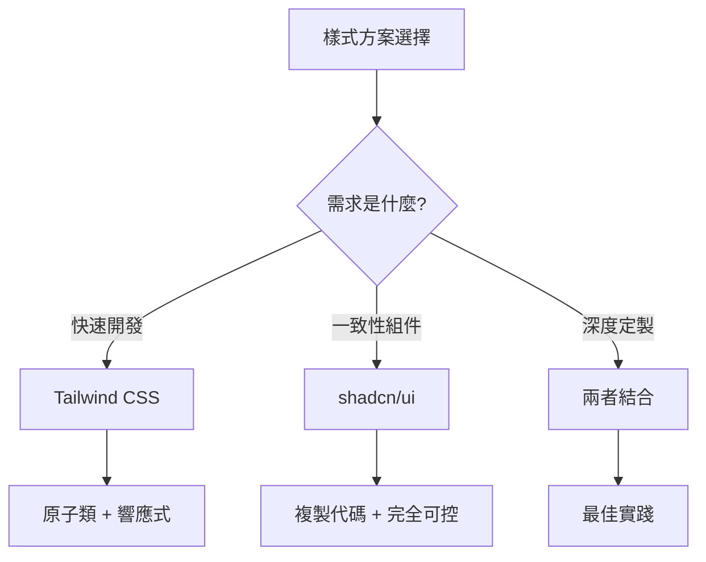

# 3.4 告別選擇困難症——Tailwind + shadcn/ui

### 一句話破題

Tailwind 提供原子化樣式類，shadcn/ui 提供可定製組件，兩者結合是 Next.js 項目的最佳樣式方案。

### 核心價值

CSS 的世界充滿選擇：CSS Modules、Styled Components、Emotion、Sass……每種方案都有優缺點。Tailwind + shadcn/ui 的組合已成爲 React 社區的主流選擇，也是 Vibe Coding 技術棧的標配。

### 爲什麼選擇這套方案？



| 方案 | 優點 | 缺點 |
|------|------|------|
| **Tailwind CSS** | 無需命名、快速迭代、體積小 | 類名長、需要學習 |
| **shadcn/ui** | 高質量組件、完全可定製 | 需要手動安裝 |
| **傳統 CSS** | 熟悉、無學習成本 | 命名困難、樣式衝突 |
| **CSS-in-JS** | 組件化、動態樣式 | 運行時開銷 |

### 本節導航

| 小節 | 主題 | 核心內容 |
|------|------|----------|
| **3.4.1** | Tailwind CSS | 原子化 CSS、常用類、響應式 |
| **3.4.2** | shadcn/ui | 安裝使用、組件定製 |
| **3.4.3** | 設計系統 | 顏色/字體/間距規範 |
| **3.4.4** | 響應式設計 | 移動優先、斷點策略 |

### 快速開始

**1. 創建項目時已包含 Tailwind**

```bash
npx create-next-app@latest my-app
# 選擇 Yes 使用 Tailwind CSS
```

**2. 安裝 shadcn/ui**

```bash
npx shadcn@latest init
```

**3. 添加組件**

```bash
npx shadcn@latest add button
npx shadcn@latest add card
npx shadcn@latest add input
```

### AI 協作指南

**核心意圖**：讓 AI 使用 Tailwind + shadcn 生成一致的 UI 代碼。

**需求定義公式**：
- 功能描述：我需要一個 [組件/頁面]
- 樣式要求：使用 Tailwind CSS
- 組件要求：使用 shadcn/ui 的 [組件名]

**關鍵術語**：`Tailwind`、`shadcn/ui`、`cn()`、`className`、`響應式`

**示例 Prompt**：

```
請用 Tailwind CSS 和 shadcn/ui 創建一個登錄表單：
- 使用 Card 作爲容器
- 使用 Input 組件（郵箱和密碼）
- 使用 Button 組件（登錄按鈕）
- 添加"忘記密碼"鏈接
- 響應式：移動端全寬，桌面端最大 400px
```

### 驗收清單

- [ ] Tailwind 配置正確，樣式生效
- [ ] shadcn/ui 組件正確安裝和導入
- [ ] 組件使用 `cn()` 合併樣式類
- [ ] 響應式斷點設置合理
