# 3.5.1 看看網絡請求慢在哪——Network 面板

### 一句話破題

數據不顯示？接口報錯？Network 面板能告訴你每個請求的完整生命週期。

### 核心價值

前端應用的大部分問題都與網絡請求相關。Network 面板讓你看到：請求發出去了嗎？服務器返回了什麼？花了多長時間？

### 打開 Network 面板

1. 打開 Chrome DevTools（F12 或右鍵 → 檢查）
2. 點擊 "Network" 標籤
3. **刷新頁面**以開始捕獲請求

### 面板核心區域

```
┌─────────────────────────────────────────────────────┐
│ [過濾器] All | Fetch/XHR | JS | CSS | Img | ...     │
├─────────────────────────────────────────────────────┤
│ Name          Status  Type    Size    Time          │
│ api/users     200     fetch   1.2KB   120ms         │
│ api/posts     404     fetch   0.5KB   80ms   ← 問題 │
│ bundle.js     200     script  450KB   1.2s          │
├─────────────────────────────────────────────────────┤
│ [請求詳情面板]                                       │
│ Headers | Preview | Response | Timing               │
└─────────────────────────────────────────────────────┘
```

### 快速過濾請求

| 過濾器 | 用途 |
|--------|------|
| **Fetch/XHR** | 只看 API 請求（最常用） |
| **JS** | JavaScript 文件 |
| **CSS** | 樣式文件 |
| **Img** | 圖片資源 |
| **搜索框** | 按 URL 關鍵詞過濾 |

### 查看請求詳情

點擊任意請求，右側會展開詳情面板：

**Headers 標籤**

```
General:
  Request URL: https://api.example.com/users
  Request Method: GET
  Status Code: 200 OK

Request Headers:
  Authorization: Bearer eyJhbGc...
  Content-Type: application/json

Response Headers:
  Content-Type: application/json
  Cache-Control: max-age=3600
```

**Response 標籤**

顯示服務器返回的原始數據：

```json
{
  "users": [
    { "id": 1, "name": "張三" },
    { "id": 2, "name": "李四" }
  ]
}
```

**Preview 標籤**

以格式化的方式展示響應數據，更易讀。

**Timing 標籤**

```mermaid
gantt
    title 請求時間線
    dateFormat X
    axisFormat %L ms
    
    section 連接
    DNS 解析      :0, 10
    TCP 連接      :10, 30
    SSL 握手      :30, 50
    
    section 請求
    等待服務器    :50, 150
    下載響應      :150, 180
```



### 常見問題診斷

**問題 1：請求返回 4xx/5xx**

| 狀態碼 | 含義 | 常見原因 |
|--------|------|----------|
| 400 | Bad Request | 請求參數格式錯誤 |
| 401 | Unauthorized | 未登錄或 token 過期 |
| 403 | Forbidden | 無權限訪問 |
| 404 | Not Found | URL 路徑錯誤 |
| 500 | Internal Server Error | 服務端代碼報錯 |

**檢查步驟**：
1. 查看 Response 標籤，服務器通常會返回錯誤描述
2. 對比 Request Headers 中的 Authorization 是否正確
3. 檢查請求 URL 和參數是否符合 API 文檔

**問題 2：請求沒發出去**

可能原因：
- 代碼邏輯問題，請求函數沒被調用
- CORS 跨域問題（Console 會有報錯）
- 網絡斷開

**問題 3：請求很慢**

查看 Timing 標籤，定位瓶頸：
- **TTFB 高**：服務器處理慢，需優化後端
- **Content Download 高**：響應體太大，考慮分頁或壓縮
- **Stalled 高**：瀏覽器連接數限制，減少併發請求

### 實用技巧

**複製請求爲 cURL**

右鍵請求 → Copy → Copy as cURL

可以在終端直接執行，或粘貼給後端同事調試：

```bash
curl 'https://api.example.com/users' \
  -H 'Authorization: Bearer xxx' \
  -H 'Content-Type: application/json'
```

**保留日誌**

勾選 "Preserve log"，頁面跳轉後請求記錄不會清空。

**模擬慢網**

點擊 "No throttling" 下拉菜單，可以模擬 3G、離線等網絡環境。

**禁用緩存**

勾選 "Disable cache"，確保每次都是新請求。

### AI 協作指南

**核心意圖**：用 Network 信息幫 AI 定位問題。

**有效的描述方式**：

```
我的 API 請求返回了錯誤：
- URL: /api/posts
- Method: POST
- Status: 400
- Request Body: {"title": ""}
- Response: {"error": "title is required"}

請問如何修復？
```

**關鍵術語**：`Status Code`、`Request Headers`、`Response Body`、`CORS`、`TTFB`

### 避坑指南

1. **記得刷新頁面**：打開 Network 面板後要刷新，否則看不到請求
2. **關注 Fetch/XHR**：調試 API 時只看這類請求，減少干擾
3. **區分預檢請求**：CORS 會先發 OPTIONS 請求，真正的請求在後面
4. **注意緩存**：304 狀態碼錶示使用了緩存，勾選 Disable cache 避免干擾

### 驗收清單

- [ ] 能夠找到指定的 API 請求
- [ ] 能夠查看請求的狀態碼和響應內容
- [ ] 能夠分析請求的時間消耗
- [ ] 知道如何複製請求爲 cURL
