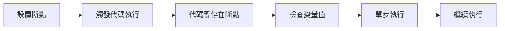

# 3.5.2 代碼到底跑沒跑——Console 調試

### 一句話破題

Console 是你與代碼對話的窗口——打印變量、追蹤執行、捕獲錯誤。

### 核心價值

代碼不按預期工作時，你需要知道：這段代碼執行了嗎？變量的值是什麼？在哪裏出錯了？Console 面板能回答所有這些問題。

### Console 日誌方法

```tsx
// 基礎日誌
console.log('普通信息', data)

// 警告（黃色）
console.warn('這是一個警告')

// 錯誤（紅色）
console.error('這是一個錯誤')

// 表格形式顯示數組/對象
console.table([{ id: 1, name: '張三' }, { id: 2, name: '李四' }])

// 分組日誌
console.group('用戶操作')
console.log('點擊了按鈕')
console.log('發送了請求')
console.groupEnd()

// 計時
console.time('數據處理')
// ... 耗時操作
console.timeEnd('數據處理') // 輸出: 數據處理: 123.45ms

// 條件日誌（只在條件爲 false 時輸出）
console.assert(user !== null, '用戶不應該爲 null')
```

### 讀懂錯誤信息

當 JavaScript 報錯時，Console 會顯示紅色錯誤信息：

```
Uncaught TypeError: Cannot read properties of undefined (reading 'name')
    at UserProfile (UserProfile.tsx:15:23)
    at renderWithHooks (react-dom.development.js:16305:18)
    at mountIndeterminateComponent (react-dom.development.js:20074:13)
```

**拆解錯誤信息**：

| 部分 | 含義 |
|------|------|
| `Uncaught TypeError` | 錯誤類型：類型錯誤 |
| `Cannot read properties of undefined` | 嘗試讀取 undefined 的屬性 |
| `(reading 'name')` | 具體是讀取 `name` 屬性時出錯 |
| `at UserProfile (UserProfile.tsx:15:23)` | 出錯位置：文件第 15 行第 23 列 |

**常見錯誤類型**：

| 錯誤類型 | 含義 | 常見場景 |
|----------|------|----------|
| `TypeError` | 類型錯誤 | 對 undefined/null 調用方法 |
| `ReferenceError` | 引用錯誤 | 使用未聲明的變量 |
| `SyntaxError` | 語法錯誤 | 代碼語法問題 |
| `RangeError` | 範圍錯誤 | 遞歸溢出、無效數組長度 |

### 調試技巧

**技巧 1：定位代碼是否執行**

```tsx
function handleClick() {
  console.log('1. 函數開始執行')
  
  if (someCondition) {
    console.log('2. 進入了 if 分支')
    // ...
  }
  
  console.log('3. 函數執行完畢')
}
```

**技巧 2：檢查變量值**

```tsx
function processData(data) {
  console.log('收到的數據:', data)
  console.log('數據類型:', typeof data)
  console.log('是否爲數組:', Array.isArray(data))
  
  // 如果是對象，展開查看所有屬性
  console.dir(data)
}
```

**技巧 3：追蹤調用棧**

```tsx
function problematicFunction() {
  console.trace('追蹤調用棧') // 顯示是誰調用了這個函數
}
```

### 使用斷點調試

比 `console.log` 更強大的是斷點調試：

1. 打開 DevTools → Sources 面板
2. 找到對應的源文件
3. 點擊行號設置斷點
4. 刷新頁面或觸發相關操作



**斷點面板控制按鈕**：

| 按鈕 | 功能 |
|------|------|
| ▶️ Resume | 繼續執行到下一個斷點 |
| ⏭️ Step Over | 執行當前行，不進入函數內部 |
| ⬇️ Step Into | 進入函數內部 |
| ⬆️ Step Out | 跳出當前函數 |

**條件斷點**：

右鍵點擊行號 → Add conditional breakpoint

```javascript
// 只在 userId 爲 5 時暫停
userId === 5
```

### React 中的 Console 調試

**調試 Props**：

```tsx
function UserCard({ user }) {
  console.log('UserCard 收到的 props:', { user })
  
  return <div>{user.name}</div>
}
```

**調試 State 更新**：

```tsx
function Counter() {
  const [count, setCount] = useState(0)
  
  useEffect(() => {
    console.log('count 更新爲:', count)
  }, [count])
  
  // ...
}
```

**調試 useEffect 執行**：

```tsx
useEffect(() => {
  console.log('Effect 執行，依賴值:', { userId })
  
  return () => {
    console.log('Effect 清理')
  }
}, [userId])
```

### AI 協作指南

**核心意圖**：把錯誤信息準確傳達給 AI。

**有效的描述方式**：

```
我的代碼報錯了：

錯誤信息：
TypeError: Cannot read properties of undefined (reading 'map')
    at ProductList (ProductList.tsx:12:18)

相關代碼：
function ProductList({ products }) {
  return products.map(p => <div>{p.name}</div>)
}

// 調用方式
<ProductList products={data?.products} />
```

**關鍵術語**：`TypeError`、`undefined`、`調用棧`、`斷點`、`單步執行`

### 避坑指南

1. **生產環境移除 console.log**：使用 ESLint 規則或構建時自動移除
2. **不要日誌敏感信息**：密碼、token 等不應打印到控制檯
3. **日誌要有意義**：`console.log(1)` 不如 `console.log('請求發送前:', payload)`
4. **利用分組**：複雜流程使用 `console.group()` 組織日誌

### 驗收清單

- [ ] 能夠使用 console.log 輸出變量值
- [ ] 能夠看懂錯誤信息並定位問題文件和行號
- [ ] 知道如何設置斷點進行調試
- [ ] 能夠使用單步執行追蹤代碼流程
