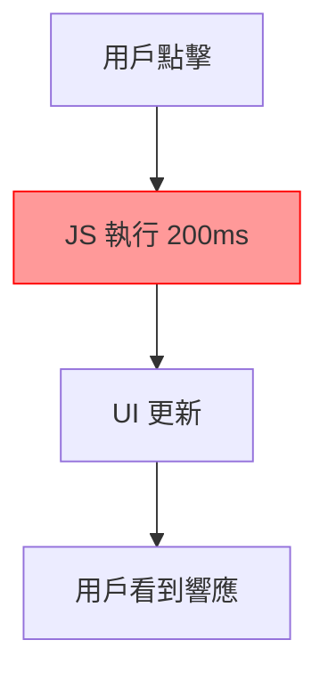

# 3.5.3 爲什麼頁面這麼卡——Performance 分析

### 一句話破題

當頁面感覺"卡"的時候，Performance 面板能告訴你時間都花在了哪裏。

### 核心價值

用戶對卡頓非常敏感——超過 100ms 的響應延遲就會被感知。Performance 面板讓你看到瀏覽器在每一毫秒都在做什麼，從而找出性能瓶頸。

### 錄製性能數據

1. 打開 DevTools → Performance 面板
2. 點擊 **Record** 按鈕（或 Ctrl+E）
3. 執行你想分析的操作（如頁面滾動、按鈕點擊）
4. 點擊 **Stop** 結束錄製

### 理解火焰圖

錄製完成後，你會看到一個"火焰圖"：

```
Main Thread
├── Task (200ms) ← 長任務！
│   ├── Function Call: heavyCalculation (150ms)
│   └── Function Call: updateDOM (50ms)
├── Task (16ms)
│   └── Render (16ms)
└── Task (8ms)
    └── Paint (8ms)
```

**關鍵概念**：

| 術語 | 含義 |
|------|------|
| **Main Thread** | 主線程，JS 執行和 UI 渲染都在這裏 |
| **Task** | 一個執行任務 |
| **Long Task** | 超過 50ms 的任務（紅色標記） |
| **Frame** | 一幀渲染（目標 16.67ms = 60fps） |

### 識別性能問題

**問題 1：長任務阻塞**



長任務會阻塞主線程，導致頁面無響應。

**優化方案**：
- 拆分長任務爲多個小任務
- 使用 `requestAnimationFrame` 分幀處理
- 將計算移至 Web Worker

```tsx
// 問題代碼：同步處理大量數據
function processAllItems(items) {
  items.forEach(item => heavyProcess(item)) // 阻塞 200ms
}

// 優化：分批處理
async function processItemsInChunks(items) {
  const chunkSize = 100
  for (let i = 0; i < items.length; i += chunkSize) {
    const chunk = items.slice(i, i + chunkSize)
    chunk.forEach(item => heavyProcess(item))
    await new Promise(resolve => setTimeout(resolve, 0)) // 讓出主線程
  }
}
```

**問題 2：頻繁重繪/重排**

Layout（重排）和 Paint（重繪）是昂貴的操作：

```tsx
// 問題：讀寫交替導致強制重排
elements.forEach(el => {
  const height = el.offsetHeight // 讀
  el.style.height = height + 10 + 'px' // 寫
})

// 優化：批量讀，批量寫
const heights = elements.map(el => el.offsetHeight) // 批量讀
elements.forEach((el, i) => {
  el.style.height = heights[i] + 10 + 'px' // 批量寫
})
```

**問題 3：內存泄漏**

切換到 Memory 面板檢查：

1. 點擊 **Take heap snapshot**
2. 執行一些操作（如打開/關閉彈窗）
3. 再次 **Take heap snapshot**
4. 比較兩個快照，查看是否有未釋放的對象

**常見內存泄漏場景**：

```tsx
// 泄漏：事件監聽未清理
useEffect(() => {
  window.addEventListener('resize', handleResize)
  // 忘記 return 清理函數！
}, [])

// 正確：清理事件監聽
useEffect(() => {
  window.addEventListener('resize', handleResize)
  return () => window.removeEventListener('resize', handleResize)
}, [])
```

### React 性能優化

**1. 避免不必要的重渲染**

使用 `React.memo` 包裹純展示組件：

```tsx
const ExpensiveComponent = React.memo(function ExpensiveComponent({ data }) {
  // 只有 data 變化時才重新渲染
  return <div>{/* 複雜渲染 */}</div>
})
```

**2. 使用 useMemo 緩存計算結果**

```tsx
const sortedList = useMemo(() => {
  return items.sort((a, b) => a.name.localeCompare(b.name))
}, [items]) // 只有 items 變化時才重新排序
```

**3. 使用 useCallback 穩定回調引用**

```tsx
const handleClick = useCallback(() => {
  doSomething(id)
}, [id]) // 只有 id 變化時才創建新函數
```

### 性能指標

| 指標 | 含義 | 目標值 |
|------|------|--------|
| **FCP** | First Contentful Paint | < 1.8s |
| **LCP** | Largest Contentful Paint | < 2.5s |
| **FID** | First Input Delay | < 100ms |
| **CLS** | Cumulative Layout Shift | < 0.1 |
| **TTI** | Time to Interactive | < 3.8s |

使用 Lighthouse 面板可以自動測量這些指標。

### AI 協作指南

**核心意圖**：用性能數據幫 AI 定位優化點。

**有效的描述方式**：

```
頁面滾動時很卡，Performance 錄製顯示：
- Main Thread 有多個 200ms+ 的長任務
- 長任務主要來自 `renderList` 函數
- 列表有 1000 個項目

請問如何優化？
```

**關鍵術語**：`Long Task`、`Layout`、`Paint`、`React.memo`、`虛擬滾動`

### 避坑指南

1. **不要過早優化**：先確認問題存在，再優化
2. **測量要在生產模式**：開發模式的 React 會慢很多
3. **關注真實用戶指標**：使用 RUM 監控真實用戶體驗
4. **優先優化關鍵路徑**：首屏渲染比次要交互更重要

### 驗收清單

- [ ] 能夠錄製並分析 Performance 數據
- [ ] 能夠識別火焰圖中的長任務
- [ ] 知道如何檢測內存泄漏
- [ ] 瞭解 React 常用的性能優化方法
