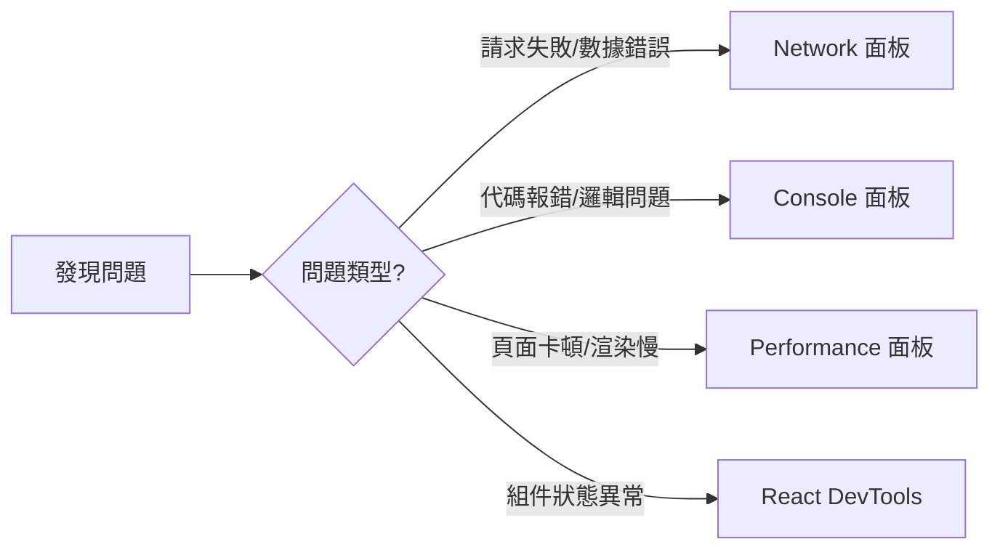

# 3.5 別靠猜來找 Bug——Debug 實戰

### 一句話破題

調試不是玄學，而是科學——用正確的工具，在正確的位置，觀察正確的數據。

### 本節定位

當代碼不按預期工作時，新手往往陷入"猜測-修改-祈禱"的循環。而高手會打開 DevTools，用數據說話。本節將教你掌握 Chrome DevTools 的四大核心面板，讓問題無所遁形。

### 調試思維模型

高效調試遵循**定位-觀察-驗證**的循環：

| 階段 | 行動 | 工具 |
|------|------|------|
| **定位** | 縮小問題範圍 | 二分法註釋代碼 |
| **觀察** | 收集運行時數據 | DevTools 各面板 |
| **驗證** | 確認假設是否正確 | 修改代碼並測試 |

### 調試前的準備

在開始調試之前，確保你的開發環境配置正確：

1. **開發模式**：確保運行的是 `npm run dev` 而非生產構建
2. **Source Maps**：確保 TypeScript/JavaScript 的 source map 已啓用
3. **React DevTools**：安裝 Chrome 擴展程序
4. **禁用緩存**：在 Network 面板勾選 "Disable cache"

### 本節導航

| 小節 | 主題 | 解決什麼問題 |
|------|------|--------------|
| **3.5.1** | Network 面板 | 請求失敗、數據格式錯誤、接口慢 |
| **3.5.2** | Console 調試 | 代碼報錯、邏輯判斷、變量值檢查 |
| **3.5.3** | Performance 分析 | 頁面卡頓、渲染性能、內存泄漏 |
| **3.5.4** | React DevTools | 組件狀態、Props 傳遞、重渲染問題 |

### 常見問題速查表

| 現象 | 可能原因 | 檢查工具 | 檢查要點 |
|------|----------|----------|----------|
| 白屏 | JS 報錯 | Console | 紅色錯誤信息 |
| 數據不顯示 | 請求失敗 | Network | 狀態碼、響應體 |
| 頁面卡頓 | 渲染性能 | Performance | 長任務、重繪 |
| 狀態不更新 | React 狀態 | React DevTools | 組件狀態、Props |

### AI 協作指南

**核心意圖**：當遇到 Bug 時，先用 DevTools 收集信息，再讓 AI 幫你分析。

**有效的求助方式**：
- "Network 顯示請求返回 500，響應體是 [粘貼響應]，這是什麼問題？"
- "Console 報錯 [粘貼錯誤棧]，這個錯誤是什麼意思？"
- "Performance 錄製顯示這個函數執行了 200ms，如何優化？"

**無效的求助方式**：
- "頁面白屏了，怎麼辦？"（信息不足）
- "代碼不工作"（沒有具體描述）

### Vibe Coding 視角

在 Vibe Coding 體系下，調試能力決定了你能否有效驗收 AI 生成的代碼。當 AI 寫的代碼不工作時，你需要：

1. **用 DevTools 定位問題**：而不是盲目讓 AI "修一修"
2. **給 AI 精確的反饋**：提供錯誤信息、網絡請求截圖
3. **驗證 AI 的修復**：確認問題真的解決了，而非引入新問題

### 驗收清單

- [ ] 知道如何打開 Chrome DevTools（F12 或 Cmd+Option+I）
- [ ] 能夠在 Network 面板找到請求並查看響應
- [ ] 能夠在 Console 面板看懂錯誤信息
- [ ] 已安裝 React Developer Tools 擴展
