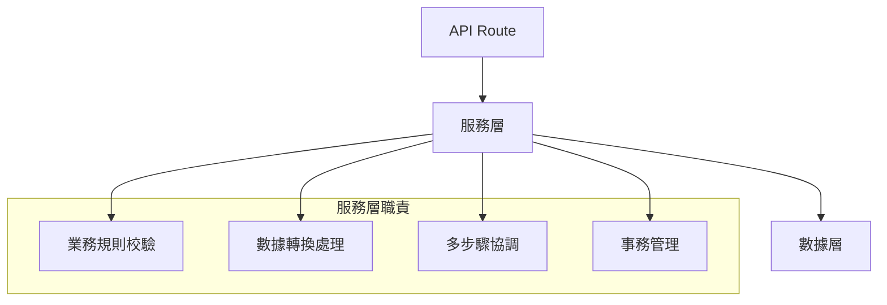

# 3.6.3 業務邏輯放哪裏——服務層設計

### 一句話破題

服務層是業務規則的家，讓 API Route 保持簡潔，讓邏輯可測試、可複用。

### 核心價值

當業務邏輯散落在 API Route 各處時，代碼很難複用，也很難測試。服務層把"做什麼事"和"怎麼接收請求"分開，讓代碼更清晰。

### 服務層的職責



| 應該在服務層 | 不應該在服務層 |
|-------------|---------------|
| 業務規則判斷 | HTTP 請求解析 |
| 數據轉換加工 | 響應格式構造 |
| 多表操作協調 | 認證鑑權檢查 |
| 第三方服務調用 | 緩存 header 設置 |

### 基礎服務結構

```tsx
// services/postService.ts

import { prisma } from '@/lib/prisma'
import { CreatePostInput, UpdatePostInput } from '@/lib/validations/post'
import { NotFoundError, ConflictError } from '@/lib/errors'

export const postService = {
  async findAll(options: { page: number; limit: number; status?: string }) {
    const { page, limit, status } = options
    const skip = (page - 1) * limit
    
    const [posts, total] = await Promise.all([
      prisma.post.findMany({
        where: status ? { status } : undefined,
        skip,
        take: limit,
        orderBy: { createdAt: 'desc' },
      }),
      prisma.post.count({ where: status ? { status } : undefined }),
    ])
    
    return { posts, total, page, limit }
  },

  async findById(id: string) {
    const post = await prisma.post.findUnique({ where: { id } })
    if (!post) {
      throw new NotFoundError('文章不存在')
    }
    return post
  },

  async create(data: CreatePostInput) {
    const slug = this.generateSlug(data.title)
    
    const existing = await prisma.post.findUnique({ where: { slug } })
    if (existing) {
      throw new ConflictError('該標題已被使用')
    }
    
    return prisma.post.create({
      data: { ...data, slug },
    })
  },

  async update(id: string, data: UpdatePostInput) {
    await this.findById(id)
    
    if (data.title) {
      const slug = this.generateSlug(data.title)
      const existing = await prisma.post.findFirst({
        where: { slug, NOT: { id } },
      })
      if (existing) {
        throw new ConflictError('該標題已被使用')
      }
      data = { ...data, slug }
    }
    
    return prisma.post.update({ where: { id }, data })
  },

  async delete(id: string) {
    await this.findById(id)
    return prisma.post.delete({ where: { id } })
  },

  generateSlug(title: string) {
    return title
      .toLowerCase()
      .trim()
      .replace(/\s+/g, '-')
      .replace(/[^\w\-]+/g, '')
  },
}
```

### 在 API Route 中使用

```tsx
// app/api/posts/route.ts
import { postService } from '@/services/postService'
import { createPostSchema, queryPostsSchema } from '@/lib/validations/post'
import { handleError } from '@/lib/errorHandler'

export async function GET(request: Request) {
  const { searchParams } = new URL(request.url)
  const result = queryPostsSchema.safeParse(Object.fromEntries(searchParams))
  
  if (!result.success) {
    return Response.json({ error: result.error.flatten() }, { status: 400 })
  }
  
  try {
    const data = await postService.findAll(result.data)
    return Response.json({ data })
  } catch (error) {
    return handleError(error)
  }
}

export async function POST(request: Request) {
  const body = await request.json()
  const result = createPostSchema.safeParse(body)
  
  if (!result.success) {
    return Response.json({ error: result.error.flatten() }, { status: 400 })
  }
  
  try {
    const post = await postService.create(result.data)
    return Response.json({ data: post }, { status: 201 })
  } catch (error) {
    return handleError(error)
  }
}
```

### 複雜業務示例

**場景**：發佈文章時需要：檢查作者權限、生成 slug、發送通知

```tsx
// services/postService.ts
async publish(postId: string, userId: string) {
  const post = await this.findById(postId)
  
  if (post.authorId !== userId) {
    throw new ForbiddenError('只能發佈自己的文章')
  }
  
  if (post.status === 'published') {
    throw new ConflictError('文章已發佈')
  }
  
  const updatedPost = await prisma.post.update({
    where: { id: postId },
    data: { 
      status: 'published',
      publishedAt: new Date(),
    },
  })
  
  await notificationService.notifyFollowers(userId, {
    type: 'new_post',
    postId: updatedPost.id,
  })
  
  return updatedPost
}
```

### 事務處理

多個數據庫操作需要原子性時，使用事務：

```tsx
async createOrder(userId: string, items: OrderItem[]) {
  return prisma.$transaction(async (tx) => {
    const order = await tx.order.create({
      data: { userId, status: 'pending' },
    })
    
    for (const item of items) {
      const product = await tx.product.findUnique({
        where: { id: item.productId },
      })
      
      if (!product || product.stock < item.quantity) {
        throw new Error(`商品 ${item.productId} 庫存不足`)
      }
      
      await tx.product.update({
        where: { id: item.productId },
        data: { stock: { decrement: item.quantity } },
      })
      
      await tx.orderItem.create({
        data: {
          orderId: order.id,
          productId: item.productId,
          quantity: item.quantity,
          price: product.price,
        },
      })
    }
    
    const total = await tx.orderItem.aggregate({
      where: { orderId: order.id },
      _sum: { price: true },
    })
    
    return tx.order.update({
      where: { id: order.id },
      data: { total: total._sum.price || 0 },
      include: { items: true },
    })
  })
}
```

### 目錄結構建議

```
src/
├── app/
│   └── api/
│       └── posts/
│           └── route.ts       # 只處理 HTTP
├── services/
│   ├── postService.ts         # 文章業務邏輯
│   ├── userService.ts         # 用戶業務邏輯
│   └── notificationService.ts # 通知服務
├── repositories/              # 可選，進一步分離數據訪問
│   └── postRepository.ts
└── lib/
    ├── prisma.ts              # Prisma 客戶端
    └── errors.ts              # 自定義錯誤類
```

### AI 協作指南

**核心意圖**：讓 AI 幫你設計業務邏輯清晰的服務層。

**需求定義公式**：
- 功能描述：實現 [業務場景] 的服務方法
- 業務規則：[規則1]、[規則2]、[規則3]
- 技術要求：使用 Prisma，拋出自定義錯誤

**關鍵術語**：`Service`、`事務`、`$transaction`、業務規則、錯誤處理

**示例 Prompt**：

```
請實現用戶註冊服務：
1. 檢查郵箱是否已註冊
2. 檢查用戶名是否已被使用
3. 密碼加密存儲
4. 創建用戶後發送歡迎郵件
5. 返回用戶信息（不含密碼）
使用 Prisma 事務保證一致性
```

### 避坑指南

1. **不要在服務層依賴 Request/Response**：保持服務層的純粹性
2. **拋出語義化錯誤**：使用自定義錯誤類，而非通用 Error
3. **單一職責**：一個服務方法只做一件事
4. **避免循環依賴**：服務之間的調用要小心

### 驗收清單

- [ ] 服務層不依賴 HTTP 相關對象
- [ ] 業務規則集中在服務層
- [ ] 使用事務處理多步驟操作
- [ ] 拋出有意義的錯誤信息
