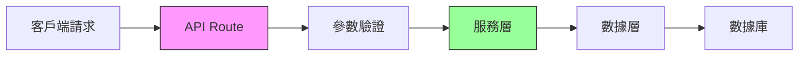

# 3.6 別把廚房建在客廳——API Route 與服務層分離

### 一句話破題

API Route 是你的應用與外界通信的門戶，但業務邏輯應該在服務層，而非路由處理器中。

### 本節定位

在 Next.js App Router 中，你可以用 Route Handlers 創建後端 API。但如果不做好分層，很快就會變成"廚房和客廳連在一起"——邏輯混亂、難以維護。



### 分層架構的核心原則

| 層級 | 職責 | 不該做的事 |
|------|------|------------|
| **API Route** | 接收請求、驗證參數、返回響應 | 業務邏輯、數據庫操作 |
| **Service 層** | 業務邏輯、規則校驗 | HTTP 處理、數據庫細節 |
| **Data 層** | 數據庫操作、ORM 調用 | 業務規則、HTTP 響應 |

### 爲什麼需要分層？

**場景**：假設你要實現"創建文章"功能。

**沒有分層（所有邏輯塞在 Route Handler 裏）**：

```tsx
// 問題代碼：一鍋燉
export async function POST(request: Request) {
  const body = await request.json()
  
  // 驗證邏輯
  if (!body.title || body.title.length < 3) {
    return Response.json({ error: '標題太短' }, { status: 400 })
  }
  
  // 業務邏輯
  const slug = body.title.toLowerCase().replace(/ /g, '-')
  const existingPost = await prisma.post.findUnique({ where: { slug } })
  if (existingPost) {
    return Response.json({ error: 'slug 已存在' }, { status: 409 })
  }
  
  // 數據庫操作
  const post = await prisma.post.create({
    data: { title: body.title, slug, content: body.content }
  })
  
  return Response.json(post, { status: 201 })
}
```

**有分層（職責清晰）**：

```tsx
// app/api/posts/route.ts - API 層
export async function POST(request: Request) {
  const body = await request.json()
  const result = createPostSchema.safeParse(body)
  if (!result.success) {
    return Response.json({ error: result.error }, { status: 400 })
  }
  
  try {
    const post = await postService.createPost(result.data)
    return Response.json(post, { status: 201 })
  } catch (error) {
    return handleError(error)
  }
}

// services/postService.ts - 服務層
export async function createPost(data: CreatePostInput) {
  const slug = generateSlug(data.title)
  const existing = await postRepository.findBySlug(slug)
  if (existing) {
    throw new ConflictError('slug 已存在')
  }
  return postRepository.create({ ...data, slug })
}

// repositories/postRepository.ts - 數據層
export async function create(data: PostData) {
  return prisma.post.create({ data })
}
```

### 本節導航

| 小節 | 主題 | 核心內容 |
|------|------|----------|
| **3.6.1** | API Route 結構 | GET/POST/PUT/DELETE 處理 |
| **3.6.2** | 請求驗證 | Zod 參數校驗、類型安全 |
| **3.6.3** | 服務層設計 | 業務邏輯封裝與複用 |
| **3.6.4** | 錯誤處理 | 統一異常處理機制 |

### AI 協作指南

**核心意圖**：讓 AI 幫你設計分層清晰的 API。

**需求定義公式**：
- 功能描述：我需要一個 [資源] 的 CRUD API
- 技術要求：使用 Next.js Route Handler + Zod + Prisma
- 分層要求：API 層只做路由，業務邏輯放服務層

**關鍵術語**：`Route Handler`、`Service`、`Repository`、`Zod`、`錯誤處理`

### 驗收清單

- [ ] API Route 只處理請求和響應
- [ ] 業務邏輯封裝在 Service 層
- [ ] 使用 Zod 進行參數驗證
- [ ] 有統一的錯誤處理機制
