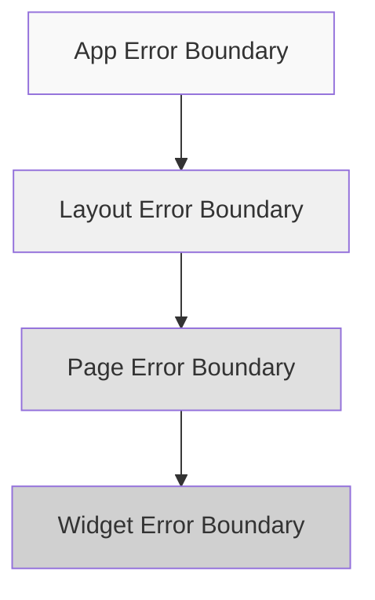

# 3.7.1 錯誤邊界

### 一句話破題

Error Boundary 是 React 的保險絲，一個組件短路時，保護其他組件繼續工作。

### 核心價值

JavaScript 錯誤不應該讓整個應用崩潰。Error Boundary 可以捕獲子組件樹中的錯誤，顯示備用 UI，而不是白屏。

### 基礎實現

```tsx
// components/ErrorBoundary.tsx
'use client'

import { Component, ReactNode } from 'react'

interface Props {
  children: ReactNode
  fallback?: ReactNode
  onError?: (error: Error, errorInfo: React.ErrorInfo) => void
}

interface State {
  hasError: boolean
  error: Error | null
}

export class ErrorBoundary extends Component<Props, State> {
  constructor(props: Props) {
    super(props)
    this.state = { hasError: false, error: null }
  }

  static getDerivedStateFromError(error: Error): State {
    return { hasError: true, error }
  }

  componentDidCatch(error: Error, errorInfo: React.ErrorInfo) {
    console.error('ErrorBoundary caught an error:', error, errorInfo)
    this.props.onError?.(error, errorInfo)
  }

  render() {
    if (this.state.hasError) {
      return this.props.fallback || <DefaultFallback error={this.state.error} />
    }

    return this.props.children
  }
}

function DefaultFallback({ error }: { error: Error | null }) {
  return (
    <div className="p-4 border border-red-200 rounded-lg bg-red-50">
      <h2 className="text-red-800 font-medium">出錯了</h2>
      <p className="text-red-600 text-sm mt-1">
        {error?.message || '發生了未知錯誤'}
      </p>
    </div>
  )
}
```

### 使用方式

**基礎使用**：

```tsx
<ErrorBoundary>
  <RiskyComponent />
</ErrorBoundary>
```

**自定義 Fallback**：

```tsx
<ErrorBoundary 
  fallback={
    <div className="text-center py-8">
      <p>此功能暫時不可用</p>
      <button onClick={() => window.location.reload()}>
        刷新頁面
      </button>
    </div>
  }
>
  <WidgetComponent />
</ErrorBoundary>
```

**帶重試功能**：

```tsx
// components/ErrorBoundaryWithRetry.tsx
'use client'

import { Component, ReactNode } from 'react'

interface Props {
  children: ReactNode
  onRetry?: () => void
}

interface State {
  hasError: boolean
  error: Error | null
}

export class ErrorBoundaryWithRetry extends Component<Props, State> {
  constructor(props: Props) {
    super(props)
    this.state = { hasError: false, error: null }
  }

  static getDerivedStateFromError(error: Error): State {
    return { hasError: true, error }
  }

  handleRetry = () => {
    this.setState({ hasError: false, error: null })
    this.props.onRetry?.()
  }

  render() {
    if (this.state.hasError) {
      return (
        <div className="p-4 border rounded-lg bg-gray-50 text-center">
          <p className="text-gray-600 mb-4">加載失敗</p>
          <button 
            onClick={this.handleRetry}
            className="px-4 py-2 bg-blue-500 text-white rounded"
          >
            重試
          </button>
        </div>
      )
    }

    return this.props.children
  }
}
```

### 在 Next.js 中使用

**佈局級別錯誤邊界**：

```tsx
// app/layout.tsx
import { ErrorBoundary } from '@/components/ErrorBoundary'

export default function RootLayout({ children }: { children: React.ReactNode }) {
  return (
    <html>
      <body>
        <ErrorBoundary fallback={<GlobalErrorPage />}>
          {children}
        </ErrorBoundary>
      </body>
    </html>
  )
}
```

**頁面級別錯誤處理**（Next.js 內置）：

```tsx
// app/dashboard/error.tsx
'use client'

export default function Error({
  error,
  reset,
}: {
  error: Error & { digest?: string }
  reset: () => void
}) {
  return (
    <div className="min-h-screen flex items-center justify-center">
      <div className="text-center">
        <h2 className="text-xl font-semibold mb-4">出錯了</h2>
        <p className="text-gray-600 mb-4">{error.message}</p>
        <button 
          onClick={reset}
          className="px-4 py-2 bg-blue-500 text-white rounded"
        >
          重試
        </button>
      </div>
    </div>
  )
}
```

### 錯誤邊界的限制

Error Boundary **無法捕獲**以下錯誤：

| 錯誤類型 | 原因 | 解決方案 |
|---------|------|---------|
| 事件處理函數中的錯誤 | 不在渲染過程中 | try-catch |
| 異步代碼（setTimeout） | 脫離 React 調用棧 | try-catch |
| 服務端渲染錯誤 | 發生在服務端 | error.tsx |
| Error Boundary 自身的錯誤 | 無法自我捕獲 | 嵌套邊界 |

```tsx
// 事件處理函數需要手動處理
function Button() {
  const handleClick = () => {
    try {
      riskyOperation()
    } catch (error) {
      // 手動處理錯誤
      showToast('操作失敗')
    }
  }
  
  return <button onClick={handleClick}>點擊</button>
}
```

### 錯誤上報

```tsx
// components/ErrorBoundary.tsx
componentDidCatch(error: Error, errorInfo: React.ErrorInfo) {
  reportError({
    error: {
      message: error.message,
      stack: error.stack,
    },
    componentStack: errorInfo.componentStack,
    url: window.location.href,
    timestamp: new Date().toISOString(),
  })
}

async function reportError(data: ErrorReport) {
  if (process.env.NODE_ENV === 'production') {
    await fetch('/api/error-report', {
      method: 'POST',
      body: JSON.stringify(data),
    })
  }
}
```

### 邊界策略



推薦分層設置：
- **全局級**：捕獲未預料的致命錯誤
- **佈局級**：保護導航欄等公共部分
- **頁面級**：隔離頁面間的錯誤
- **組件級**：保護獨立的功能模塊

### AI 協作指南

**核心意圖**：讓 AI 幫你實現健壯的錯誤邊界系統。

**需求定義公式**：
- 功能描述：創建帶 [功能] 的錯誤邊界組件
- 降級方案：錯誤時顯示 [備用UI]
- 附加功能：[重試/上報/日誌]

**示例 Prompt**：

```
請創建一個 Error Boundary 組件：
1. 捕獲子組件的渲染錯誤
2. 顯示友好的錯誤提示和重試按鈕
3. 支持錯誤上報到後端
4. 開發環境顯示錯誤堆棧
```

### 驗收清單

- [ ] 關鍵功能模塊有 Error Boundary 保護
- [ ] 有合適的 fallback UI
- [ ] 支持錯誤重試
- [ ] 生產環境有錯誤上報
