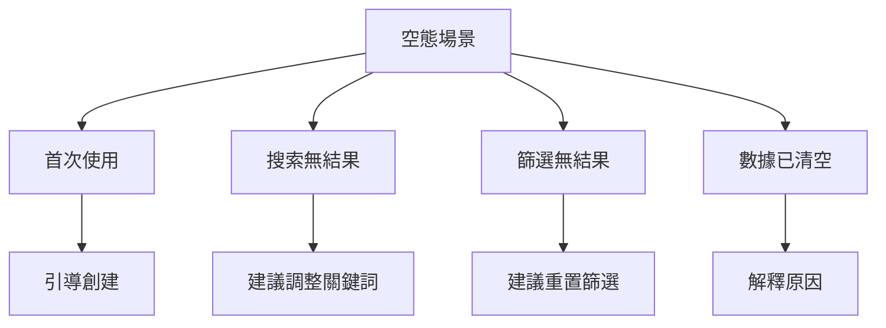

# 3.7.2 空態設計

### 一句話破題

空白不是終點，而是引導用戶開始的機會。好的空態設計讓用戶知道該做什麼。

### 核心價值

當列表爲空、搜索無結果時，不要只顯示"暫無數據"。空態頁面應該解釋爲什麼是空的，並引導用戶進行下一步操作。

### 空態類型



| 場景 | 用戶心理 | 設計要點 |
|-----|---------|---------|
| 首次使用 | 好奇期待 | 強調價值，引導開始 |
| 搜索無結果 | 輕微失望 | 提供替代建議 |
| 篩選無結果 | 困惑 | 顯示重置按鈕 |
| 數據已清空 | 可能誤操作 | 提供恢復途徑 |

### 基礎空態組件

```tsx
// components/Empty.tsx
import { ReactNode } from 'react'

interface EmptyProps {
  icon?: ReactNode
  title: string
  description?: string
  action?: ReactNode
}

export function Empty({ icon, title, description, action }: EmptyProps) {
  return (
    <div className="flex flex-col items-center justify-center py-12">
      {icon && (
        <div className="text-gray-400 mb-4">
          {icon}
        </div>
      )}
      <h3 className="text-lg font-medium text-gray-900 mb-2">
        {title}
      </h3>
      {description && (
        <p className="text-sm text-gray-500 mb-4 text-center max-w-sm">
          {description}
        </p>
      )}
      {action && (
        <div className="mt-4">
          {action}
        </div>
      )}
    </div>
  )
}
```

### 場景化空態

**首次使用**：

```tsx
<Empty
  icon={<FileIcon className="w-12 h-12" />}
  title="還沒有任何文檔"
  description="創建你的第一個文檔，開始記錄你的想法"
  action={
    <Button onClick={openCreateDialog}>
      <PlusIcon className="w-4 h-4 mr-2" />
      創建文檔
    </Button>
  }
/>
```

**搜索無結果**：

```tsx
function SearchEmpty({ query }: { query: string }) {
  return (
    <Empty
      icon={<SearchIcon className="w-12 h-12" />}
      title={`找不到 "${query}" 相關內容`}
      description="試試其他關鍵詞，或檢查是否有拼寫錯誤"
      action={
        <div className="space-y-2 text-center">
          <p className="text-sm text-gray-500">你可以試試：</p>
          <div className="flex gap-2 justify-center">
            <Button variant="outline" size="sm">React</Button>
            <Button variant="outline" size="sm">Next.js</Button>
            <Button variant="outline" size="sm">TypeScript</Button>
          </div>
        </div>
      }
    />
  )
}
```

**篩選無結果**：

```tsx
function FilterEmpty({ onReset }: { onReset: () => void }) {
  return (
    <Empty
      icon={<FilterIcon className="w-12 h-12" />}
      title="沒有符合條件的結果"
      description="當前篩選條件下沒有匹配的數據"
      action={
        <Button variant="outline" onClick={onReset}>
          重置篩選條件
        </Button>
      }
    />
  )
}
```

### 列表組件封裝

```tsx
// components/List.tsx
interface ListProps<T> {
  data: T[]
  loading?: boolean
  empty?: ReactNode
  renderItem: (item: T, index: number) => ReactNode
}

export function List<T>({ data, loading, empty, renderItem }: ListProps<T>) {
  if (loading) {
    return <ListSkeleton />
  }
  
  if (data.length === 0) {
    return empty || <Empty title="暫無數據" />
  }
  
  return (
    <ul className="divide-y">
      {data.map((item, index) => (
        <li key={index}>{renderItem(item, index)}</li>
      ))}
    </ul>
  )
}

// 使用
<List
  data={posts}
  loading={isLoading}
  empty={
    <Empty
      title="還沒有文章"
      action={<Button>寫第一篇</Button>}
    />
  }
  renderItem={(post) => <PostCard post={post} />}
/>
```

### 帶插圖的空態

```tsx
// components/EmptyWithIllustration.tsx
interface EmptyWithIllustrationProps {
  illustration: 'inbox' | 'search' | 'error' | 'success'
  title: string
  description?: string
  action?: ReactNode
}

const illustrations = {
  inbox: '/illustrations/empty-inbox.svg',
  search: '/illustrations/empty-search.svg',
  error: '/illustrations/error.svg',
  success: '/illustrations/success.svg',
}

export function EmptyWithIllustration({
  illustration,
  title,
  description,
  action,
}: EmptyWithIllustrationProps) {
  return (
    <div className="flex flex-col items-center py-16">
      
      <h3 className="text-xl font-medium mb-2">{title}</h3>
      {description && (
        <p className="text-gray-500 mb-6 text-center max-w-md">
          {description}
        </p>
      )}
      {action}
    </div>
  )
}
```

### 動態空態

根據上下文顯示不同的空態：

```tsx
function PostList({ category }: { category?: string }) {
  const { data: posts, isLoading } = usePosts({ category })
  
  const emptyState = useMemo(() => {
    if (category) {
      return (
        <Empty
          title={`"${category}" 分類下暫無文章`}
          action={
            <Link href="/posts">查看全部文章</Link>
          }
        />
      )
    }
    
    return (
      <Empty
        title="還沒有任何文章"
        description="開始寫你的第一篇文章吧"
        action={
          <Button asChild>
            <Link href="/posts/new">寫文章</Link>
          </Button>
        }
      />
    )
  }, [category])
  
  return (
    <List
      data={posts}
      loading={isLoading}
      empty={emptyState}
      renderItem={(post) => <PostCard post={post} />}
    />
  )
}
```

### 空態設計原則

**1. 解釋原因**：告訴用戶爲什麼是空的

```tsx
// 差
<p>暫無數據</p>

// 好
<p>你還沒有創建任何項目</p>
```

**2. 提供出路**：給用戶一個明確的行動

```tsx
// 差
<Empty title="沒有收藏" />

// 好
<Empty 
  title="沒有收藏" 
  action={<Link href="/explore">發現內容</Link>}
/>
```

**3. 保持品牌一致性**：使用統一的插圖風格和語氣

### AI 協作指南

**核心意圖**：讓 AI 幫你設計各種場景的空態頁面。

**需求定義公式**：
- 場景描述：[頁面/功能] 的空態設計
- 空態原因：[首次使用/無搜索結果/篩選爲空]
- 引導目標：希望用戶 [執行某操作]

**示例 Prompt**：

```
請設計電商收藏夾的空態頁面：
1. 首次使用：引導用戶去逛商品
2. 顯示友好的插圖和文案
3. 提供"去逛逛"按鈕
4. 可以推薦熱門商品
```

### 驗收清單

- [ ] 所有列表都有空態處理
- [ ] 空態有明確的下一步引導
- [ ] 搜索/篩選有對應的空態
- [ ] 空態風格與品牌一致
