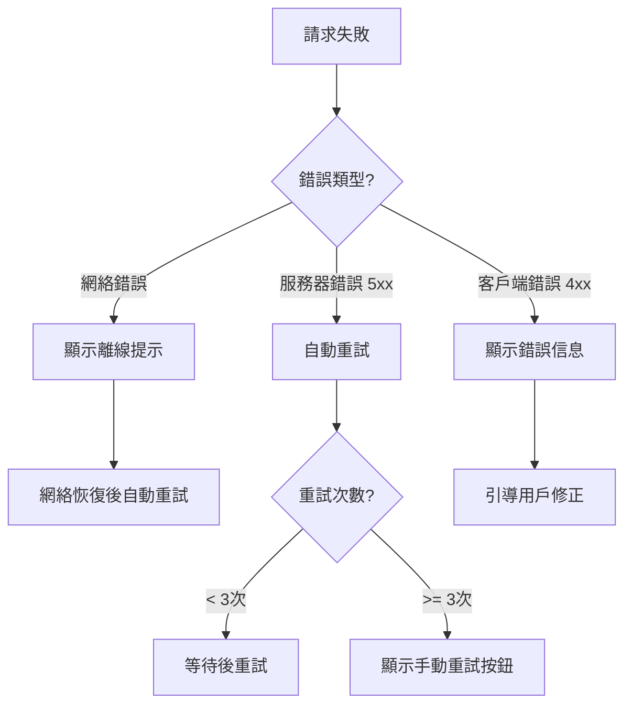

# 3.7.4 錯誤重試

### 一句話破題

失敗不可怕，可怕的是用戶不知道怎麼重試。給用戶一個按鈕，勝過一句"請稍後再試"。

### 核心價值

網絡請求失敗是常態。好的錯誤處理應該：告訴用戶發生了什麼、提供立即重試的方式、必要時自動重試。

### 錯誤狀態組件

```tsx
// components/ErrorState.tsx
import { ReactNode } from 'react'

interface ErrorStateProps {
  title?: string
  message?: string
  onRetry?: () => void
  retrying?: boolean
  action?: ReactNode
}

export function ErrorState({
  title = '加載失敗',
  message = '請檢查網絡連接後重試',
  onRetry,
  retrying = false,
  action,
}: ErrorStateProps) {
  return (
    <div className="flex flex-col items-center justify-center py-12">
      <div className="w-16 h-16 mb-4 text-red-500">
        <AlertCircleIcon className="w-full h-full" />
      </div>
      
      <h3 className="text-lg font-medium text-gray-900 mb-2">
        {title}
      </h3>
      
      <p className="text-sm text-gray-500 mb-6 text-center max-w-sm">
        {message}
      </p>
      
      {action || (onRetry && (
        <button
          onClick={onRetry}
          disabled={retrying}
          className="px-4 py-2 bg-blue-500 text-white rounded hover:bg-blue-600 disabled:opacity-50"
        >
          {retrying ? '重試中...' : '重試'}
        </button>
      ))}
    </div>
  )
}
```

### 在列表中使用

```tsx
function PostList() {
  const { data, error, isLoading, refetch, isRefetching } = usePosts()
  
  if (isLoading) {
    return <PostListSkeleton />
  }
  
  if (error) {
    return (
      <ErrorState
        title="加載文章失敗"
        message={error.message}
        onRetry={refetch}
        retrying={isRefetching}
      />
    )
  }
  
  if (data.length === 0) {
    return <Empty title="暫無文章" />
  }
  
  return (
    <ul className="space-y-4">
      {data.map((post) => (
        <PostCard key={post.id} post={post} />
      ))}
    </ul>
  )
}
```

### 自動重試

```tsx
// hooks/useAutoRetry.ts
import { useState, useCallback } from 'react'

interface UseAutoRetryOptions {
  maxRetries?: number
  retryDelay?: number
  onMaxRetriesReached?: () => void
}

export function useAutoRetry<T>(
  fetcher: () => Promise<T>,
  options: UseAutoRetryOptions = {}
) {
  const { maxRetries = 3, retryDelay = 1000, onMaxRetriesReached } = options
  
  const [data, setData] = useState<T | null>(null)
  const [error, setError] = useState<Error | null>(null)
  const [isLoading, setIsLoading] = useState(false)
  const [retryCount, setRetryCount] = useState(0)
  
  const execute = useCallback(async () => {
    setIsLoading(true)
    setError(null)
    
    let lastError: Error | null = null
    
    for (let i = 0; i <= maxRetries; i++) {
      try {
        const result = await fetcher()
        setData(result)
        setRetryCount(0)
        setIsLoading(false)
        return result
      } catch (e) {
        lastError = e as Error
        setRetryCount(i)
        
        if (i < maxRetries) {
          await new Promise((r) => setTimeout(r, retryDelay * (i + 1)))
        }
      }
    }
    
    setError(lastError)
    setIsLoading(false)
    onMaxRetriesReached?.()
    throw lastError
  }, [fetcher, maxRetries, retryDelay, onMaxRetriesReached])
  
  return { data, error, isLoading, retryCount, execute }
}
```

### 帶重試的 fetch

```tsx
// lib/fetchWithRetry.ts
interface RetryOptions {
  retries?: number
  retryDelay?: number
  retryOn?: number[]
}

export async function fetchWithRetry(
  url: string,
  options?: RequestInit,
  retryOptions: RetryOptions = {}
) {
  const { 
    retries = 3, 
    retryDelay = 1000,
    retryOn = [500, 502, 503, 504]
  } = retryOptions
  
  let lastError: Error
  
  for (let i = 0; i <= retries; i++) {
    try {
      const response = await fetch(url, options)
      
      if (!response.ok && retryOn.includes(response.status)) {
        throw new Error(`HTTP ${response.status}`)
      }
      
      return response
    } catch (error) {
      lastError = error as Error
      
      if (i < retries) {
        await new Promise((r) => setTimeout(r, retryDelay * Math.pow(2, i)))
      }
    }
  }
  
  throw lastError!
}

// 使用
const response = await fetchWithRetry('/api/posts', {}, {
  retries: 3,
  retryDelay: 1000,
  retryOn: [500, 502, 503, 504],
})
```

### Toast 提示重試

```tsx
// hooks/useMutationWithRetry.ts
import { toast } from 'sonner'

export function useMutationWithRetry<TData, TVariables>(
  mutationFn: (variables: TVariables) => Promise<TData>
) {
  const [isLoading, setIsLoading] = useState(false)
  
  const mutate = async (variables: TVariables) => {
    setIsLoading(true)
    
    try {
      const result = await mutationFn(variables)
      toast.success('操作成功')
      return result
    } catch (error) {
      toast.error('操作失敗', {
        action: {
          label: '重試',
          onClick: () => mutate(variables),
        },
      })
      throw error
    } finally {
      setIsLoading(false)
    }
  }
  
  return { mutate, isLoading }
}

// 使用
function SubmitButton() {
  const { mutate, isLoading } = useMutationWithRetry(submitForm)
  
  return (
    <Button onClick={() => mutate(formData)} loading={isLoading}>
      提交
    </Button>
  )
}
```

### 離線狀態處理

```tsx
// hooks/useOnlineStatus.ts
import { useState, useEffect } from 'react'

export function useOnlineStatus() {
  const [isOnline, setIsOnline] = useState(
    typeof navigator !== 'undefined' ? navigator.onLine : true
  )
  
  useEffect(() => {
    const handleOnline = () => setIsOnline(true)
    const handleOffline = () => setIsOnline(false)
    
    window.addEventListener('online', handleOnline)
    window.addEventListener('offline', handleOffline)
    
    return () => {
      window.removeEventListener('online', handleOnline)
      window.removeEventListener('offline', handleOffline)
    }
  }, [])
  
  return isOnline
}

// 離線提示組件
export function OfflineBanner() {
  const isOnline = useOnlineStatus()
  
  if (isOnline) return null
  
  return (
    <div className="fixed bottom-4 left-4 right-4 bg-yellow-500 text-white p-4 rounded-lg shadow-lg">
      <p className="font-medium">網絡已斷開</p>
      <p className="text-sm">請檢查網絡連接，恢復後將自動重試</p>
    </div>
  )
}
```

### 在線恢復後自動重試

```tsx
// hooks/useRetryOnReconnect.ts
import { useEffect, useRef } from 'react'
import { useOnlineStatus } from './useOnlineStatus'

export function useRetryOnReconnect(callback: () => void) {
  const isOnline = useOnlineStatus()
  const wasOffline = useRef(false)
  
  useEffect(() => {
    if (!isOnline) {
      wasOffline.current = true
    } else if (wasOffline.current) {
      wasOffline.current = false
      callback()
    }
  }, [isOnline, callback])
}

// 使用
function PostList() {
  const { refetch } = usePosts()
  
  useRetryOnReconnect(refetch)
  
  // ...
}
```

### 錯誤恢復策略



### AI 協作指南

**核心意圖**：讓 AI 幫你實現健壯的錯誤重試機制。

**需求定義公式**：
- 功能描述：爲 [場景] 實現錯誤重試
- 重試策略：[自動/手動/混合]
- 用戶反饋：[Toast/內聯提示/頁面狀態]

**示例 Prompt**：

```
請實現一個帶重試功能的數據獲取 Hook：
1. 自動重試 3 次，每次間隔翻倍（指數退避）
2. 只對 5xx 錯誤和網絡錯誤重試
3. 顯示當前重試次數
4. 網絡恢復後自動重試
```

### 驗收清單

- [ ] 失敗請求有明確的錯誤提示
- [ ] 提供手動重試按鈕
- [ ] 關鍵請求有自動重試
- [ ] 離線狀態有提示
