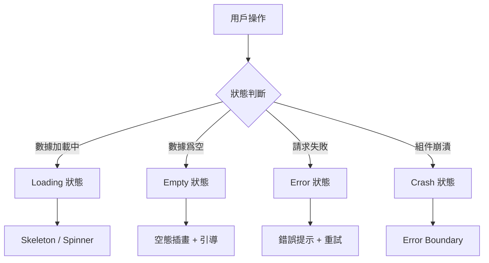

# 3.7 可用性設計

### 一句話破題

用戶不怕等待，怕的是不知道發生了什麼。優秀的可用性設計讓每種狀態都有恰當的反饋。

### 核心價值

一個應用會遇到四種非正常狀態：加載中、數據爲空、請求失敗、組件崩潰。處理好這四種狀態，用戶體驗就不會差。

### 狀態全景圖



### 四種狀態對比

| 狀態 | 用戶感知 | 解決方案 | 本章節 |
|-----|---------|---------|-------|
| Loading | 等待焦慮 | Skeleton 減少感知時間 | 3.7.3 |
| Empty | 困惑迷茫 | 引導用戶下一步操作 | 3.7.2 |
| Error | 沮喪憤怒 | 提供重試和幫助 | 3.7.4 |
| Crash | 恐慌無助 | 優雅降級，保護全局 | 3.7.1 |

### 本章目標

1. 學會用 Error Boundary 隔離組件崩潰
2. 設計有引導性的空態頁面
3. 使用 Skeleton 提升加載體驗
4. 實現用戶友好的錯誤重試機制

### 設計原則

**1. 永遠告訴用戶發生了什麼**
```tsx
// 差：無任何反饋
{loading && null}

// 好：明確的狀態反饋
{loading && <Skeleton />}
```

**2. 提供可操作的下一步**
```tsx
// 差：只顯示錯誤信息
<p>請求失敗</p>

// 好：提供解決方案
<ErrorState 
  message="請求失敗"
  action={<Button onClick={retry}>重試</Button>}
/>
```

**3. 優雅降級而非全面崩潰**
```tsx
// 差：一個組件出錯，整頁白屏
<App />

// 好：錯誤被隔離
<ErrorBoundary fallback={<ErrorFallback />}>
  <RiskyComponent />
</ErrorBoundary>
```

### 狀態組件庫

推薦使用統一的狀態組件庫管理各種狀態：

```tsx
// components/states/index.ts
export { Loading, Skeleton } from './Loading'
export { Empty } from './Empty'
export { ErrorState } from './Error'
export { ErrorBoundary } from './ErrorBoundary'
```

### 本章內容

- [3.7.1 錯誤邊界](./3.7.1-error-boundary.md) - 隔離組件崩潰
- [3.7.2 空態設計](./3.7.2-empty-state.md) - 引導用戶操作
- [3.7.3 加載狀態](./3.7.3-loading-state.md) - 減少等待焦慮
- [3.7.4 錯誤重試](./3.7.4-retry.md) - 優雅處理失敗
