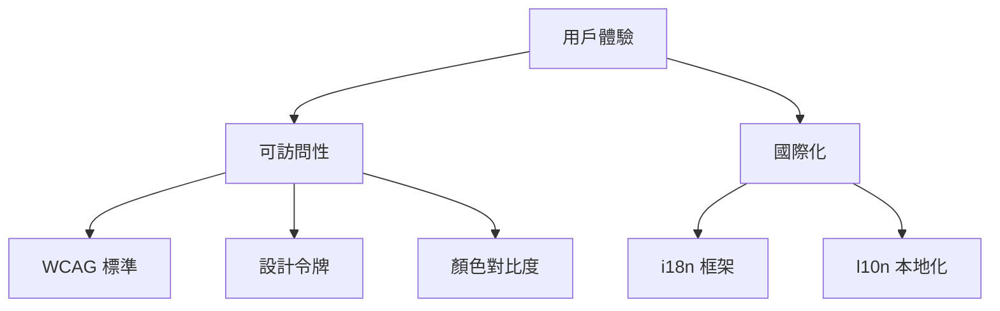

# 3.8 可訪問性與國際化

### 一句話破題

可訪問性不是可選項，而是讓更多人能使用你產品的基本要求。國際化讓你的產品走向世界。

### 核心價值

15% 的人口有某種形式的殘障，還有更多人處於臨時不便狀態（比如抱着孩子只能單手操作）。可訪問性設計讓產品對所有人都友好。國際化讓產品能觸達全球用戶。

### 本章全景



### 可訪問性 vs 國際化

| 概念 | 目標 | 關注點 |
|-----|------|-------|
| 可訪問性 (a11y) | 讓殘障用戶能使用 | 視覺/聽覺/運動/認知障礙 |
| 國際化 (i18n) | 讓產品支持多語言 | 翻譯/日期/貨幣格式 |
| 本地化 (l10n) | 讓產品適應當地文化 | 習慣/法規/文化差異 |

### 爲什麼要關注

**商業價值**：
- 全球 10 億+ 殘障人士是潛在用戶
- 多語言支持打開國際市場
- 許多地區有法律合規要求

**技術價值**：
- 語義化 HTML 對 SEO 有益
- 設計令牌提升開發效率
- i18n 架構讓代碼更模塊化

### 本章目標

1. 瞭解 WCAG 2.1 核心要求
2. 建立設計令牌系統
3. 確保顏色對比度達標
4. 實現多語言支持
5. 掌握本地化最佳實踐

### 快速自檢

```bash
# 鍵盤可訪問性測試
# 打開你的網站，拔掉鼠標，只用鍵盤操作

# 屏幕閱讀器測試
# macOS: 開啓 VoiceOver (Cmd+F5)
# Windows: 使用 NVDA (免費)

# 顏色對比度檢查
# Chrome DevTools > Elements > 選擇元素 > Accessibility
```

### 本章內容

- [3.8.1 WCAG 標準](./3.8.1-wcag.md) - 可訪問性基礎要求
- [3.8.2 設計令牌](./3.8.2-design-tokens.md) - 系統化管理設計
- [3.8.3 顏色對比度](./3.8.3-contrast.md) - 視覺障礙友好設計
- [3.8.4 國際化 i18n](./3.8.4-i18n.md) - 多語言支持
- [3.8.5 本地化 l10n](./3.8.5-l10n.md) - 文化適配
