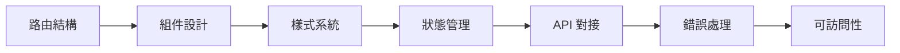

# 3 ｜前端到後端（把頁面跑起來）

### 一句話破題

前端不是"畫頁面"，而是用組件化思維構建可交互、可維護的用戶界面。

### 本章定位

在完成了技術選型和架構設計後，我們終於要動手寫代碼了。但在 Vibe Coding 體系下，"寫代碼"的含義發生了根本變化——你不再是逐行敲代碼的程序員，而是**指揮 AI 搭建界面的架構師**。

本章將帶你掌握 Next.js App Router 的前端開發全流程：

### 章節導航

| 章節 | 主題 | 核心能力 |
|------|------|----------|
| **3.1** | App Router 路由 | 文件系統路由、動態路由、路由組、數據獲取 |
| **3.2** | 組件構建塊 | Props、State、Effects、自定義 Hooks |
| **3.3** | Figma 集成 | 設計稿到代碼的 AI 協作流程 |
| **3.4** | Tailwind + shadcn | 統一設計系統與組件庫 |
| **3.5** | Debug 實戰 | Network、Console、Performance、DevTools |
| **3.6** | API Route | 服務層分離、請求驗證、錯誤處理 |
| **3.7** | 可用性設計 | Error Boundary、空態、加載狀態 |
| **3.8** | 可訪問性與國際化 | WCAG、設計令牌、i18n/l10n |

### Vibe Coding 視角

在傳統開發中，前端工程師需要同時掌握 HTML 結構、CSS 樣式、JavaScript 邏輯。但在 Vibe Coding 體系下，你的核心任務變成了：

1. **定義邊界**：告訴 AI 組件的輸入輸出是什麼
2. **描述交互**：用自然語言描述用戶行爲和系統響應
3. **驗收結果**：檢查 AI 生成的代碼是否符合預期

這種轉變並不意味着降低了技術門檻，反而對你的**架構思維**和**驗收能力**提出了更高要求。只有真正理解了組件化、狀態管理、渲染策略等核心概念，你纔能有效地指揮 AI，並在它"胡說八道"時及時糾正。

### 學習建議

1. **先跑通，再優化**：每個小節都有"最小可行代碼"，先讓它跑起來
2. **邊學邊做**：打開你的項目，跟着教程一步步實踐
3. **善用驗收清單**：每節末尾都有 Checklist，完成後再進入下一節
