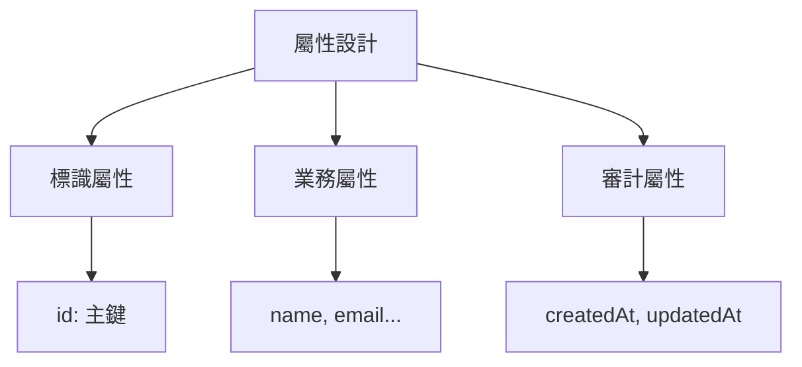

# 4.1.1 你的數據有哪些主角——實體識別：業務對象抽象與屬性定義

### 一句話破題

實體就是業務中需要"記住"的核心對象——找對了實體，數據庫設計就成功了一半。

### 什麼是實體？

**實體**是業務領域中具有獨立存在意義的事物。它可以是：

- **具體的人或物**：用戶、商品、訂單
- **抽象的概念**：角色、權限、分類
- **發生的事件**：交易記錄、操作日誌

### 如何從需求中識別實體？

**方法一：名詞提取法**

從需求描述中提取核心名詞：

> "用戶可以發佈文章，其他用戶可以對文章進行評論和點贊"

提取的名詞：`用戶`、`文章`、`評論`、`點贊`

**方法二：問答驗證法**

對每個候選實體問三個問題：

1. 它是否需要被獨立存儲？
2. 它是否有自己的屬性？
3. 它是否會被其他實體引用？

| 候選 | 獨立存儲 | 有屬性 | 被引用 | 結論 |
|------|----------|--------|--------|------|
| 用戶 | ✓ | ✓ | ✓ | 實體 |
| 文章 | ✓ | ✓ | ✓ | 實體 |
| 評論 | ✓ | ✓ | ✓ | 實體 |
| 點贊 | ✓ | ✓ | ✗ | 實體或關係表 |

### 實體的屬性設計

每個實體都有若干屬性，屬性設計需要考慮：



**標識屬性**：唯一標識一條記錄

```typescript
// 推薦使用 CUID 或 UUID
id: string  // cuid() 或 uuid()
```

**業務屬性**：描述實體的核心特徵

```typescript
// 用戶實體的業務屬性
email: string     // 必填，唯一
name: string      // 必填
avatar?: string   // 可選
bio?: string      // 可選
```

**審計屬性**：記錄數據變更歷史

```typescript
createdAt: DateTime  // 創建時間
updatedAt: DateTime  // 更新時間
deletedAt?: DateTime // 軟刪除時間（可選）
```

### Prisma 中的實體定義

```prisma
model User {
  // 標識屬性
  id        String   @id @default(cuid())
  
  // 業務屬性
  email     String   @unique
  name      String
  avatar    String?
  bio       String?
  
  // 審計屬性
  createdAt DateTime @default(now())
  updatedAt DateTime @updatedAt
  
  // 關係（下一節詳細介紹）
  posts     Post[]
  comments  Comment[]
}
```

### 常見實體設計模式

**用戶相關**：
- `User`：用戶基本信息
- `Profile`：用戶詳細資料（一對一）
- `Account`：第三方登錄賬號（一對多）

**內容相關**：
- `Post`：文章/帖子
- `Comment`：評論
- `Tag`：標籤
- `Category`：分類

**交易相關**：
- `Order`：訂單
- `OrderItem`：訂單項
- `Payment`：支付記錄

### 避坑指南

1. **不要把所有東西都做成實體**：如果一個"東西"只是另一個實體的屬性（如用戶的地址），可以考慮嵌入到父實體中

2. **不要過度設計**：先滿足當前需求，後續可以通過遷移來擴展

3. **命名要一致**：選擇單數（`User`）或複數（`Users`）後保持統一，推薦單數

### AI 協作指南

讓 AI 幫你識別實體時，可以這樣提問：

```
我要做一個 [業務類型] 應用，主要功能包括：
1. [功能1]
2. [功能2]
3. [功能3]

請幫我識別需要哪些核心實體，並列出每個實體的主要屬性。
```

### 本節小結

- 實體是業務中需要獨立存儲的核心對象
- 通過"名詞提取 + 問答驗證"識別實體
- 每個實體都應有標識、業務、審計三類屬性
- 使用 Prisma model 定義實體
