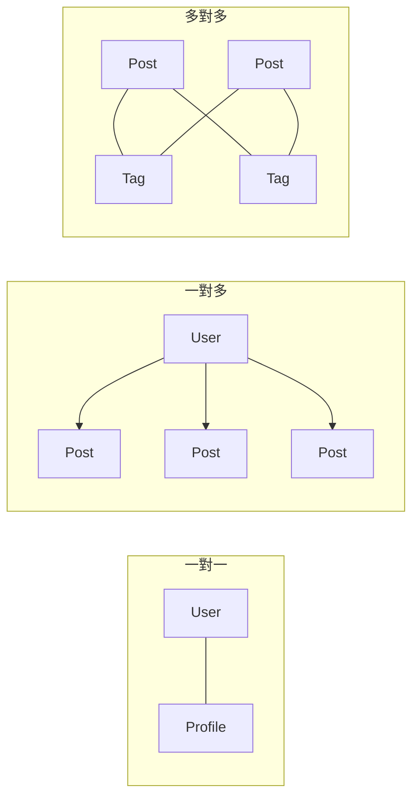
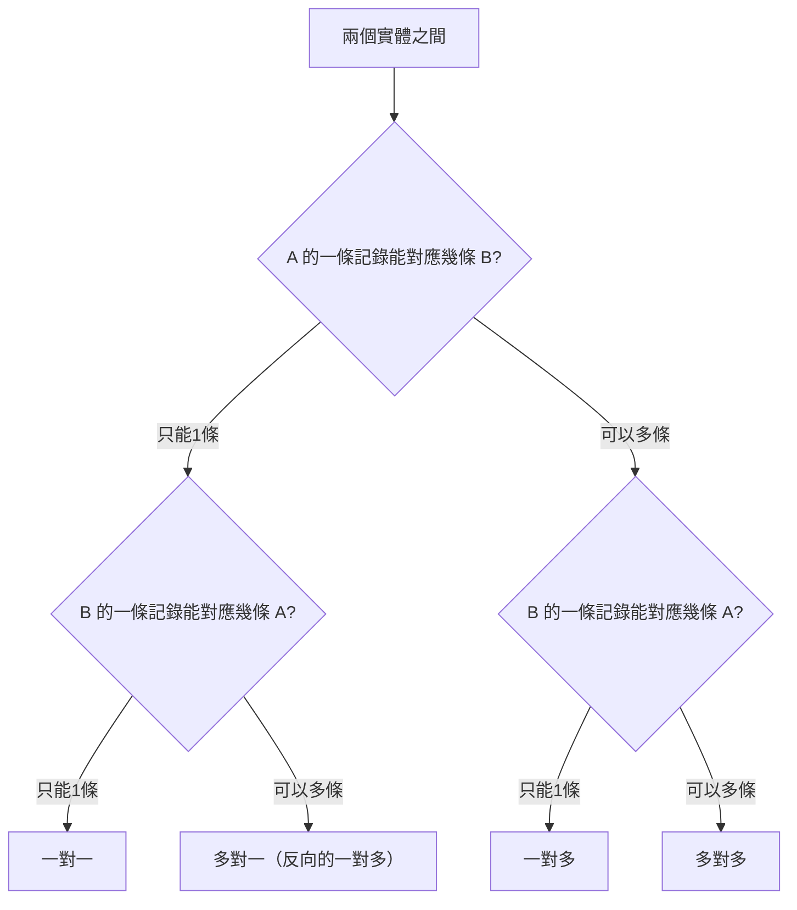

# 4.1.2 主角之間什麼關係——關係設計：一對一/一對多/多對多

### 一句話破題

實體之間的關係決定了數據如何關聯——選對關係類型，查詢才能又快又準。

### 三種基本關係



| 關係類型 | 說明 | 典型場景 |
|----------|------|----------|
| **一對一** | A 只能對應一個 B，B 也只能對應一個 A | 用戶-詳情、訂單-支付 |
| **一對多** | A 可以對應多個 B，但 B 只能對應一個 A | 用戶-文章、分類-商品 |
| **多對多** | A 可以對應多個 B，B 也可以對應多個 A | 文章-標籤、學生-課程 |

### 一對一關係

**場景**：用戶和用戶詳情分表存儲（主表輕量，詳情表存大字段）

```prisma
model User {
  id       String   @id @default(cuid())
  email    String   @unique
  name     String
  profile  Profile?  // 可選的一對一關係
}

model Profile {
  id       String  @id @default(cuid())
  bio      String?
  avatar   String?
  userId   String  @unique  // 外鍵必須唯一
  user     User    @relation(fields: [userId], references: [id])
}
```

**查詢示例**：

```typescript
// 查詢用戶時包含詳情
const user = await prisma.user.findUnique({
  where: { id: userId },
  include: { profile: true }
})
```

### 一對多關係

**場景**：一個用戶可以發佈多篇文章

```prisma
model User {
  id     String @id @default(cuid())
  email  String @unique
  posts  Post[] // 一個用戶有多篇文章
}

model Post {
  id       String @id @default(cuid())
  title    String
  content  String
  authorId String          // 外鍵
  author   User   @relation(fields: [authorId], references: [id])
}
```

**查詢示例**：

```typescript
// 查詢用戶的所有文章
const userWithPosts = await prisma.user.findUnique({
  where: { id: userId },
  include: { posts: true }
})

// 查詢文章時包含作者信息
const post = await prisma.post.findUnique({
  where: { id: postId },
  include: { author: true }
})
```

### 多對多關係

**場景**：文章可以有多個標籤，標籤可以被多篇文章使用

**方式一：隱式多對多（Prisma 自動創建中間表）**

```prisma
model Post {
  id    String @id @default(cuid())
  title String
  tags  Tag[]  // 多對多關係
}

model Tag {
  id    String @id @default(cuid())
  name  String @unique
  posts Post[] // 多對多關係
}
```

**方式二：顯式多對多（自定義中間表，可存額外字段）**

```prisma
model Post {
  id       String    @id @default(cuid())
  title    String
  postTags PostTag[]
}

model Tag {
  id       String    @id @default(cuid())
  name     String    @unique
  postTags PostTag[]
}

// 中間表，可以存儲額外信息
model PostTag {
  postId    String
  tagId     String
  createdAt DateTime @default(now())  // 額外字段
  
  post Post @relation(fields: [postId], references: [id])
  tag  Tag  @relation(fields: [tagId], references: [id])
  
  @@id([postId, tagId])  // 複合主鍵
}
```

### 如何選擇關係類型？



### 關係設計的最佳實踐

1. **外鍵命名規範**：使用 `關聯模型名 + Id`，如 `authorId`、`categoryId`

2. **級聯刪除**：在 Prisma 中配置刪除行爲
   ```prisma
   author User @relation(fields: [authorId], references: [id], onDelete: Cascade)
   ```

3. **索引優化**：外鍵字段自動創建索引，但複雜查詢可能需要額外索引

4. **避免循環依賴**：A 引用 B，B 引用 C，C 又引用 A 會導致問題

### 避坑指南

- **多對多選隱式還是顯式**：如果中間關係不需要額外屬性，用隱式；需要記錄"關聯時間"等信息，用顯式

- **自引用關係**：如"用戶關注用戶"，需要特別處理
  ```prisma
  model User {
    id        String @id
    followers User[] @relation("UserFollows")
    following User[] @relation("UserFollows")
  }
  ```

### 本節小結

- 一對一：兩邊都唯一，外鍵加 `@unique`
- 一對多：最常見的關係，一方有數組，多方有外鍵
- 多對多：可以隱式（簡單）或顯式（靈活）
- 根據業務需求選擇合適的關係類型
