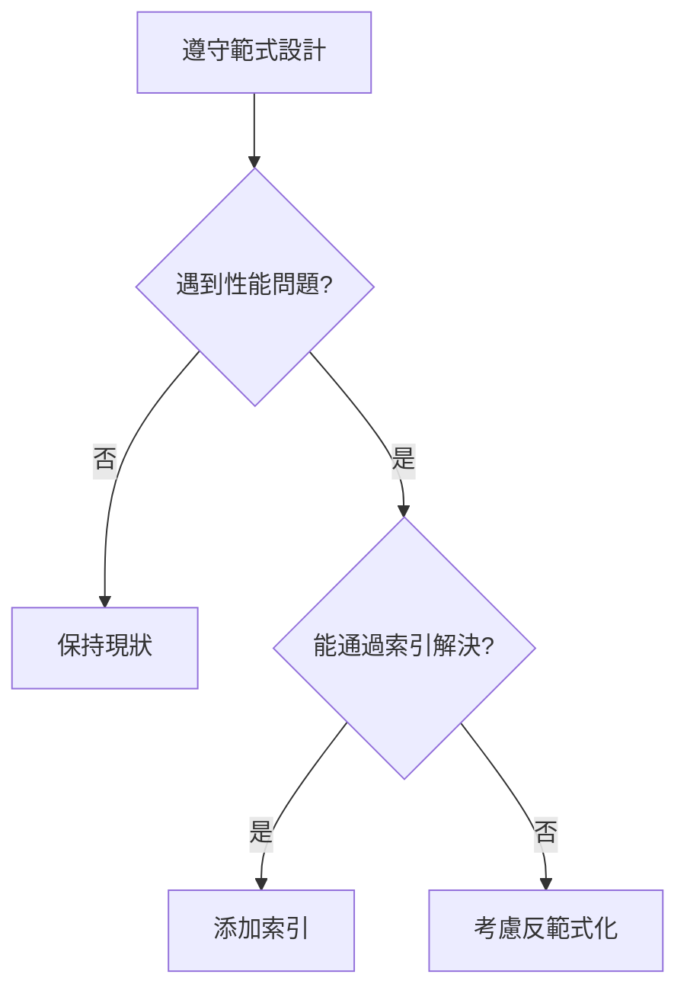

# 4.1.4 規則可以被打破嗎——反規範化：性能優化的權衡考慮

### 一句話破題

反範式化是爲了性能而"故意違規"——用數據冗餘換取查詢速度。

### 什麼時候需要反範式化？



**反範式化的觸發條件**：

1. 頻繁的多表 JOIN 查詢嚴重影響性能
2. 某些聚合數據需要即時計算，成本過高
3. 讀多寫少的場景，可以犧牲寫入效率換取讀取速度

### 常見反範式化策略

#### 策略一：冗餘存儲

**場景**：文章列表需要顯示作者名稱，每次都 JOIN 用戶表成本高。

**規範化設計**：

```prisma
model Post {
  id       String @id
  title    String
  authorId String
  author   User   @relation(fields: [authorId], references: [id])
}
```

**反範式化設計**：

```prisma
model Post {
  id         String @id
  title      String
  authorId   String
  authorName String  // 冗餘存儲作者名稱
  author     User    @relation(fields: [authorId], references: [id])
}
```

**代價**：用戶改名時，需要同步更新所有相關文章。

#### 策略二：預計算聚合

**場景**：顯示文章的評論數、點贊數。

**規範化做法**：每次查詢時 COUNT

```typescript
const post = await prisma.post.findUnique({
  where: { id },
  include: {
    _count: {
      select: { comments: true, likes: true }
    }
  }
})
```

**反範式化做法**：存儲計數器

```prisma
model Post {
  id           String @id
  title        String
  commentCount Int    @default(0)  // 冗餘計數
  likeCount    Int    @default(0)  // 冗餘計數
}
```

**維護方式**：評論/點贊時更新計數器

```typescript
await prisma.$transaction([
  prisma.comment.create({ data: { postId, content } }),
  prisma.post.update({
    where: { id: postId },
    data: { commentCount: { increment: 1 } }
  })
])
```

#### 策略三：物化視圖/緩存表

**場景**：複雜的統計報表查詢。

**做法**：定期生成彙總數據表

```prisma
// 每日銷售彙總表
model DailySalesSummary {
  id        String   @id @default(cuid())
  date      DateTime @unique
  totalSales Decimal
  orderCount Int
  createdAt DateTime @default(now())
}
```

**更新策略**：
- 定時任務每天凌晨生成
- 或即時更新（通過觸發器或應用層）

### 反範式化的代價

| 獲得 | 付出 |
|------|------|
| 讀取速度快 | 寫入需要維護多處 |
| 減少 JOIN | 數據可能不一致 |
| 查詢簡單 | 存儲空間增加 |

### 維護數據一致性的方法

**方法一：事務保證**

```typescript
await prisma.$transaction(async (tx) => {
  // 更新主數據
  await tx.user.update({
    where: { id: userId },
    data: { name: newName }
  })
  // 同步更新冗餘數據
  await tx.post.updateMany({
    where: { authorId: userId },
    data: { authorName: newName }
  })
})
```

**方法二：最終一致性**

對於非關鍵數據，可以接受短暫的不一致：

```typescript
// 異步更新冗餘數據
await queue.add('syncAuthorName', { userId, newName })
```

**方法三：數據庫觸發器**

在數據庫層面自動同步（不推薦，會增加複雜度）。

### 決策檢查清單

在決定反範式化之前，問自己：

- [ ] **確實有性能問題嗎**？有實際的監控數據支撐嗎？
- [ ] **其他方案試過了嗎**？索引、緩存、查詢優化？
- [ ] **能接受數據不一致的風險嗎**？
- [ ] **有能力維護數據同步邏輯嗎**？
- [ ] **未來數據量增長後還適用嗎**？

### Vibe Coding 中的實踐建議

1. **初期不要反範式化**：先按範式設計，保持簡單
2. **用監控指導優化**：有數據支撐再做決策
3. **讓 AI 幫你評估**：
   ```
   我的 Post 表每秒查詢 1000 次，每次都需要 JOIN User 表獲取作者名。
   你覺得我應該冗餘存儲 authorName 嗎？有什麼風險？
   ```

### 本節小結

- 反範式化是爲性能而做的權衡
- 常見策略：冗餘存儲、預計算聚合、物化視圖
- 代價是需要維護數據一致性
- 先遵守範式，遇到真實性能問題再反範式化
