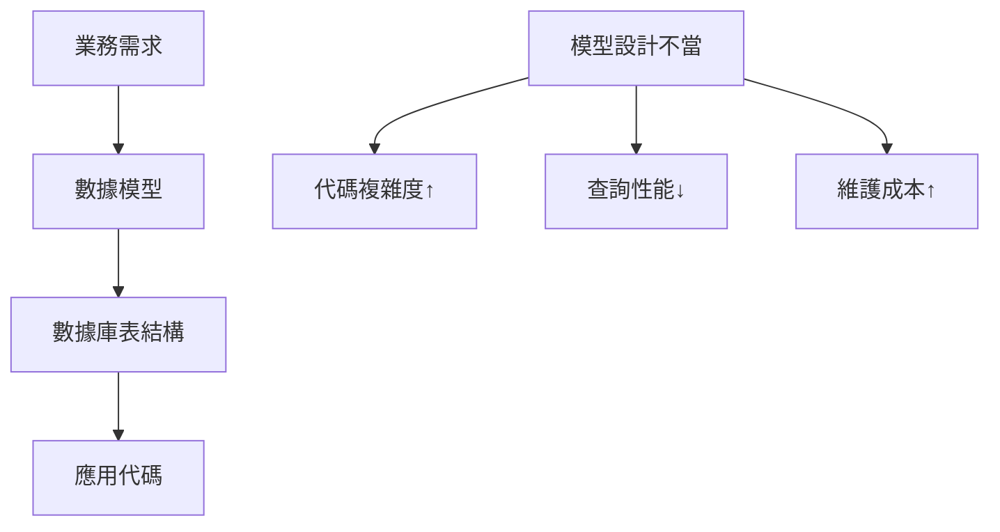
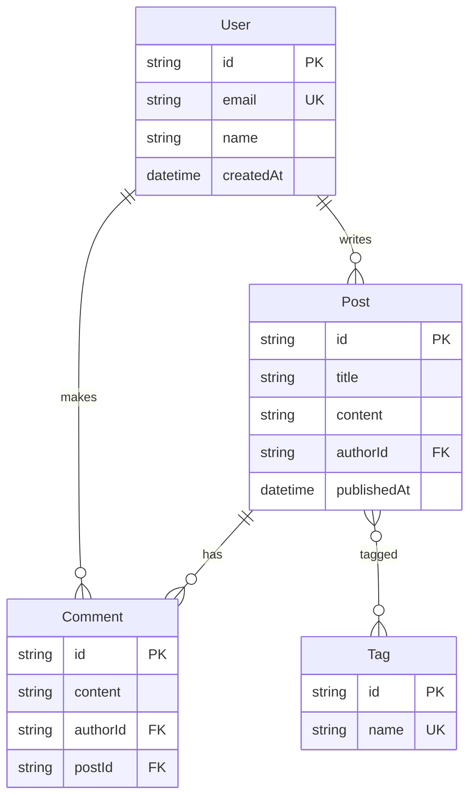

# 4.1 數據關係要先理清——數據建模與 ER 圖：實體/關係/約束；面向變更與演進

### 認知重構

數據建模不是"畫表格"，而是**用結構化的方式描述業務世界**。一個好的數據模型，能讓複雜的業務邏輯變得清晰可控。

### 爲什麼數據建模很重要？



數據模型是業務需求到代碼實現的**中間翻譯層**：

- **設計得好**：代碼簡潔、查詢高效、易於擴展
- **設計得差**：到處打補丁、查詢慢、改一處動全身

### 本節核心概念

| 概念 | 說明 | 示例 |
|------|------|------|
| **實體** | 業務中的核心對象 | 用戶、文章、訂單 |
| **屬性** | 實體的特徵 | 用戶名、郵箱、創建時間 |
| **關係** | 實體之間的關聯 | 用戶"擁有"多篇文章 |
| **約束** | 數據的規則限制 | 郵箱必須唯一 |

### 子章節導航

| 章節 | 主題 | 學習目標 |
|------|------|----------|
| 4.1.1 | 實體識別 | 從業務中提取核心對象 |
| 4.1.2 | 關係設計 | 一對一/一對多/多對多 |
| 4.1.3 | 範式理論 | 規範化的數據結構 |
| 4.1.4 | 反範式化 | 爲性能做的合理妥協 |

### ER 圖示例

以博客系統爲例：



### AI 協作指南

**核心意圖**：告訴 AI 你要設計什麼業務的數據模型。

**需求定義公式**：
```
我需要爲 [業務場景] 設計數據模型。
主要實體包括：[實體列表]
核心業務流程是：[流程描述]
請幫我設計 ER 圖和 Prisma Schema。
```

**關鍵術語**：`實體`、`屬性`、`關係`、`主鍵`、`外鍵`、`一對多`、`多對多`

### 下一步

學習如何從業務需求中識別實體 → 4.1.1 實體識別
