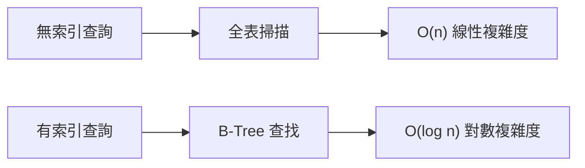

# 4.2.2 爲什麼查詢這麼快——索引原理：B-Tree 索引與查詢優化

### 一句話破題

索引就像書的目錄——沒有它你只能一頁頁翻找，有了它可以直接跳到目標位置。

### 索引的本質



| 數據量 | 全表掃描 | 索引查詢 |
|--------|----------|----------|
| 1,000 | 1,000 次 | 10 次 |
| 100,000 | 100,000 次 | 17 次 |
| 10,000,000 | 10,000,000 次 | 24 次 |

### B-Tree 索引的工作原理

B-Tree（平衡樹）是數據庫最常用的索引結構：

```
              [50]
             /    \
        [25,35]    [75,85]
        / | \       / | \
    [10] [30] [40] [60] [80] [90]
```

- 每個節點包含多個鍵值
- 數據按順序排列
- 從根節點開始，每次排除一半數據

### 在 Prisma 中創建索引

**單字段索引**：
```prisma
model User {
  id    String @id
  email String @unique  // 唯一索引，自動創建
  name  String
  
  @@index([name])  // 普通索引
}
```

**複合索引**：
```prisma
model Post {
  id        String @id
  authorId  String
  status    String
  createdAt DateTime
  
  // 複合索引：authorId + status
  @@index([authorId, status])
}
```

**何時需要創建索引**：

| 場景 | 是否需要索引 |
|------|-------------|
| WHERE 條件字段 | 需要 |
| ORDER BY 排序字段 | 需要 |
| JOIN 關聯字段 | 需要（外鍵自動創建） |
| 唯一約束字段 | 自動創建 |
| 很少查詢的字段 | 不需要 |

### 複合索引的順序

複合索引的字段順序很重要，遵循**最左前綴原則**：

```prisma
@@index([authorId, status, createdAt])
```

- ✅ 支持 `WHERE authorId = ?`
- ✅ 支持 `WHERE authorId = ? AND status = ?`
- ✅ 支持 `WHERE authorId = ? AND status = ? AND createdAt > ?`
- ❌ 不支持 `WHERE status = ?`（跳過了 authorId）
- ❌ 不支持 `WHERE createdAt > ?`（跳過了前兩個字段）

### 索引的代價

索引不是免費的：

| 獲得 | 付出 |
|------|------|
| 查詢變快 | 寫入變慢（需要維護索引） |
| 範圍查詢高效 | 佔用額外存儲空間 |
| - | 索引過多會影響寫入性能 |

### 查詢優化實踐

**查看查詢執行計劃**（PostgreSQL）：
```sql
EXPLAIN ANALYZE SELECT * FROM users WHERE email = 'test@example.com';
```

**Prisma 日誌查看生成的 SQL**：
```typescript
const prisma = new PrismaClient({
  log: ['query']
})
```

**常見優化技巧**：

1. **只查詢需要的字段**：
   ```typescript
   // 只選擇需要的字段
   const users = await prisma.user.findMany({
     select: { id: true, name: true }
   })
   ```

2. **避免 SELECT ***：不要查詢不需要的大字段

3. **合理使用分頁**：
   ```typescript
   const users = await prisma.user.findMany({
     take: 20,
     skip: 0
   })
   ```

### 什麼時候不用索引

即使有索引，數據庫也可能選擇不使用：

- 查詢結果超過表數據的 20-30%
- 使用了函數計算（如 `LOWER(email)`）
- 使用了 `LIKE '%keyword'`（前綴通配符）

### 避坑指南

1. **不要給每個字段都加索引**：只給查詢條件中的高頻字段加

2. **注意索引失效場景**：
   - 對索引列使用函數
   - 隱式類型轉換
   - LIKE 以通配符開頭

3. **定期檢查慢查詢**：監控並優化慢 SQL

### 本節小結

- 索引通過 B-Tree 結構加速查詢
- 外鍵和唯一約束會自動創建索引
- 複合索引遵循最左前綴原則
- 索引有代價，不是越多越好
