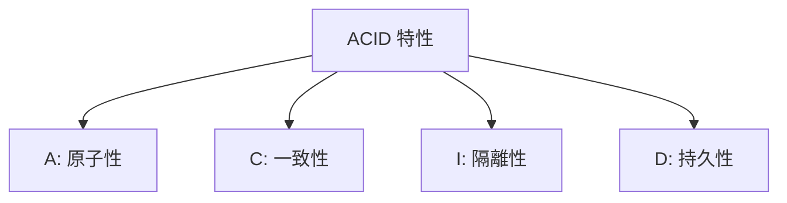

# 4.2.3 轉賬爲什麼是安全的——事務特性：ACID 屬性與隔離級別

### 一句話破題

事務保證多個操作"要麼全成功，要麼全失敗"——這是數據安全的基石。

### 經典案例：銀行轉賬

張三給李四轉賬 100 元，需要兩步操作：

1. 張三賬戶 -100 元
2. 李四賬戶 +100 元

**如果沒有事務**：
- 第一步成功，第二步失敗 → 張三少了 100，李四沒收到
- 系統崩潰在中間 → 數據不一致

**有事務保護**：
- 兩步要麼都成功
- 要麼都回滾到操作前的狀態

### ACID 四大特性



| 特性 | 說明 | 保證什麼 |
|------|------|----------|
| **A**tomicity | 原子性 | 全部成功或全部回滾 |
| **C**onsistency | 一致性 | 數據始終符合業務規則 |
| **I**solation | 隔離性 | 併發事務互不干擾 |
| **D**urability | 持久性 | 提交後數據永久保存 |

### Prisma 中使用事務

**方式一：順序事務**

```typescript
// 所有操作在同一個事務中執行
const [user, post] = await prisma.$transaction([
  prisma.user.create({ data: { email: 'user@example.com' } }),
  prisma.post.create({ data: { title: '新文章', authorId: 'xxx' } })
])
```

**方式二：交互式事務（推薦）**

```typescript
// 更靈活，可以在事務中編寫業務邏輯
const result = await prisma.$transaction(async (tx) => {
  // 1. 扣減張三餘額
  const sender = await tx.account.update({
    where: { userId: 'zhangsan' },
    data: { balance: { decrement: 100 } }
  })
  
  // 2. 檢查餘額是否足夠
  if (sender.balance < 0) {
    throw new Error('餘額不足')  // 拋出異常會自動回滾
  }
  
  // 3. 增加李四餘額
  const receiver = await tx.account.update({
    where: { userId: 'lisi' },
    data: { balance: { increment: 100 } }
  })
  
  return { sender, receiver }
})
```

### 事務的隔離級別

不同隔離級別決定了事務之間能"看到"彼此的多少：

| 隔離級別 | 髒讀 | 不可重複讀 | 幻讀 | 性能 |
|----------|------|------------|------|------|
| Read Uncommitted | ✓ | ✓ | ✓ | 最高 |
| Read Committed | ✗ | ✓ | ✓ | 高 |
| Repeatable Read | ✗ | ✗ | ✓ | 中 |
| Serializable | ✗ | ✗ | ✗ | 低 |

**PostgreSQL 默認**：Read Committed

**設置隔離級別**（Prisma）：
```typescript
await prisma.$transaction(
  async (tx) => { /* ... */ },
  {
    isolationLevel: 'Serializable'
  }
)
```

### 常見問題解釋

**髒讀**：讀到了其他事務未提交的數據

**不可重複讀**：同一事務內，兩次讀取同一數據結果不同

**幻讀**：同一事務內，兩次查詢記錄數不同（有新增或刪除）

### 事務的最佳實踐

1. **事務要短**：長事務會佔用數據庫連接和鎖資源

2. **避免事務中調用外部服務**：
   ```typescript
   // 錯誤示例
   await prisma.$transaction(async (tx) => {
     await tx.order.create({ ... })
     await callPaymentAPI()  // 外部調用可能很慢
   })
   
   // 正確做法：先調用外部服務，再在事務中更新數據庫
   const paymentResult = await callPaymentAPI()
   await prisma.$transaction(async (tx) => {
     await tx.order.update({ data: { status: 'PAID' } })
   })
   ```

3. **設置超時時間**：
   ```typescript
   await prisma.$transaction(
     async (tx) => { /* ... */ },
     { timeout: 5000 }  // 5秒超時
   )
   ```

### 什麼時候需要事務？

| 場景 | 是否需要事務 |
|------|-------------|
| 單條數據的 CRUD | 不需要（自帶原子性） |
| 轉賬（多表更新） | 需要 |
| 創建訂單 + 扣減庫存 | 需要 |
| 級聯刪除 | 可用事務或數據庫級聯 |

### 本節小結

- 事務保證多個操作的原子性
- ACID 是事務的四大特性
- Prisma 提供兩種事務寫法
- 事務要短，避免在事務中調用外部服務
