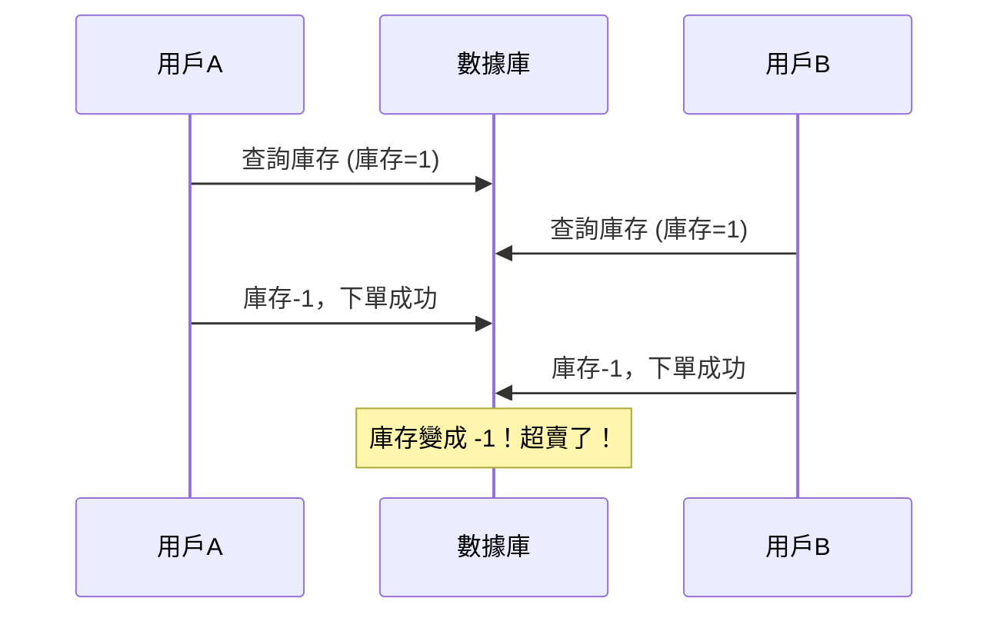
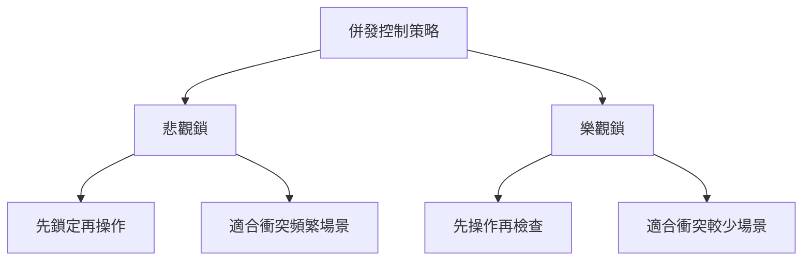
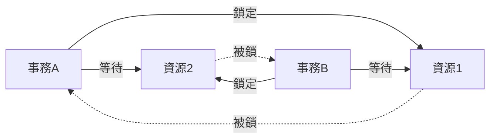

# 4.2.4 同時操作數據怎麼辦——併發控制：鎖機制與死鎖預防

### 一句話破題

當多個用戶同時修改同一條數據時，鎖機制決定了誰先誰後——理解它能幫你避免數據混亂和死鎖。

### 併發問題場景

**場景**：商品庫存只剩 1 件，兩個用戶同時下單



### 鎖的類型

| 鎖類型 | 說明 | 場景 |
|--------|------|------|
| **共享鎖** | 多個事務可以同時讀 | SELECT 查詢 |
| **排他鎖** | 只有一個事務能寫 | UPDATE/DELETE |
| **行級鎖** | 只鎖定特定行 | 精確控制 |
| **表級鎖** | 鎖定整張表 | 批量操作 |

### 樂觀鎖 vs 悲觀鎖



**悲觀鎖**：假設一定會衝突，先鎖住再說

```typescript
// Prisma 中使用悲觀鎖（需要原生 SQL）
await prisma.$queryRaw`
  SELECT * FROM products WHERE id = ${productId} FOR UPDATE
`
```

**樂觀鎖**：假設不會衝突，更新時檢查版本

```prisma
model Product {
  id        String @id
  stock     Int
  version   Int    @default(0)  // 版本號字段
}
```

```typescript
// 樂觀鎖更新
const updated = await prisma.product.updateMany({
  where: { 
    id: productId, 
    version: currentVersion  // 檢查版本號
  },
  data: { 
    stock: { decrement: 1 },
    version: { increment: 1 }  // 版本號+1
  }
})

if (updated.count === 0) {
  throw new Error('數據已被其他人修改，請重試')
}
```

### 解決庫存超賣問題

**方案一：數據庫約束**

```prisma
model Product {
  id    String @id
  stock Int    // 添加 CHECK 約束：stock >= 0
}
```

```sql
ALTER TABLE products ADD CONSTRAINT stock_non_negative CHECK (stock >= 0);
```

**方案二：原子操作 + 條件更新**

```typescript
const result = await prisma.product.updateMany({
  where: { 
    id: productId,
    stock: { gte: 1 }  // 只有庫存 >= 1 才更新
  },
  data: { stock: { decrement: 1 } }
})

if (result.count === 0) {
  throw new Error('庫存不足')
}
```

### 死鎖及其預防

**死鎖場景**：



事務 A 鎖了資源 1，等待資源 2；事務 B 鎖了資源 2，等待資源 1 → 互相等待，死鎖！

**預防死鎖的方法**：

1. **按固定順序獲取鎖**：所有事務都先鎖資源 1，再鎖資源 2

2. **設置鎖超時**：等待超時後自動放棄
   ```typescript
   await prisma.$transaction(
     async (tx) => { /* ... */ },
     { timeout: 5000 }
   )
   ```

3. **減少鎖的範圍和時間**：事務越短越好

4. **使用樂觀鎖**：不加鎖，衝突時重試

### Prisma 中的併發處理

**推薦做法**：使用條件更新

```typescript
// 安全的庫存扣減
async function decrementStock(productId: string, quantity: number) {
  const result = await prisma.product.updateMany({
    where: {
      id: productId,
      stock: { gte: quantity }
    },
    data: {
      stock: { decrement: quantity }
    }
  })
  
  if (result.count === 0) {
    throw new Error('庫存不足或商品不存在')
  }
  
  return result
}
```

### 避坑指南

1. **不要在應用層判斷後再更新**：
   ```typescript
   // 錯誤：存在併發問題
   const product = await prisma.product.findUnique({ where: { id } })
   if (product.stock >= 1) {
     await prisma.product.update({ data: { stock: product.stock - 1 } })
   }
   
   // 正確：使用原子操作
   await prisma.product.updateMany({
     where: { id, stock: { gte: 1 } },
     data: { stock: { decrement: 1 } }
   })
   ```

2. **避免長事務**：事務越長，持有鎖的時間越長，死鎖風險越高

3. **監控死鎖**：PostgreSQL 會自動檢測並回滾死鎖中的一個事務

### 本節小結

- 併發控制防止多用戶同時操作導致的數據混亂
- 悲觀鎖先鎖再操作，樂觀鎖先操作再檢查
- 使用條件更新（updateMany + where 條件）是 Prisma 中處理併發的推薦方式
- 避免死鎖：按順序加鎖、設置超時、縮短事務
