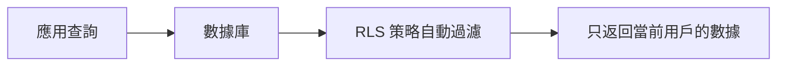
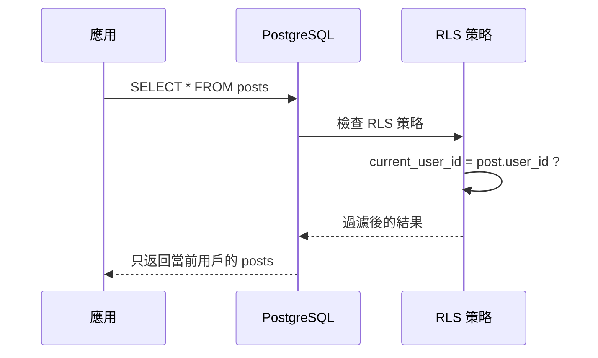

# 4.2.5 張三爲什麼看不了李四的數據——行級安全 ：PostgreSQL 核心安全特性

### 一句話破題

行級安全（RLS）讓數據庫自動過濾數據——用戶只能看到屬於自己的記錄，無需在每個查詢中手動添加 WHERE 條件。

### 爲什麼需要 RLS？

**傳統做法**：每個查詢都要手動添加用戶過濾

```typescript
// 每次查詢都要記得加 userId 條件
const posts = await prisma.post.findMany({
  where: { userId: currentUserId }  // 容易忘記！
})
```

**問題**：
- 開發者可能忘記添加過濾條件
- 一旦遺漏，用戶就能看到其他人的數據
- 安全隱患巨大

**RLS 解決方案**：數據庫層面自動過濾



### RLS 的工作原理



### 在 Supabase 中使用 RLS

Supabase 內置了 RLS 支持，這也是本課程推薦使用 Supabase 的原因之一。

**步驟一：啓用 RLS**

```sql
-- 對錶啓用 RLS
ALTER TABLE posts ENABLE ROW LEVEL SECURITY;
```

**步驟二：創建策略**

```sql
-- 用戶只能查看自己的文章
CREATE POLICY "Users can view own posts"
ON posts FOR SELECT
USING (user_id = auth.uid());

-- 用戶只能創建屬於自己的文章
CREATE POLICY "Users can create own posts"
ON posts FOR INSERT
WITH CHECK (user_id = auth.uid());

-- 用戶只能更新自己的文章
CREATE POLICY "Users can update own posts"
ON posts FOR UPDATE
USING (user_id = auth.uid());

-- 用戶只能刪除自己的文章
CREATE POLICY "Users can delete own posts"
ON posts FOR DELETE
USING (user_id = auth.uid());
```

### 常見 RLS 策略模式

**模式一：用戶隔離**

每個用戶只能訪問自己的數據：

```sql
CREATE POLICY "User isolation"
ON user_data FOR ALL
USING (user_id = auth.uid());
```

**模式二：公開 + 私有**

公開數據所有人可見，私有數據僅作者可見：

```sql
CREATE POLICY "Public or own posts"
ON posts FOR SELECT
USING (
  is_public = true 
  OR user_id = auth.uid()
);
```

**模式三：組織/團隊隔離**

同一組織的成員可以互相訪問：

```sql
CREATE POLICY "Team access"
ON documents FOR SELECT
USING (
  team_id IN (
    SELECT team_id FROM team_members 
    WHERE user_id = auth.uid()
  )
);
```

**模式四：角色權限**

管理員可以訪問所有數據：

```sql
CREATE POLICY "Admin full access"
ON posts FOR ALL
USING (
  auth.jwt() ->> 'role' = 'admin'
  OR user_id = auth.uid()
);
```

### Prisma + Supabase 配合使用

雖然 Prisma 不直接支持 RLS，但可以配合 Supabase 使用：

**方案一：使用 Supabase Client 直接查詢**

```typescript
import { createClient } from '@supabase/supabase-js'

const supabase = createClient(url, anonKey)

// RLS 會自動生效
const { data } = await supabase
  .from('posts')
  .select('*')  // 自動過濾，只返回當前用戶的數據
```

**方案二：Prisma + 手動過濾（非敏感數據）**

```typescript
// 對於非核心安全數據，可以在應用層過濾
const posts = await prisma.post.findMany({
  where: { userId: session.user.id }
})
```

### RLS vs 應用層過濾

| 特性 | RLS | 應用層過濾 |
|------|-----|-----------|
| **安全性** | 數據庫層面強制執行 | 依賴開發者不遺漏 |
| **性能** | 數據庫優化 | 可能多查數據再過濾 |
| **複雜度** | 需要學習 SQL 策略 | 簡單直觀 |
| **靈活性** | 策略固定 | 可動態調整 |

**建議**：
- 敏感數據（用戶隱私、財務數據）→ 使用 RLS
- 一般數據 → 應用層過濾即可

### 避坑指南

1. **忘記啓用 RLS**：創建表後記得執行 `ALTER TABLE ... ENABLE ROW LEVEL SECURITY`

2. **策略過於嚴格**：如果沒有創建任何策略，啓用 RLS 後所有查詢都會返回空

3. **服務端繞過 RLS**：使用 service_role key 會繞過 RLS，只在後端使用
   ```typescript
   // 後端管理操作，繞過 RLS
   const adminClient = createClient(url, serviceRoleKey)
   ```

4. **性能考慮**：複雜的 RLS 策略可能影響查詢性能，注意優化

### 本節小結

- RLS 讓數據庫自動過濾數據，防止數據泄露
- Supabase 內置 RLS 支持，配置簡單
- 常見策略：用戶隔離、公開/私有、團隊訪問、角色權限
- 敏感數據建議使用 RLS，一般數據可用應用層過濾
